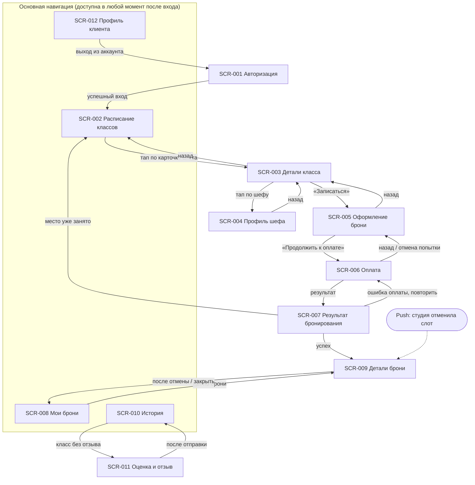

# Реестр экранов клиентского приложения «Кулинарная студия»

> Единственная роль в скоупе — Клиент (см. constraints-and-scope.md, SCOPE-IN-001).
> Каждый экран ниже оформлен отдельным дизайн-брифом по шаблону
> `00-design-brief-template.md`. Файл брифа — в этой же папке.

| ID | Экран | Приоритет | Назначение (1 строка) | Ключевые требования | Файл брифа |
|---|---|---|---|---|---|
| SCR-001 | Авторизация (логин) | Must | Вход по логину/паролю как обязательная точка входа | UC-001, FR-001, US-001 | `SCR-001-login.md` |
| SCR-002 | Расписание классов | Must | Список доступных слотов на горизонте 7 дней с фильтром по датам | UC-002, FR-002–004, FR-006–007, US-002–003 | `SCR-002-schedule.md` |
| SCR-003 | Детали класса (слот) | Must | Полная карточка конкретного слота перед решением о записи | FR-004–007, US-004–005 | `SCR-003-slot-details.md` |
| SCR-004 | Профиль шефа | Should | Репутация и стиль шефа как фактор доверия перед записью | FR-005, US-004, US-016 | `SCR-004-chef-profile.md` |
| SCR-005 | Оформление брони: экипировка и сводка | Must | Обязательный выбор экипировки и понимание итоговой стоимости | FR-008–010, US-005–007, US-018 | `SCR-005-booking-setup.md` |
| SCR-006 | Оплата | Must | Синхронный ввод платёжных данных и получение мгновенного результата | FR-011, NFR-005, NFR-016, US-008–009 | `SCR-006-payment.md` |
| SCR-007 | Результат бронирования | Must | Однозначный итог попытки записи: успех / место занято / ошибка оплаты | FR-012–013, US-009 | `SCR-007-booking-result.md` |
| SCR-008 | Мои брони (активные) | Must | Обзор предстоящих записей и доступ к управлению ими | UC-004 (предусловие), US-010–011 | `SCR-008-my-bookings.md` |
| SCR-009 | Детали брони | Must | Управление конкретной бронью: отмена, статусы, отмена студией | UC-004, UC-005, FR-014–019, US-010–011, US-013–014 | `SCR-009-booking-details.md` |
| SCR-010 | История прошлых классов | Could | Архив посещённых классов | UC-007, FR-026, US-017 | `SCR-010-history.md` |
| SCR-011 | Оценка и отзыв | Should | Разовая безвозвратная оценка и отзыв после завершённого класса | UC-006, FR-023–025, US-015–016 | `SCR-011-rating.md` |
| SCR-012 | Профиль клиента | Should | Управление аллергиями и аккаунтом, влияющими на каждую новую бронь | FR-027, US-018 | `SCR-012-client-profile.md` |

## Карта навигации между экранами

### Схема переходов

### Таблица переходов (резервный вид, если диаграмма не рендерится)

| Откуда | Действие пользователя / событие | Куда |
|---|---|---|
| SCR-001 | Успешный вход | SCR-002 |
| SCR-002 | Тап по карточке слота | SCR-003 |
| SCR-003 | «Назад» | SCR-002 |
| SCR-003 | Тап по имени/фото шефа | SCR-004 |
| SCR-004 | «Назад» | SCR-003 |
| SCR-003 | «Записаться» (если доступно) | SCR-005 |
| SCR-005 | «Назад» | SCR-003 |
| SCR-005 | «Продолжить к оплате» (после выбора экипировки) | SCR-006 |
| SCR-006 | «Назад» / отказ от попытки | SCR-005 |
| SCR-006 | Получен результат оплаты | SCR-007 |
| SCR-007 | Исход «Успех» | SCR-009 |
| SCR-007 | Исход «Место уже занято» → выбор другого слота | SCR-002 (далее SCR-003) |
| SCR-007 | Исход «Ошибка оплаты» → повторить попытку | SCR-006 |
| SCR-008 | Тап по карточке брони | SCR-009 |
| SCR-009 | Подтверждение отмены брони / закрытие экрана | SCR-008 |
| SCR-010 | Тап по завершённому классу без отзыва | SCR-011 |
| SCR-011 | Отправка отзыва | SCR-010 (или SCR-009, если вход был оттуда) |
| SCR-012 | «Выйти из аккаунта» | SCR-001 |
| Push-уведомление об отмене студией | Тап по уведомлению | SCR-009 |
| Push-уведомление о подтверждении / напоминании | Тап по уведомлению | SCR-009 (или SCR-008 — см. открытый вопрос ниже) |

### Точка входа и постоянная навигация

- **Единственная точка входа** в приложение — SCR-001; из неё нет пути назад,
  и ни один другой экран, кроме SCR-012 (выход из аккаунта), на неё не ведёт.
- **Экраны основной навигации** (доступны напрямую, вне линейных сценариев,
  предположительно через нижнее меню/таб-бар): SCR-002, SCR-008, SCR-010,
  SCR-012. Остальные экраны достижимы только последовательно, из конкретного
  предыдущего шага — это осознанное ограничение, а не пробел: линейные
  сценарии (запись, оплата, отмена, отзыв) не должны быть доступны «напрямую
  из меню», так как вне контекста конкретного слота/брони они не имеют
  смысла.
- **SCR-007** — единственный экран без собственного пункта в постоянной
  навигации и без пути возврата на него намеренно: это разовая развязка
  одной попытки бронирования, а не место, куда возвращаются.

### Открытый вопрос по навигации

- Если push-уведомление относится к брони, когда у пользователя несколько
  активных броней, — ведёт ли переход сразу в SCR-009 конкретной брони, или
  сначала в SCR-008 со списком (например, если бэкенд не гарантирует
  однозначного deep link на конкретную бронь из push). Технически это влияет
  на глубину навигации, но не на смысл самих экранов — стоит уточнить у
  разработки до финальной проработки переходов push → экран.

## Примечания к составу реестра

- **Экраны-модалки/шаги** (например, подтверждение отмены брони) не вынесены
  отдельными пунктами реестра, а описаны как состояние внутри профильного
  экрана (SCR-009), если по сути это не самостоятельная задача пользователя,
  а подтверждение уже принятого решения.
- **SCR-012 «Профиль клиента»** не описан явным экраном ни в одном UC, но
  логически необходим: FR-027 требует, чтобы аллергии «подтягивались из
  профиля», то есть где-то они должны быть однажды введены и доступны для
  просмотра/изменения. Это единственный экран в реестре, добавленный по
  выводу, а не по прямой ссылке на UC — отмечено отдельно как открытый вопрос
  в его брифе.
- Экраны административной роли и роли шефа **не входят** в реестр — они вне
  скоупа поставки (SCOPE-OUT-001).
- Лист ожидания, групповая бронь, настройка уведомлений, редактирование
  отзыва — сознательно не имеют отдельных экранов ни в каком виде
  (SCOPE-OUT-007/008/009/011).
