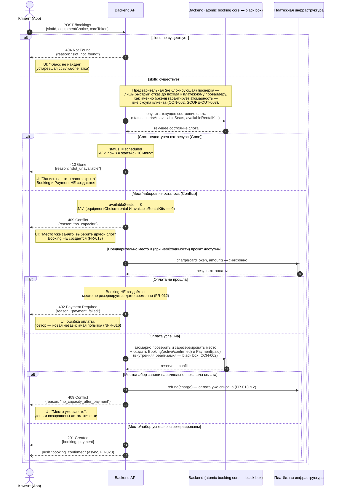

# Sequence-диаграмма: createBooking (POST /bookings)

> Источники сценария: `use-cases.md` UC-003; `functional-requirements.md` FR-007,
> FR-008, FR-009, FR-011…FR-014, FR-028; `non-functional-requirements.md` NFR-004,
> NFR-005, NFR-013, NFR-015, NFR-016; `constraints-and-scope.md` CON-002, CON-006,
> CON-007.

## Контекст веток ответа

| Код | Когда возникает | Что видит клиент |
|---|---|---|
| **404 Not Found** | `slotId` в запросе не существует вовсе (опечатка, устаревшая ссылка) | Сообщение «класс не найден»; Booking не создаётся |
| **201 Created** | Слот в `scheduled`, до старта > 10 минут, есть свободное место (и прокатный набор, если выбран прокат), оплата прошла синхронно | Подтверждённая бронь (`active/confirmed`), Payment `paid`, push-подтверждение (FR-020) |
| **409 Conflict** | Гонка на бэкенде: место (или прокатный набор) заняли раньше, чем завершилась текущая попытка | Сообщение «место уже занято» и предложение выбрать другой слот (FR-013); Booking не создаётся; если оплата уже успела списаться — автоматический возврат |
| **410 Gone** | Слот больше не доступен как ресурс: либо порог 10 минут до старта уже наступил, либо слот переведён в `cancelled_by_studio`/`completed` до обработки запроса | Сообщение о недоступности слота для записи; Booking не создаётся, оплата не инициируется |

Клиентское приложение не реализует собственную блокирующую логику или проверку
времени как источник истины (CON-002, CON-006, NFR-004, NFR-013) — это лишь
UI-подсказки (диздейбленные кнопки); финальное решение всегда принимает бэкенд.

> **Решение по коду ошибки (зафиксировано по итогам Q&A):** 404 Not Found — если
> `slotId` не существует вовсе (опечатка, устаревший deep link). 410 Gone —
> если слот существовал, но стал недоступен для записи (порог 10 минут,
> `cancelled_by_studio`, `completed`). Эти два случая теперь разведены в
> диаграмме ниже как отдельная первая проверка.

## Диаграмма

## Пояснения к веткам

- **410 Gone** трактуется как «ресурс, на который направлен запрос, больше не
  существует в бронируемом виде» — либо истёк временной порог (CON-006), либо
  слот уже переведён в `cancelled_by_studio`/`completed` административным
  действием студии (не входит в скоуп клиента, но меняет состояние ресурса
  раньше запроса клиента).
- **409 Conflict** — классическая гонка за последнее место/последний прокатный
  набор: два клиента почти одновременно отправили `createBooking` на слот с
  1 свободным местом; побеждает тот, чья транзакция на бэкенде закоммитилась
  первой (гарантия «0 двойных броней» — целиком на стороне бэкенда, CON-002).
  Отдельная под-ветка учитывает случай, когда оплата клиента уже успела пройти
  до момента проигрыша гонки, — тогда бэкенд обязан автоматически инициировать
  возврат (FR-013, BR-010), а не просто отклонить запрос.
- **201 Created** — единственный путь, где Booking и Payment создаются
  атомарно одним действием пользователя (FR-011, NFR-005): промежуточного
  статуса `pending` не существует по замыслу домена (CON-007).
- Ветка «Оплата не прошла» (402) добавлена для полноты картины UC-003/FR-012,
  но не входит в запрошенный набор 201/409/410. Она наступает уже *после*
  предварительной проверки вместимости (иначе клиента лишний раз отправляли бы
  к платёжному провайдеру на заведомо занятый слот) и оставлена как контекст
  для читаемости диаграммы.
- **404 Not Found** — отдельная, добавленная по итогам Q&A ветка для случая,
  когда `slotId` не существует вовсе (не путать с 410 — «слот был, но исчез»).
  Технически это тот же самый первый запрос, но семантически другая причина
  отказа, поэтому в диаграмме это отдельная проверка перед всеми остальными.
- **Внутренняя атомарность бронирования — чёрный ящик.** По итогам Q&A детали
  реализации (`SELECT ... FOR UPDATE`, транзакции, порядок `INSERT`/`UPDATE`)
  убраны из диаграммы: по CON-002 и SCOPE-OUT-003 то, как именно бэкенд
  гарантирует «0 двойных броней», не входит в скоуп клиентского приложения и
  рассматривается как чёрный ящик. Диаграмма показывает только два возможных
  исхода атомарной операции — `reserved` (место зарезервировано, Booking и
  Payment созданы) и `conflict` (место увели раньше) — не то, *как* бэкенд это
  гарантирует.

## Открытые вопросы и принятые решения

| № | Вопрос | Решение | Статус |
|---|---|---|---|
| 1 | Код ответа для несуществующего `slotId` | 404 Not Found, отдельно от 410 Gone — принято | ✅ Внесено в диаграмму |
| 2 | Показывать ли конкретную реализацию блокировки бэкенда (`SELECT FOR UPDATE`, транзакции) | Упростить до чёрного ящика `Backend: atomic check+reserve` — принято | ✅ Внесено в диаграмму |
