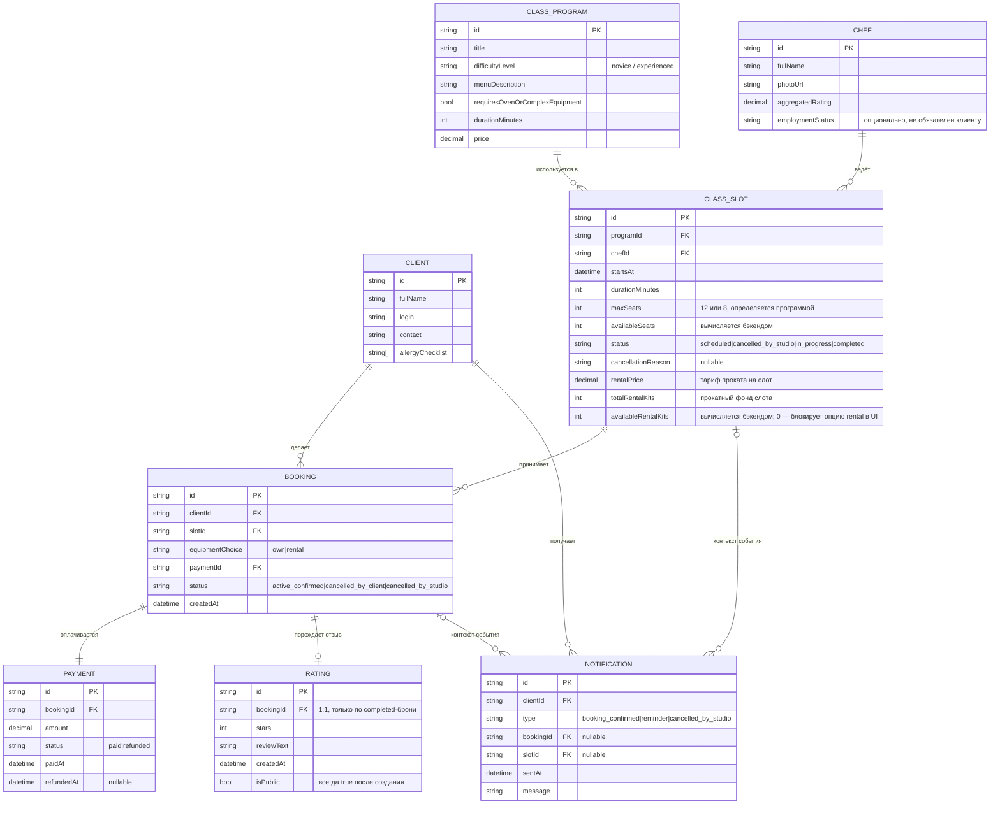

# ER-модель и модели сущностей клиентского приложения «Кулинарная студия»

> Скоуп: только роль «Клиент». Источники: `domain-description.md`, `business-requirements.md`,
> `functional-requirements.md`, `non-functional-requirements.md`, `constraints-and-scope.md`,
> `use-cases.md`, `user-stories.md`.

## 1. Легенда владения данными

Приложение — **read-only консьюмер бэкенда** почти для всех справочных сущностей
(CON-001, NFR-003, BR-008). Клиентские действия (бронь, отмена, оплата, оценка)
отправляются в API, но домен ими не управляется напрямую — бэкенд атомарно решает,
применить их или отклонить.

Использованы три пометки:

- 🔒 **Read-only** — сущность целиком приходит из бэкенда; клиентское приложение её не создаёт, не редактирует и не удаляет, только отображает.
- ✍️ **Client-write** — клиентское приложение инициирует создание/изменение записи (через API-запрос от лица клиента); финальное состояние всё равно фиксирует бэкенд.
- ⚙️ **System-derived** — запись меняется автоматически бэкендом как следствие другого события (отмена, форс-мажор), клиент это только наблюдает через push/UI.

## 2. ER-диаграмма

> Примечание к диаграмме (правка по итогам Q&A со стейкхолдером):
> `RentalKitFund` убран как отдельная сущность — прокатный фонд (`rentalPrice`,
> `totalRentalKits`, `availableRentalKits`) свёрнут в атрибуты `CLASS_SLOT`,
> так как в домене это 1:1-атрибут слота, а не самостоятельная сущность с
> собственным жизненным циклом (domain-description.md §3 «RentalKit»: тариф
> и фонд описаны как свойства, видимые «на конкретный слот»). `Booking` теперь
> ссылается на прокат только через `equipmentChoice = rental` — отдельный FK
> не нужен, потому что фонд один на слот и уже доступен через `slotId`.
> - `BOOKING — RATING`: «ровно одна бронь на отзыв (отзыв не может существовать
>   без конкретной завершённой брони) — ноль-или-один отзыв на бронь».
>
> Примечание к диаграмме: аллергии клиента (`allergyChecklist`) сознательно не
> дублируются в `BOOKING` отдельным полем — согласно `domain-description.md` §3
> «Booking» и §4, они хранятся только в профиле `CLIENT` и подтягиваются в бронь
> автоматически на уровне отображения/бизнес-логики бэкенда (FR-027), а не как
> отдельный персистентный атрибут связи.

## 3. Модели сущностей

### 3.1 Client — 🔒 Read-only (кроме входа)
Аутентификационные и профильные данные клиента, включая чек-лист аллергий.
Приложение выполняет **логин** (UC-001, FR-001), но не содержит функциональности
регистрации/редактирования профиля в этой поставке — сущность целиком читается
у бэкенда после успешной проверки учётных данных.

| Атрибут | Тип | Комментарий |
|---|---|---|
| id | string (PK) | |
| fullName | string | |
| login | string | используется для входа |
| contact | string | телефон/email |
| allergyChecklist | string[] | чек-лист аллергенов, источник — профиль (FR-027) |

**Кем меняется:** бэкенд/CRM студии (вне скоупа). Клиентское приложение — только читает при логине и при подстановке в бронь.

---

### 3.2 ClassProgram — 🔒 Read-only
Шаблон класса: что готовят, уровень, признак «требует духовки/сложной техники»
(влияет на `maxSeats` слота), длительность, стоимость (BR-008, CON-001, CON-004, CON-005).

| Атрибут | Тип | Комментарий |
|---|---|---|
| id | string (PK) | |
| title | string | |
| difficultyLevel | enum | novice / experienced |
| menuDescription | string | |
| requiresOvenOrComplexEquipment | bool | определяет лимит слота: 8 вместо 12 |
| durationMinutes | int | ориентировочно ~180 |
| price | decimal | отображается клиенту до оплаты (FR-010) |

**Кем меняется:** админ-интерфейс студии (SCOPE-OUT-002). Приложение — только читает.

---

### 3.3 Chef — 🔒 Read-only
Карточка ведущего: имя, фото, агрегированный рейтинг, публичные отзывы (FR-005).

| Атрибут | Тип | Комментарий |
|---|---|---|
| id | string (PK) | |
| fullName | string | |
| photoUrl | string | |
| aggregatedRating | decimal | считается бэкендом на основе Rating |
| employmentStatus | string, nullable | штатный/приглашённый — не обязателен к показу |

**Кем меняется:** админ-интерфейс студии. Рейтинг пересчитывается бэкендом как побочный эффект создания Rating клиентом (⚙️ System-derived), но сам объект Chef клиент не редактирует.

---

### 3.4 ClassSlot — 🔒 Read-only
Конкретное проведение программы конкретным шефом в конкретное время. Ключевая
справочная сущность экрана расписания (UC-002, FR-002…FR-007). Прокатный фонд
(тариф и остаток доступных наборов экипировки) смоделирован как атрибуты
самого слота, а не отдельная сущность, — по итогам ревью (см. «Открытые
вопросы» ниже): в домене это 1:1-свойство слота, без собственного жизненного
цикла (BR-005, US-007, FR-009).

| Атрибут | Тип | Комментарий |
|---|---|---|
| id | string (PK) | |
| programId | FK → ClassProgram | |
| chefId | FK → Chef | |
| startsAt | datetime | |
| durationMinutes | int | |
| maxSeats | int | 12 или 8 (CON-005), приходит от бэкенда, не вычисляется клиентом |
| availableSeats | int | вычисляется бэкендом, не кэшируется между экранами (NFR-015) |
| status | enum | scheduled / cancelled_by_studio / in_progress / completed |
| cancellationReason | string, nullable | заполняется при cancelled_by_studio (R-008) |
| rentalPrice | decimal | тариф проката на этот слот, отображается до оплаты (FR-010) |
| totalRentalKits | int | прокатный фонд слота (наборов фартук+нож) |
| availableRentalKits | int | вычисляется бэкендом; при 0 — вариант «прокатная» блокируется в UI (FR-009) |

**Кем меняется:** бэкенд/расписание студии — создание, статус `in_progress`/`completed` по времени, `cancelled_by_studio` — по решению студии (⚙️ System-derived относительно клиента). `availableSeats` и `availableRentalKits` уменьшаются атомарно бэкендом при успешном Booking. Приложение только читает и корректно обрабатывает отказ (CON-002, NFR-004).

---

### 3.5 Booking — ✍️ Client-write (create, cancel) / ⚙️ System-derived (studio-cancel)
Центральная сущность клиентского сценария — связь клиента и слота. Создаётся
**атомарно вместе с успешной оплатой** (UC-003, FR-011), отдельного статуса
«заявка» нет.

| Атрибут | Тип | Комментарий |
|---|---|---|
| id | string (PK) | |
| clientId | FK → Client | |
| slotId | FK → ClassSlot | |
| equipmentChoice | enum | own / rental — обязательный явный выбор (FR-008); при rental фонд берётся из слота (slotId), отдельного FK не требуется |
| paymentId | FK → Payment | 1:1, обязателен |
| status | enum | active_confirmed / cancelled_by_client / cancelled_by_studio |
| createdAt | datetime | |

**Кем меняется:**
- ✍️ Клиент инициирует **создание** (UC-003) и **отмену `cancelled_by_client`** (UC-004), но не позднее чем за 10 минут до начала (CON-006, FR-014/015) — финальную проверку порога и атомарность всё равно выполняет бэкенд (NFR-004, NFR-013).
- ⚙️ Переход в `cancelled_by_studio` клиент не инициирует — это следствие отмены слота студией (UC-005), приложение только отображает.
- Отдельных статусов «поздняя отмена»/no-show нет по замыслу (CON-008).

---

### 3.6 Payment — ⚙️ System-derived (инициируется клиентом, но не редактируется напрямую)
Оплата — синхронная и обязательная предпосылка Booking (FR-011, NFR-005). Модель
содержит только два статуса (CON-007).

| Атрибут | Тип | Комментарий |
|---|---|---|
| id | string (PK) | |
| bookingId | FK → Booking | 1:1 |
| amount | decimal | стоимость класса (+ проката, если выбран) |
| status | enum | paid / refunded — без промежуточных статусов |
| paidAt | datetime | |
| refundedAt | datetime, nullable | заполняется при автоматическом возврате |

**Кем меняется:** создаётся атомарно вместе с Booking как прямой результат
клиентского действия «оплатить и забронировать» (✍️ инициирован клиентом), но сам
процесс списания/возврата — целиком на бэкенд-платёжной инфраструктуре (CON-003,
NFR-008). Переход `paid → refunded` — всегда автоматический побочный эффект отмены
Booking (клиентом или студией), клиент не управляет статусом Payment напрямую
(BR-010, FR-016, FR-018).

---

### 3.7 Rating — ✍️ Client-write (только create)
Оценка и текстовый отзыв по завершённому классу (UC-006, FR-023…FR-025).

| Атрибут | Тип | Комментарий |
|---|---|---|
| id | string (PK) | |
| bookingId | FK → Booking | 1:1, только для Booking со слотом в статусе completed |
| stars | int | |
| reviewText | string | |
| createdAt | datetime | |
| isPublic | bool | всегда true с момента создания, приватности/премодерации нет (NFR-017) |

**Кем меняется:** клиент — только создание, ровно один раз. Редактирование и
удаление после отправки не предусмотрены ни в приложении, ни в API (NFR-014,
FR-024) — фактически это ✍️ **create-only**, без update/delete.

---

### 3.8 Notification — 🔒 Read-only
Push-уведомление клиенту, привязанное к брони/слоту (BR-007, FR-020…FR-022).

| Атрибут | Тип | Комментарий |
|---|---|---|
| id | string (PK) | |
| clientId | FK → Client | |
| type | enum | booking_confirmed / reminder / cancelled_by_studio |
| bookingId | FK, nullable | |
| slotId | FK, nullable | |
| sentAt | datetime | окно доставки reminder не гарантировано до минуты (NFR-011) |
| message | string | |

**Кем меняется:** исключительно бэкенд/сервис push-рассылки, как реакция на
события (создание Booking, приближение старта, отмена слота студией). Клиент
только получает и читает, настройки уведомлений недоступны (NFR-006, SCOPE-OUT-011).

## 4. Сводная таблица владения

| Сущность | Создаёт | Изменяет статус/данные | Право клиента |
|---|---|---|---|
| Client | студия/CRM (вне скоупа) | бэкенд | 🔒 read (кроме логина) |
| ClassProgram | админ студии | админ студии | 🔒 read-only |
| Chef | админ студии | админ студии, рейтинг — бэкенд агрегирует | 🔒 read-only |
| ClassSlot | админ студии | бэкенд (seats, rental-фонд, статусы), студия (cancelled_by_studio) | 🔒 read-only |
| Booking | **клиент** (через API, атомарно с оплатой) | **клиент** (cancel), бэкенд (studio-cancel) | ✍️ create + cancel |
| Payment | бэкенд, как следствие клиентского действия | бэкенд, автоматически (refund) | ⚙️ инициирует, не управляет напрямую |
| Rating | **клиент** | — (immutable) | ✍️ create-only |
| Notification | бэкенд/push-сервис | — | 🔒 read-only |

Единственные сущности, где приложение выступает **источником изменений**, а не
просто зеркалом бэкенда, — это `Booking` (создание и отмена клиентом) и `Rating`
(создание клиентом); всё остальное — производные события бэкенда или чисто
справочные, read-only данные (в соответствии с BR-008, CON-001, NFR-003).

## 5. Открытые вопросы и принятые решения

| № | Вопрос | Решение | Статус |
|---|---|---|---|
| 1 | Заводить ли `RentalKitFund` отдельной сущностью или свернуть в атрибуты `ClassSlot`? | Свернуть в атрибуты `ClassSlot` (`rentalPrice`, `totalRentalKits`, `availableRentalKits`) — принято | ✅ Внесено в модель |
