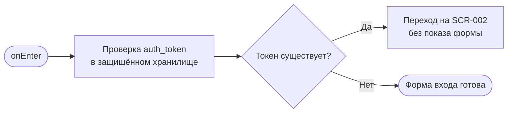
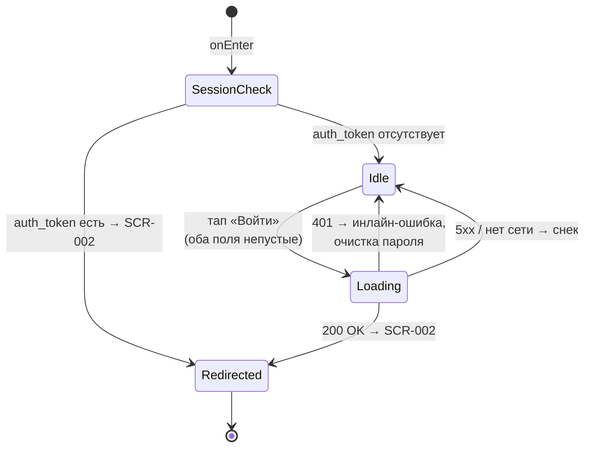

# Авторизация (логин)

**ID:** SCR-001  
**Тип:** Экран  
**Домен:** 01. Авторизация  
**Приоритет:** Critical  
**Статус:** Актуален  
**Функциональные блоки:** FB-001-001  
**Зона авторизации:** НЗ  
**Дизайн-бриф:** [SCR-001 Авторизация](../../3-design-brief/SCR-001-login.md)

---

## Содержание

- [История изменений](#история-изменений)
- [Обзор](#обзор)
- [Навигация](#навигация)
- [Входные данные](#входные-данные)
- [Применяемые логики](#применяемые-логики)
- [Инициализация](#инициализация)
- [Используемые запросы](#используемые-запросы)
- [Макет экрана](#макет-экрана)
- [Элементы экрана](#элементы-экрана)
- [Состояния экрана](#состояния-экрана)
- [Действия пользователя](#действия-пользователя)
- [Связанные требования](#связанные-требования)
- [Критерии приёмки](#критерии-приёмки)

---

## История изменений

| Релиз | ТЗ | Описание изменений |
|-------|-----|-------------------|
| 1.0.0 | [SCR-001 Авторизация](../../3-design-brief/SCR-001-login.md) | Первоначальная документация экрана авторизации |

---

## Обзор

Экран авторизации — единственная точка входа в приложение. Открывается первым при запуске, без исключений и без гостевого режима. Назначение экрана — проверить учётные данные клиента и при успехе пропустить его к расписанию классов (SCR-002). Восстановление пароля и регистрация в поставке отсутствуют, любые ссылки и подсказки на них запрещены (см. [SCR-001 Авторизация](../../3-design-brief/SCR-001-login.md), п.9, п.12).

### User Story

> Как клиент, я хочу войти по логину и паролю,
> чтобы получить доступ к расписанию классов.

### Бизнес-ценность

- Обязательная авторизация как шлюз к любым данным приложения — доступ только идентифицированных клиентов.
- Минимум трения для постоянного клиента: быстрая форма без промежуточной валидации и лишних шагов.
- Единый идентификатор клиента, на который опираются персонификация (аллергии) и привязка броней.

---

## Навигация

### Входящая (откуда открывается)

| Источник | Триггер | Условие | Передаваемые параметры |
|----------|---------|---------|------------------------|
| Запуск приложения | onEnter | Всегда (точка входа) | — |
| [SCR-012 Профиль клиента](../06-profile/SCR-012-client-profile.md) | Тап «Выйти из аккаунта» | Явный выход (см. [LOGIC-001](../09-logics/LOGIC-001-auth-and-session.md)) | — |
| Любой авторизованный экран | Глобальный перехват 401 | Токен отсутствует/недействителен (см. [LOGIC-001](../09-logics/LOGIC-001-auth-and-session.md)) | — |

### Исходящая (куда ведёт)

| Назначение | Триггер | Передаваемые параметры |
|------------|---------|------------------------|
| [SCR-002 Расписание классов](../02-schedule/SCR-002-schedule.md) | Успешный вход (200 OK) ИЛИ обнаружен сохранённый токен при onEnter | — |

> Возврата «назад» с SCR-001 нет — это точка входа (см. [SCR-001 Авторизация](../../3-design-brief/SCR-001-login.md), п.11).

---

## Входные данные

| Название | Тип | Возможные значения | Описание |
|----------|-----|-------------------|----------|
| `auth_token` | Защищённое хранилище | Наличие / отсутствие JWT | Определяет восстановление сессии при onEnter (см. [LOGIC-001](../09-logics/LOGIC-001-auth-and-session.md)) |
| `login` | Ввод пользователя | Произвольная непустая строка | Логин клиента, выдаётся студией |
| `password` | Ввод пользователя | Произвольная непустая строка | Пароль клиента, ввод маскирован |

---

## Применяемые логики

| Логика | Элемент/Триггер | Описание |
|--------|-----------------|----------|
| [LOGIC-001 Авторизация и управление сессией](../09-logics/LOGIC-001-auth-and-session.md) | onEnter, кнопка «Войти» | Вход через POST /auth/login, сохранение токена и профиля, восстановление сессии при старте |

---

## Инициализация

> При открытии экрана удалённые запросы не отправляются. Решение о показе формы входа или переходе на SCR-002 принимается по локальной проверке токена в защищённом хранилище (см. [LOGIC-001](../09-logics/LOGIC-001-auth-and-session.md)).

### Диаграмма загрузки



### Запросы при открытии

| № | Запрос | Критичный | Зависит от | Условие |
|---|--------|-----------|------------|---------|
| 1 | Локальная проверка `auth_token` в защищённом хранилище | Да | — | Всегда |

> Удалённые запросы при открытии отсутствуют. Полное описание запроса отправки формы см. в секции [Используемые запросы](#используемые-запросы).

---

## Используемые запросы

### login

**Тип:** REST  
**Метод:** POST  
**Спецификация:** [openapi.yaml](../../api/openapi.yaml) → `login` (POST /auth/login)

**Триггер:** Тап на кнопку «Войти»

**Параметры:**

| Параметр | Тип | Обязательность | Источник | Описание |
|----------|-----|----------------|----------|----------|
| `login` | string | Да | Поле «Логин» | Логин клиента |
| `password` | string | Да | Поле «Пароль» | Пароль клиента |

**Обработка ответа:**

| Результат | Условие | UI-реакция |
|-----------|---------|------------|
| Загрузка | — | Лоадер на кнопке «Войти», блокировка полей и кнопки |
| Успех | HTTP 200 | Сохранить `token` и `user` (ClientProfile) в защищённое хранилище → переход на [SCR-002](../02-schedule/SCR-002-schedule.md) (см. [LOGIC-001](../09-logics/LOGIC-001-auth-and-session.md)) |
| HTTP 401 | `reason = invalid_credentials` | Инлайн-ошибка/снек «Неверный логин или пароль» (текст из `ErrorResponse.message`); очистить поле «Пароль»; поле «Логин» оставить без изменений |
| HTTP 5xx | — | Снек «Произошла ошибка. Попробуйте позже»; поля не очищать |
| Сеть | Нет соединения | Снек «Нет соединения. Проверьте подключение к интернету»; поля не очищать |

---

## Макет экрана

### Структура

```
┌─────────────────────────────────────┐
│                                     │
│         [Лого / атмосфера студии]   │  ← Бренд-зона (фон)
│                                     │
├─────────────────────────────────────┤
│  Поле «Логин»                       │
│  Поле «Пароль»                      │  ← Форма входа
│  Инлайн-сообщение об ошибке (опц.)  │
│                                     │
│         [ Кнопка «Войти» ]          │  ← Primary
└─────────────────────────────────────┘
```

### Компоненты

| Компонент | Описание | Обязательность |
|-----------|----------|----------------|
| Бренд-зона | Лого/иллюстрация студии как фон, узнавание бренда | Да |
| Форма входа | Поля «Логин», «Пароль», кнопка «Войти» | Да |
| Инлайн-ошибка | Сообщение «Неверный логин или пароль» | Опционально (только при 401) |

---

## Элементы экрана

### 1. Бренд-зона

| Элемент | Описание | Источник данных | Валидация | Действие |
|---------|----------|-----------------|-----------|----------|
| Лого/иллюстрация | Атмосфера кулинарной студии, узнавание бренда за первые секунды | Статика | — | — |

**Логика:**
- Декоративный элемент, не отвлекает от полей ввода и кнопки (см. [SCR-001 Авторизация](../../3-design-brief/SCR-001-login.md), п.6).

### 2. Форма входа

| Элемент | Описание | Источник данных | Валидация | Действие |
|---------|----------|-----------------|-----------|----------|
| Поле «Логин» | Текстовый ввод логина | Ввод пользователя | Обязательное; непустое значение. Промежуточная ошибка не показывается | — |
| Поле «Пароль» | Текстовый ввод пароля, маскированный | Ввод пользователя | Обязательное; непустое значение. Промежуточная ошибка не показывается | — |
| Кнопка «Войти» | Primary button, отправка формы | — | — | Валидация непустых полей → запрос [login](#login) |

**Момент валидации:** При отправке формы (тап «Войти»). Промежуточная валидация при вводе не применяется, чтобы не раздражать пользователя (см. [SCR-001 Авторизация](../../3-design-brief/SCR-001-login.md), п.5).

**Логика:**
- Кнопка «Войти»: При тапе → проверка, что оба поля непустые → при успехе отправить запрос [login](#login) через [LOGIC-001](../09-logics/LOGIC-001-auth-and-session.md).
- На экране запрещены: регистрация нового аккаунта, восстановление пароля в любом виде (ссылки/подсказки/намёки), гостевой режим, предпросмотр расписания, выбор языка/валюты (см. [SCR-001 Авторизация](../../3-design-brief/SCR-001-login.md), п.9, п.12; CON-009).

**Условия доступности:**
- Кнопка «Войти» активна, если: поле «Логин» непустое И поле «Пароль» непустое.
- Во время запроса [login](#login) кнопка и поля заблокированы, на кнопке — лоадер.

### 3. Сообщение об ошибке входа

| Элемент | Описание | Источник данных | Валидация | Действие |
|---------|----------|-----------------|-----------|----------|
| Инлайн-сообщение/снек | Текст ошибки входа | `ErrorResponse.message` из [login](#login) | — | — |

**Логика:**
- При 401 отображается общий текст «Неверный логин или пароль» (без уточнения, что именно неверно) — из соображений безопасности (см. [SCR-001 Авторизация](../../3-design-brief/SCR-001-login.md), п.5, п.8). Тон сообщения — нейтральный, без обвинительной интонации.

---

## Состояния экрана

### Таблица состояний

| Состояние | Условие | Отображение |
|-----------|---------|-------------|
| Idle | Пустая форма (по умолчанию) / заполнение без отправки | Форма ввода, кнопка «Войти» активна при непустых полях |
| Loading | Ожидание ответа [login](#login) | Лоадер на кнопке «Войти», поля и кнопка заблокированы |
| Error | HTTP 401 / 5xx / нет сети | Инлайн-ошибка «Неверный логин или пароль» (401) или снек (5xx/сеть); форма остаётся доступной для повтора |
| Redirected | HTTP 200 или найден токен при onEnter | Переход на [SCR-002](../02-schedule/SCR-002-schedule.md) |

### Диаграмма переходов



---

## Действия пользователя

| Действие | Элемент | Триггер | Результат |
|----------|---------|---------|-----------|
| Ввести логин | Поле «Логин» | Ввод текста | Значение сохраняется в поле |
| Ввести пароль | Поле «Пароль» | Ввод текста | Значение маскировано, кнопка «Войти» активируется при непустых полях |
| Отправить форму | Кнопка «Войти» | Tap | Запрос [login](#login) → при успехе переход на [SCR-002](../02-schedule/SCR-002-schedule.md); при 401 — ошибка + очистка пароля |
| Повторить ввод | Поля «Логин»/«Пароль» | Tap | Повторная отправка формы (новая независимая попытка) |

---

## Связанные требования

### Функциональные

| ID | Название | Приоритет |
|----|----------|-----------|
| FR-001 | Обязательная авторизация до показа расписания; экран логина — первый экран, гостевого режима нет | Must |
| UC-001 | Авторизация клиента | Must |

### Интеграции

| ID | Название | Приоритет |
|----|----------|-----------|
| NFR-008 | Клиент не хранит чувствительные данные без необходимости; в защищённом хранилище держится только токен и профиль (платёжные реквизиты не хранятся) | Must |

### UI

| ID | Название | Приоритет |
|----|----------|-----------|
| US-001 | Вход по логину и паролю для доступа к расписанию | Must |

### Данные

| ID | Название | Приоритет |
|----|----------|-----------|
| NFR-003 | Приложение — не источник истины, учётные данные проверяются бэкендом | Must |
| CON-009 | Одноязычный (русский) интерфейс, без выбора языка/валюты | Must |

---

## Критерии приёмки

### Позитивные сценарии

| ID | Критерий | Приоритет |
|----|----------|-----------|
| AC-001 | **Дано** клиент на SCR-001 с пустой формой и без сохранённого токена, **Когда** вводит валидные логин и пароль и нажимает «Войти», **Тогда** отправляется POST /auth/login, при 200 `token` и `user` (ClientProfile) сохраняются в защищённое хранилище и выполняется переход на SCR-002 | P0 |
| AC-002 | **Дано** у клиента есть сохранённый `auth_token` в защищённом хранилище, **Когда** он запускает приложение, **Тогда** форма входа не показывается, выполняется прямой переход на SCR-002 (восстановление сессии) | P0 |
| AC-003 | **Дано** оба поля заполнены, **Когда** клиент нажимает «Войти», **Тогда** на кнопке появляется лоадер, поля и кнопка блокируются на время запроса | P0 |

### Негативные сценарии

| ID | Критерий | Приоритет |
|----|----------|-----------|
| AC-N01 | **Дано** клиент ввёл неверные учётные данные, **Когда** нажимает «Войти», **Тогда** POST /auth/login возвращает 401 `invalid_credentials`, показывается сообщение «Неверный логин или пароль» (без уточнения, что именно неверно), поле «Пароль» очищается, поле «Логин» сохраняется, доступ к SCR-002 не предоставляется | P0 |
| AC-N02 | **Дано** хотя бы одно из полей «Логин»/«Пароль» пусто, **Тогда** кнопка «Войти» неактивна (отправка невозможна) | P0 |
| AC-N03 | **Дано** сервер вернул 5xx, **Когда** клиент нажимает «Войти», **Тогда** показывается снек «Произошла ошибка. Попробуйте позже», поля не очищаются, форма доступна для повтора | P1 |
| AC-N04 | **Дано** нет соединения с сетью, **Когда** клиент нажимает «Войти», **Тогда** показывается снек «Нет соединения. Проверьте подключение к интернету», поля не очищаются | P1 |
| AC-N05 | **Дано** визуальная проверка экрана, **Тогда** на нём отсутствуют любые ссылки/подсказки/намёки на восстановление пароля и регистрацию, а также выбор языка/валюты (соответствие брифу и CON-009) | P0 |

### Граничные условия (Edge Cases)

| ID | Критерий | Приоритет |
|----|----------|-----------|
| AC-E01 | **Дано** запрос [login](#login) уже выполняется (лоадер на кнопке), **Когда** клиент повторно тапает «Войти», **Тогда** повторный запрос не отправляется (кнопка залочена) | P1 |
| AC-E02 | **Дано** во время загрузки потеряна сеть, **Когда** запрос завершается ошибкой сети, **Тогда** показывается снек «Нет соединения. Проверьте подключение к интернету», форма остаётся доступной для повтора | P2 |
| AC-E03 | **Дано** при работе в приложении любой запрос вернул 401 (истёкшая/недействительная сессия), **Тогда** сессия очищается и клиент возвращается на SCR-001 (глобальный перехват, см. [LOGIC-001](../09-logics/LOGIC-001-auth-and-session.md)) | P1 |
| AC-E04 | **Дано** клиент вводит только пробелы в одном из полей, **Тогда** поле трактуется как пустое, кнопка «Войти» остаётся неактивной | P2 |

---
