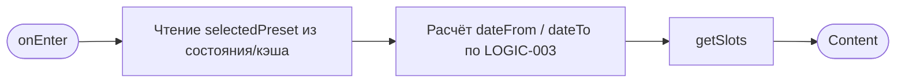
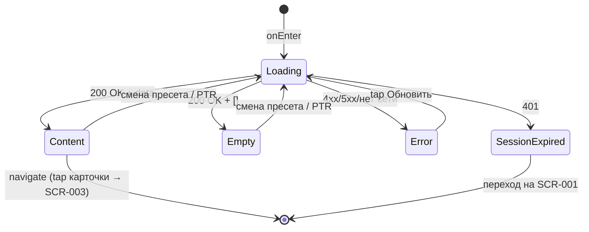

# Расписание классов

**ID:** SCR-002  
**Тип:** Экран  
**Домен:** 02. Расписание и классы  
**Приоритет:** Critical  
**Статус:** Черновик  
**Функциональные блоки:** FB-002-001 Расписание, FB-002-002 Карточка слота, FB-002-003 Фильтр дат  
**Зона авторизации:** АЗ  
**Дизайн-бриф:** [SCR-002 Расписание классов](../../3-design-brief/SCR-002-schedule.md)

---

## Содержание

- [История изменений](#история-изменений)
- [Обзор](#обзор)
- [Навигация](#навигация)
- [Входные данные](#входные-данные)
- [Применяемые логики](#применяемые-логики)
- [Свойства Bottom Sheet](#свойства-bottom-sheet)
- [Инициализация](#инициализация)
- [Используемые запросы](#используемые-запросы)
- [Макет экрана](#макет-экрана)
- [Элементы экрана](#элементы-экрана)
- [Состояния экрана](#состояния-экрана)
- [Действия пользователя](#действия-пользователя)
- [Связанные требования](#связанные-требования)
- [Критерии приёмки](#критерии-приёмки)
---

## История изменений

| Релиз | ТЗ | Описание изменений |
|-------|-----|-------------------|
| — | — | Первоначальная документация |

---

## Обзор

Домашний экран приложения и точка входа после авторизации. Отображает список доступных классов (слотов) на ближайшие 7 дней по умолчанию с возможностью расширить горизонт пресетами 14 и 30 дней. Пользователь сканирует и сравнивает классы, чтобы выбрать подходящий для подробного просмотра. Запись «в один тап» и лист ожидания отсутствуют: экран предназначен для обзора, а не для оформления брони.

### User Story

> Как клиент, я хочу видеть список классов на ближайшие 7 дней
> и расширять горизонт фильтром по датам, чтобы выбрать подходящий по времени и теме класс.

### Бизнес-ценность

- Первичная точка взаимодействия с продуктом после входа.
- Даёт быстрый обзор доступности мест и расписания без необходимости открывать каждый класс.
- Снижает ложные ожидания: занятые и отменённые слоты видны, но визуально отличимы.

---

## Навигация

### Входящая (откуда открывается)

| Источник | Триггер | Условие | Передаваемые параметры |
|----------|---------|---------|------------------------|
| [SCR-001 Авторизация](../01-auth/SCR-001-login.md) | Успешный вход | Всегда | — |
| Постоянная навигация (таб-бар) | Переключение на вкладку «Расписание» | Всегда | — |
| [SCR-007 Результат бронирования](../03-booking/SCR-007-booking-result.md) | Исход «Место уже занято» | Всегда | — |

### Исходящая (куда ведёт)

| Назначение | Триггер | Передаваемые параметры |
|------------|---------|------------------------|
| [SCR-003 Детали класса](SCR-003-slot-details.md) | Тап по карточке слота | `slotId`, `slot` (превью объекта Slot) |

---

## Входные данные

| Название | Тип | Возможные значения | Описание |
|----------|-----|-------------------|----------|
| `selectedPreset` | Состояние / Локальный кэш | `7`, `14`, `30` | Активный пресет диапазона дат. По умолчанию `7`. Управляется [LOGIC-003](../09-logics/LOGIC-003-schedule-date-filter.md). |
| `token` | Защищённое хранилище | JWT | Bearer-токен авторизации. При отсутствии — переход на SCR-001. |

---

## Применяемые логики

| Логика | Элемент/Триггер | Описание |
|--------|-----------------|----------|
| [LOGIC-003 Фильтр расписания по диапазону дат](../09-logics/LOGIC-003-schedule-date-filter.md) | Переключатель пресетов 7/14/30 | Расчёт `dateFrom`/`dateTo` и перезапрос списка при смене пресета. |
| [LOGIC-002 Доступность слота для записи](../09-logics/LOGIC-002-slot-availability.md) | Карточка слота | Визуальное отличие карточки: приглушение при `availableSeats = 0`, метка при `cancelled_by_studio`. |
| [LOGIC-001 Истечение сессии](../09-logics/LOGIC-001-session-expiry.md) | HTTP 401 от любого запроса | Глобальная обработка: очистка сессии, переход на SCR-001. |

---

## Свойства Bottom Sheet

> Не применимо (тип: Экран).

---

## Инициализация

### Диаграмма загрузки



### Запросы при открытии

| № | Запрос | Критичный | Зависит от | Условие |
|---|--------|-----------|------------|---------|
| 1 | [getSlots](#getslots) | Да | — | Всегда (активный пресет, по умолчанию 7) |

> Полное описание запросов см. в секции [Используемые запросы](#используемые-запросы).

---

## Используемые запросы

### getSlots

**Тип:** REST  
**Метод:** GET  
**Спецификация:** [openapi.yaml](../../api/openapi.yaml) → `getSlots` (GET /slots)

**Триггер:** Инициализация; смена пресета диапазона; pull-to-refresh.

**Параметры:**

| Параметр | Тип | Обязательность | Источник | Описание |
|----------|-----|----------------|----------|----------|
| `dateFrom` | string (date) | Да | `сегодня` (LOGIC-003) | Начальная дата (включительно), формат YYYY-MM-DD. |
| `dateTo` | string (date) | Да | `сегодня + selectedPreset` (LOGIC-003) | Конечная дата (включительно), формат YYYY-MM-DD. |
| `authorization` | string | Да | Защищённое хранилище | `Bearer <token>`. |

**Обработка ответа:**

| Результат | Условие | UI-реакция |
|-----------|---------|------------|
| Загрузка (первая) | — | Скелетон / шиммер списка. |
| Загрузка (смена пресета / PTR) | — | Текущий контент остаётся видимым; лёгкий индикатор обновления (без full-screen скелетона). |
| Успех | `data` не пуст | Отрисовать карточки слотов. |
| Успех | `data` пуст | Empty state «Пока нет доступных классов». |
| HTTP 401 | — | [LOGIC-001](../09-logics/LOGIC-001-session-expiry.md): очистка сессии, переход на SCR-001. |
| HTTP 4xx (кроме 401) | — | Error state с кнопкой «Обновить». |
| HTTP 5xx | — | Error state с кнопкой «Обновить». |
| Сеть | Нет соединения | Error state с кнопкой «Обновить». |

---

## Макет экрана

### Структура

```
┌─────────────────────────────────────┐
│  Расписание                  [≡]     │  ← Header (заголовок вкладки)
├─────────────────────────────────────┤
│  [ 7 дней ][ 14 дней ][ 30 дней ]   │  ← Пресеты диапазона (LOGIC-003)
├─────────────────────────────────────┤
│  ┌─────────────────────────────────┐│
│  │ Карточка слота                  ││
│  │  дата/время · места · программа ││
│  │  стоимость · шеф                ││
│  └─────────────────────────────────┘│
│  ┌─────────────────────────────────┐│
│  │ Карточка слота ...              ││  ← Scrollable список
│  └─────────────────────────────────┘│
│              ...                    │
└─────────────────────────────────────┘
```

### Компоненты

| Компонент | Описание | Обязательность |
|-----------|----------|----------------|
| Заголовок | Название вкладки «Расписание». | Да |
| Переключатель пресетов | Быстрые диапазоны 7 / 14 / 30 дней. | Да |
| Список карточек слотов | Вертикальный список карточек. | Да |
| Карточка слота | Компактное представление класса. | Да |

---

## Элементы экрана

### 1. Переключатель пресетов диапазона

| Элемент | Описание | Источник данных | Валидация | Действие |
|---------|----------|-----------------|-----------|----------|
| Пресет «7 дней» | Диапазон по умолчанию. | `selectedPreset` | — | Активировать → [LOGIC-003](../09-logics/LOGIC-003-schedule-date-filter.md) → [getSlots](#getslots) |
| Пресет «14 дней» | Расширенный диапазон. | `selectedPreset` | — | Активировать → [LOGIC-003](../09-logics/LOGIC-003-schedule-date-filter.md) → [getSlots](#getslots) |
| Пресет «30 дней» | Максимальный диапазон. | `selectedPreset` | — | Активировать → [LOGIC-003](../09-logics/LOGIC-003-schedule-date-filter.md) → [getSlots](#getslots) |

**Логика:**
- Переключатель пресетов: [LOGIC-003](../09-logics/LOGIC-003-schedule-date-filter.md) — `dateFrom = сегодня`, `dateTo = сегодня + N`, перезапрос `getSlots` при смене пресета.

**Условия доступности:**
- Активный пресет визуально выделен; смена пресета блокирует повторный тап до завершения перезапроса.

---

### 2. Карточка слота

> Приоритеты контента (по убыванию значимости): дата/время начала (1), доступность мест (2), программа (3), стоимость (4), шеф (5).

| Элемент | Описание | Источник данных | Валидация | Действие |
|---------|----------|-----------------|-----------|----------|
| Дата и время начала | Дата и время старта класса (приоритет 1). | `startsAt` из getSlots | Формат «5 июля, 18:00» | Открыть [SCR-003 Детали класса](SCR-003-slot-details.md) |
| Доступность мест | Индикатор свободных мест (приоритет 2). | `availableSeats`, `maxSeats` из getSlots | `availableSeats = 0` → «Мест нет» | Открыть [SCR-003 Детали класса](SCR-003-slot-details.md) |
| Программа | Тема класса (приоритет 3). | `program.name` из getSlots | — | Открыть [SCR-003 Детали класса](SCR-003-slot-details.md) |
| Стоимость | Цена участия (приоритет 4). | `price` из getSlots | — | Открыть [SCR-003 Детали класса](SCR-003-slot-details.md) |
| Шеф | Имя шефа (приоритет 5). | `chef.name` из getSlots | — | Открыть [SCR-003 Детали класса](SCR-003-slot-details.md) |
| Метка «Отменён» | Индикатор отмены студией. | `status = cancelled_by_studio` из getSlots | — | — |

**Логика:**
- Карточка слота: [LOGIC-002](../09-logics/LOGIC-002-slot-availability.md) — визуальное отличие по доступности. При `availableSeats = 0` карточка приглушена, отображается «Мест нет». При `status = cancelled_by_studio` показывается метка «Отменён» (класс остаётся в общем списке). Карточка остаётся тапабельной в любом состоянии (ведёт на SCR-003).

**Условия доступности:**
- Карточка доступна для тапа всегда (включая занятые и отменённые слоты).

---

## Состояния экрана

### Таблица состояний

| Состояние | Условие | Отображение |
|-----------|---------|-------------|
| Loading (первая) | Ожидание getSlots при входе | Скелетон / шиммер списка. |
| Loading (смена пресета / PTR) | Перезапрос getSlots | Текущий список остаётся видимым + лёгкий индикатор обновления. |
| Content | getSlots 200 + data | Стандартный список карточек. |
| Empty | getSlots 200 + пустой массив | Заглушка «Пока нет доступных классов». |
| Error | getSlots 4xx (кроме 401) / 5xx / нет сети | Error state с кнопкой «Обновить». |
| SessionExpired | getSlots 401 | [LOGIC-001](../09-logics/LOGIC-001-session-expiry.md): очистка сессии, переход на SCR-001. |

### Диаграмма переходов



---

## Действия пользователя

| Действие | Элемент | Триггер | Результат |
|----------|---------|---------|-----------|
| Открыть детали класса | Карточка слота | Tap | Переход на [SCR-003 Детали класса](SCR-003-slot-details.md) с `slotId` и превью `slot`. |
| Сменить диапазон | Пресет 7/14/30 | Tap | [LOGIC-003](../09-logics/LOGIC-003-schedule-date-filter.md) → перезапрос [getSlots](#getslots). |
| Обновить список | Любая область списка | Pull-to-refresh | Перезапрос [getSlots](#getslots) с активным пресетом. |
| Повторить загрузку | Кнопка «Обновить» (Error state) | Tap | Перезапрос [getSlots](#getslots). |

---

## Связанные требования

### Функциональные (FR / UC)

| ID | Название | Приоритет |
|----|----------|-----------|
| FR-002 | Список слотов на 7 дней по умолчанию + фильтр по датам | Must |
| FR-003 | Empty state «Пока нет доступных классов» | Must |
| FR-004 | Карточка слота: дата/время, длительность, программа, стоимость, шеф, места | Must |
| FR-006 | Отображение статуса слота | Must |
| FR-007 | Блокировка записи при `availableSeats = 0` без листа ожидания | Must |
| UC-002 | Просмотр расписания классов | Must |

### Интеграции (NFR / CON)

| ID | Название | Приоритет |
|----|----------|-----------|
| NFR-018 | Отсутствие realtime-обновления (обновление по инициативе клиента) | Should |
| CON-001 | Приложение — read-only консьюмер API | Must |

### UI (US)

| ID | Название | Приоритет |
|----|----------|-----------|
| US-002 | Список классов на ближайшие 7 дней | Must |
| US-003 | Расширение горизонта фильтром по датам | Should |

### Данные (NFR / CON)

| ID | Название | Приоритет |
|----|----------|-----------|
| NFR-003 | Приложение не источник истины для справочных сущностей | Must |
| NFR-015 | Данные о местах актуальны только из свежего ответа бэкенда | Must |
| CON-001 | Приложение — read-only консьюмер API | Must |

---

## Критерии приёмки

### Позитивные сценарии

| ID | Критерий | Приоритет |
|----|----------|-----------|
| AC-001 | **Дано** авторизованный клиент, **Когда** вход на SCR-002, **Тогда** отправляется getSlots с `dateFrom=сегодня`, `dateTo=сегодня+7` и отображается список карточек. | P0 |
| AC-002 | **Дано** список слотов, **Когда** тап по карточке, **Тогда** переход на SCR-003 с передачей `slotId` и превью `slot`. | P0 |
| AC-003 | **Дано** слот с `availableSeats = 0`, **Когда** отрисовка списка, **Тогда** карточка приглушена и содержит «Мест нет», но остаётся тапабельной. | P0 |
| AC-004 | **Дано** слот со `status = cancelled_by_studio`, **Когда** отрисовка списка, **Тогда** карточка содержит метку «Отменён» и остаётся в общем списке. | P1 |
| AC-005 | **Дано** активный пресет 7, **Когда** выбор пресета «30 дней», **Тогда** `dateTo` пересчитывается на `сегодня+30`, getSlots перезапрашивается, список обновляется без full-screen скелетона. | P0 |
| AC-006 | **Дано** список на экране, **Когда** pull-to-refresh, **Тогда** getSlots перезапрашивается с активным пресетом. | P1 |

### Негативные сценарии

| ID | Критерий | Приоритет |
|----|----------|-----------|
| AC-N01 | **Дано** нет соединения, **Когда** открытие экрана, **Тогда** отображается error state с кнопкой «Обновить». | P0 |
| AC-N02 | **Дано** getSlots возвращает 5xx, **Когда** обработка ответа, **Тогда** отображается error state с кнопкой «Обновить». | P0 |
| AC-N03 | **Дано** getSlots возвращает 401, **Когда** обработка ответа, **Тогда** сессия очищается и осуществляется переход на SCR-001 ([LOGIC-001](../09-logics/LOGIC-001-session-expiry.md)). | P0 |
| AC-N04 | **Дано** getSlots возвращает пустой массив, **Когда** обработка ответа, **Тогда** отображается empty state «Пока нет доступных классов». | P0 |

### Граничные условия (Edge Cases)

| ID | Критерий | Приоритет |
|----|----------|-----------|
| AC-E01 | **Дано** смена пресета во время выполнения предыдущего запроса, **Когда** повторный тап, **Тогда** активен только последний запрос (предыдущий результат игнорируется). | P1 |
| AC-E02 | **Дано** нет листа ожидания и записи «в один тап», **Когда** тап по карточке, **Тогда** происходит только переход на SCR-003 (без оформления брони из списка). | P1 |
| AC-E03 | **Дано** потеря сети во время смены пресета, **Когда** восстановление, **Тогда** доступен повтор через кнопку «Обновить» или повторный выбор пресета. | P2 |

---
