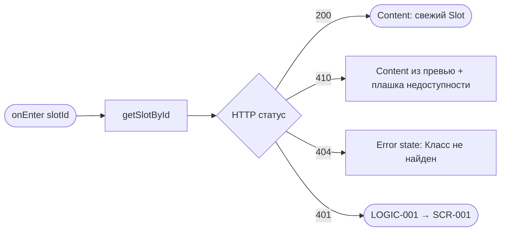
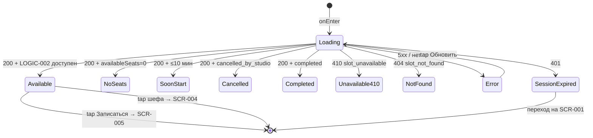

# Детали класса (слот)

**ID:** SCR-003  
**Тип:** Экран  
**Домен:** 02. Расписание и классы  
**Приоритет:** Critical  
**Статус:** Черновик  
**Функциональные блоки:** FB-003-001 Детали слота, FB-003-002 Доступность записи, FB-003-003 Блок шефа, FB-003-004 Сигнал проката  
**Зона авторизации:** АЗ  
**Дизайн-бриф:** [SCR-003 Детали класса](../../3-design-brief/SCR-003-slot-details.md)

---

## Содержание

- [История изменений](#история-изменений)
- [Обзор](#обзор)
- [Навигация](#навигация)
- [Входные данные](#входные-данные)
- [Применяемые логики](#применяемые-логики)
- [Свойства Bottom Sheet](#свойства-bottom-sheet)
- [Инициализация](#инициализация)
- [Используемые запросы](#используемые-запросы)
- [Макет экрана](#макет-экрана)
- [Элементы экрана](#элементы-экрана)
- [Состояния экрана](#состояния-экрана)
- [Действия пользователя](#действия-пользователя)
- [Связанные требования](#связанные-требования)
- [Критерии приёмки](#критерии-приёмки)
---

## История изменений

| Релиз | ТЗ | Описание изменений |
|-------|-----|-------------------|
| — | — | Первоначальная документация |

---

## Обзор

Промежуточный экран между сканированием расписания и решением о записи. Пользователь, заинтересовавшийся конкретным классом, собирает достаточно информации, чтобы решить «записываюсь / не записываюсь», без перехода к оплате. Здесь же определяется доступность записи по правилу [LOGIC-002](../09-logics/LOGIC-002-slot-availability.md) и формируется явная причина недоступности, если запись закрыта.

### User Story

> Как клиент, я хочу увидеть полную информацию о классе и понять, доступна ли ещё запись,
> чтобы принять взвешенное решение перед оформлением брони.

### Бизнес-ценность

- Снимает неоднозначность: причина недоступности записи показана явно, а не скрыта.
- Разделяет «узнать о классе» и «оформить бронь» — оплата и выбор экипировки вынесены на SCR-005/SCR-006.
- Даёт углубление в профиль шефа (SCR-004) как фактор доверия.

---

## Навигация

### Входящая (откуда открывается)

| Источник | Триггер | Условие | Передаваемые параметры |
|----------|---------|---------|------------------------|
| [SCR-002 Расписание классов](SCR-002-schedule.md) | Тап по карточке слота | Всегда | `slotId`, `slot` (превью объекта Slot) |
| [SCR-004 Профиль шефа](SCR-004-chef-profile.md) | Тап по другому классу шефа | Всегда | `slotId`, `slot` (превью объекта Slot) |

### Исходящая (куда ведёт)

| Назначение | Триггер | Передаваемые параметры |
|------------|---------|------------------------|
| [SCR-002 Расписание классов](SCR-002-schedule.md) | «Назад» | — |
| [SCR-004 Профиль шефа](SCR-004-chef-profile.md) | Тап по имени/фото шефа | `chefId`, `chef` (превью) |
| [SCR-005 Оформление брони](../03-booking/SCR-005-booking-setup.md) | «Записаться» (если доступно по LOGIC-002) | `slotId` |

---

## Входные данные

| Название | Тип | Возможные значения | Описание |
|----------|-----|-------------------|----------|
| `slotId` | Параметр навигации | UUID | Идентификатор слота. Обязательный. |
| `slot` | Параметр навигации (превью) | Объект Slot | Оптимистичные данные карточки для мгновенной отрисовки и рендера контента при 410. |
| `token` | Защищённое хранилище | JWT | Bearer-токен авторизации. |

---

## Применяемые логики

| Логика | Элемент/Триггер | Описание |
|--------|-----------------|----------|
| [LOGIC-002 Доступность слота для записи](../09-logics/LOGIC-002-slot-availability.md) | Кнопка «Записаться», блок доступности | Определение доступности и формирование причины недоступности. |
| [LOGIC-001 Истечение сессии](../09-logics/LOGIC-001-session-expiry.md) | HTTP 401 от getSlotById | Глобальная обработка: очистка сессии, переход на SCR-001. |

---

## Свойства Bottom Sheet

> Не применимо (тип: Экран).

---

## Инициализация

### Диаграмма загрузки



### Запросы при открытии

| № | Запрос | Критичный | Зависит от | Условие |
|---|--------|-----------|------------|---------|
| 1 | [getSlotById](#getslotbyid) | Да | — | Всегда (при `slotId` не null) |

> Полное описание запросов см. в секции [Используемые запросы](#используемые-запросы).

---

## Используемые запросы

### getSlotById

**Тип:** REST  
**Метод:** GET  
**Спецификация:** [openapi.yaml](../../api/openapi.yaml) → `getSlotById` (GET /slots/{slotId})

**Триггер:** Инициализация.

**Параметры:**

| Параметр | Тип | Обязательность | Источник | Описание |
|----------|-----|----------------|----------|----------|
| `slotId` | string (uuid) | Да | Параметр навигации | Идентификатор слота. |
| `authorization` | string | Да | Защищённое хранилище | `Bearer <token>`. |

**Обработка ответа:**

| Результат | Условие | UI-реакция |
|-----------|---------|------------|
| Загрузка | — | Скелетон / шиммер (или мгновенный рендер из превью `slot` с догрузкой свежих данных). |
| Успех | 200 + Slot | Отрисовать контент из свежего Slot; применить [LOGIC-002](../09-logics/LOGIC-002-slot-availability.md) для кнопки и причины недоступности. |
| HTTP 410 | `reason = slot_unavailable` | Контент из превью `slot` + плашка «Запись на этот класс закрыта», кнопки записи нет. |
| HTTP 401 | — | [LOGIC-001](../09-logics/LOGIC-001-session-expiry.md): очистка сессии, переход на SCR-001. |
| HTTP 404 | `reason = slot_not_found` | Error state «Класс не найден». |
| HTTP 5xx | — | Error state с кнопкой «Обновить». |
| Сеть | Нет соединения | Error state с кнопкой «Обновить». |

---

## Макет экрана

### Структура

```
┌─────────────────────────────────────┐
│ [←] Детали класса                   │  ← Header
├─────────────────────────────────────┤
│  [Плашка недоступности, если есть]   │  ← Блок доступности (приоритет 1)
│  Дата, время, длительность           │  ← (приоритет 2)
│  Стоимость участия                   │  ← (приоритет 3)
│  Программа / описание (текст)        │  ← (приоритет 4)
│  Шеф: фото · имя · рейтинг →         │  ← (приоритет 5) → SCR-004
│  Сигнал проката: доступен/исчерпан   │  ← (приоритет 6)
├─────────────────────────────────────┤
│         [ Записаться ]               │  ← Fixed Bottom (если доступно)
└─────────────────────────────────────┘
```

### Компоненты

| Компонент | Описание | Обязательность |
|-----------|----------|----------------|
| Блок доступности | Индикатор свободных мест / причина недоступности. | Да |
| Дата/время/длительность | Когда проходит класс. | Да |
| Стоимость | Цена участия. | Да |
| Программа/описание | Текстовое описание программы (без фото и меню). | Да |
| Блок шефа | Фото, имя, рейтинг; ведёт на SCR-004. | Да |
| Сигнал проката | Доступен/исчерпан прокатный фонд. | Да |
| Кнопка «Записаться» | Переход на SCR-005. | Опционально (только при доступности по LOGIC-002) |

---

## Элементы экрана

### 1. Блок доступности записи (приоритет 1)

| Элемент | Описание | Источник данных | Валидация | Действие |
|---------|----------|-----------------|-----------|----------|
| Доступность мест | Свободные места / причина недоступности. | `availableSeats`, `maxSeats`, `status`, `startsAt` из getSlotById | — | — |

**Логика:**
- Блок доступности: [LOGIC-002](../09-logics/LOGIC-002-slot-availability.md) — формирует состояние и причину недоступности (см. секцию [Состояния экрана](#состояния-экрана)).

---

### 2. Дата, время, длительность (приоритет 2)

| Элемент | Описание | Источник данных | Валидация | Действие |
|---------|----------|-----------------|-----------|----------|
| Дата и время начала | Когда стартует класс. | `startsAt` из getSlotById | Формат «5 июля 2026, 18:00» | — |
| Длительность | Продолжительность класса. | `durationMinutes` из getSlotById | Формат «2 ч 30 мин» | — |

---

### 3. Стоимость (приоритет 3)

| Элемент | Описание | Источник данных | Валидация | Действие |
|---------|----------|-----------------|-----------|----------|
| Стоимость участия | Цена за участие. | `price` из getSlotById | — | — |

---

### 4. Программа / описание (приоритет 4)

| Элемент | Описание | Источник данных | Валидация | Действие |
|---------|----------|-----------------|-----------|----------|
| Название программы | Тема класса. | `program.name` из getSlotById | — | — |
| Описание программы | Связный текстовый абзац о классе. | `program.description` из getSlotById | — | — |

**Логика:**
- Описание программы — только текст: без фото и без структурированного состава блюд/меню (РЕШЕНО в дизайн-брифе).

---

### 5. Блок шефа (приоритет 5)

| Элемент | Описание | Источник данных | Валидация | Действие |
|---------|----------|-----------------|-----------|----------|
| Фото шефа | Аватар шефа. | `chef.photoUrl` из getSlotById | — | Открыть [SCR-004 Профиль шефа](SCR-004-chef-profile.md) |
| Имя шефа | Имя шефа. | `chef.name` из getSlotById | — | Открыть [SCR-004 Профиль шефа](SCR-004-chef-profile.md) |
| Рейтинг | Агрегированный рейтинг шефа. | `chef.rating` из getSlotById | — | Открыть [SCR-004 Профиль шефа](SCR-004-chef-profile.md) |

**Условия доступности:**
- Тап по фото/имени/рейтингу шефа доступен всегда (переход на SCR-004 с `chefId`).

---

### 6. Сигнал проката экипировки (приоритет 6)

| Элемент | Описание | Источник данных | Валидация | Действие |
|---------|----------|-----------------|-----------|----------|
| Сигнал «Прокат доступен» | Прокатный фонд доступен. | `availableRentalKits > 0` из getSlotById | — | — |
| Сигнал «Прокатный фонд исчерпан» | Прокатный фонд исчерпан. | `availableRentalKits = 0` из getSlotById | — | — |

**Логика:**
- Сигнал проката — информационный: показывает доступность/исчерпание прокатного фонда в целом. Детальный выбор экипировки и блокировка варианта «прокатная» при исчерпании осуществляются на SCR-005.

---

### 7. Кнопка «Записаться»

| Элемент | Описание | Источник данных | Валидация | Действие |
|---------|----------|-----------------|-----------|----------|
| Кнопка «Записаться» | Переход к оформлению брони. | Результат [LOGIC-002](../09-logics/LOGIC-002-slot-availability.md) | — | Открыть [SCR-005 Оформление брони](../03-booking/SCR-005-booking-setup.md) |

**Логика:**
- Кнопка «Записаться»: [LOGIC-002](../09-logics/LOGIC-002-slot-availability.md) — активна только при полной доступности слота.

**Условия доступности:**
- Кнопка активна, если: `status = scheduled` И `availableSeats > 0` И до `startsAt` более 10 минут ([LOGIC-002](../09-logics/LOGIC-002-slot-availability.md)).
- Во всех прочих случаях кнопка скрыта/недоступна, а причина недоступности показана в блоке доступности.

---

## Состояния экрана

### Таблица состояний

| Состояние | Условие | Отображение |
|-----------|---------|-------------|
| Loading | Ожидание getSlotById | Скелетон / шиммер (или рендер из превью). |
| Content (Обычное) | 200, LOGIC-002 = доступен | Полный контент, кнопка «Записаться» активна. |
| Content (Мест нет) | `availableSeats = 0` | Контент + «Свободных мест нет», кнопка записи недоступна с причиной. |
| Content (Скоро начало) | до `startsAt` ≤ 10 мин | Контент + «До начала класса менее 10 минут, запись закрыта», кнопки записи нет. |
| Content (Отменён студией) | `status = cancelled_by_studio` | Контент + пометка «Класс отменён студией», кнопки записи нет. |
| Content (Завершён) | `status = completed` | Контент + «Класс уже прошёл», кнопки записи нет. |
| Content (Идёт) | `status = in_progress` | Контент + «Класс идёт», кнопки записи нет. |
| Content (slot_unavailable) | getSlotById 410 | Контент из превью + плашка «Запись на этот класс закрыта», кнопки записи нет. |
| NotFound | getSlotById 404 | Error state «Класс не найден». |
| Error | getSlotById 5xx / нет сети | Error state с кнопкой «Обновить». |
| SessionExpired | getSlotById 401 | [LOGIC-001](../09-logics/LOGIC-001-session-expiry.md): очистка сессии, переход на SCR-001. |

### Диаграмма переходов



---

## Действия пользователя

| Действие | Элемент | Триггер | Результат |
|----------|---------|---------|-----------|
| Перейти к оформлению брони | Кнопка «Записаться» | Tap (при доступности) | Переход на [SCR-005 Оформление брони](../03-booking/SCR-005-booking-setup.md) с `slotId`. |
| Открыть профиль шефа | Фото/имя/рейтинг шефа | Tap | Переход на [SCR-004 Профиль шефа](SCR-004-chef-profile.md) с `chefId`. |
| Вернуться к расписанию | «Назад» | Tap / Swipe | Возврат на [SCR-002 Расписание классов](SCR-002-schedule.md), состояние списка сохранено. |
| Повторить загрузку | Кнопка «Обновить» (Error) | Tap | Перезапрос [getSlotById](#getslotbyid). |

---

## Связанные требования

### Функциональные (FR / UC)

| ID | Название | Приоритет |
|----|----------|-----------|
| FR-004 | Карточка слота: дата/время, длительность, программа, стоимость, шеф, места | Must |
| FR-005 | Карточка шефа: имя, фото, агрегированный рейтинг, отзывы | Should |
| FR-006 | Отображение статуса слота | Must |
| FR-007 | Блокировка записи при `availableSeats = 0` без листа ожидания | Must |
| FR-009 | Блокировка варианта «прокатная» при исчерпании фонда (сигнал на SCR-003) | Must |
| UC-003 | Бронирование слота (предусловие: доступность слота) | Must |

### Интеграции (NFR / CON)

| ID | Название | Приоритет |
|----|----------|-----------|
| NFR-013 | 10-минутный порог — UI-мера, финальную проверку делает бэкенд | Must |
| NFR-018 | Отсутствие realtime-обновления | Should |
| CON-005 | Вместимость слота определяется признаком программы | Must |
| CON-006 | Порог 10 минут до начала | Must |

### UI (US)

| ID | Название | Приоритет |
|----|----------|-----------|
| US-004 | Карточка шефа с фото, рейтингом и отзывами | Should |
| US-005 | Видеть стоимость класса и проката заранее | Must |
| US-011 | Видеть недоступность кнопок записи/отмены за 10 минут | Must |

### Данные (NFR / CON)

| ID | Название | Приоритет |
|----|----------|-----------|
| NFR-003 | Приложение не источник истины для справочных сущностей | Must |
| NFR-015 | Опираться на свежий ответ бэкенда при подтверждении брони | Must |
| CON-001 | Приложение — read-only консьюмер API | Must |

---

## Критерии приёмки

### Позитивные сценарии

| ID | Критерий | Приоритет |
|----|----------|-----------|
| AC-001 | **Дано** слот доступен (scheduled, места > 0, > 10 мин до старта), **Когда** открытие SCR-003, **Тогда** отображается полный контент и активная кнопка «Записаться». | P0 |
| AC-002 | **Дано** активная кнопка «Записаться», **Когда** тап по ней, **Тогда** переход на SCR-005 с передачей `slotId`. | P0 |
| AC-003 | **Дано** блок шефа на экране, **Когда** тап по фото/имени/рейтингу, **Тогда** переход на SCR-004 с передачей `chefId`. | P1 |
| AC-004 | **Дано** слот с `availableRentalKits > 0`, **Когда** отрисовка сигнала проката, **Тогда** показан сигнал «Прокат доступен» (без детального состава). | P1 |
| AC-005 | **Дано** слот с `availableRentalKits = 0`, **Когда** отрисовка сигнала проката, **Тогда** показан сигнал «Прокатный фонд исчерпан». | P1 |
| AC-006 | **Дано** «Назад», **Когда** тап, **Тогда** возврат на SCR-002 с сохранением состояния списка. | P1 |

### Негативные сценарии

| ID | Критерий | Приоритет |
|----|----------|-----------|
| AC-N01 | **Дано** `availableSeats = 0`, **Когда** открытие SCR-003, **Тогда** кнопка «Записаться» недоступна и показана причина «Свободных мест нет». | P0 |
| AC-N02 | **Дано** до `startsAt` ≤ 10 минут, **Когда** открытие SCR-003, **Тогда** кнопки записи нет и показано «До начала класса менее 10 минут, запись закрыта». | P0 |
| AC-N03 | **Дано** `status = cancelled_by_studio`, **Когда** открытие SCR-003, **Тогда** класс помечен «Класс отменён студией», кнопки записи нет. | P0 |
| AC-N04 | **Дано** `status = completed`, **Когда** открытие SCR-003, **Тогда** показано «Класс уже прошёл», кнопки записи нет. | P1 |
| AC-N05 | **Дано** getSlotById возвращает 410 (slot_unavailable), **Когда** обработка ответа, **Тогда** отображается контент из превью с плашкой «Запись на этот класс закрыта», кнопки записи нет. | P0 |
| AC-N06 | **Дано** getSlotById возвращает 404, **Когда** обработка ответа, **Тогда** отображается error state «Класс не найден». | P0 |
| AC-N07 | **Дано** getSlotById возвращает 401, **Когда** обработка ответа, **Тогда** сессия очищается и осуществляется переход на SCR-001 ([LOGIC-001](../09-logics/LOGIC-001-session-expiry.md)). | P0 |
| AC-N08 | **Дано** нет соединения, **Когда** открытие экрана, **Тогда** отображается error state с кнопкой «Обновить». | P0 |

### Граничные условия (Edge Cases)

| ID | Критерий | Приоритет |
|----|----------|-----------|
| AC-E01 | **Дано** ровно 10 минут до `startsAt`, **Когда** оценка доступности, **Тогда** запись считается недоступной (строгое `> 10 минут`). | P1 |
| AC-E02 | **Дано** описание программы длинное, **Когда** отрисовка, **Тогда** текст отображается полностью (скролл/раскрытие), без обрезки без причины. | P2 |
| AC-E03 | **Дано** превью `slot` передано, **Когда** getSlotById ещё выполняется, **Тогда** контент отрисовывается из превью, затем обновляется свежими данными. | P2 |

---
