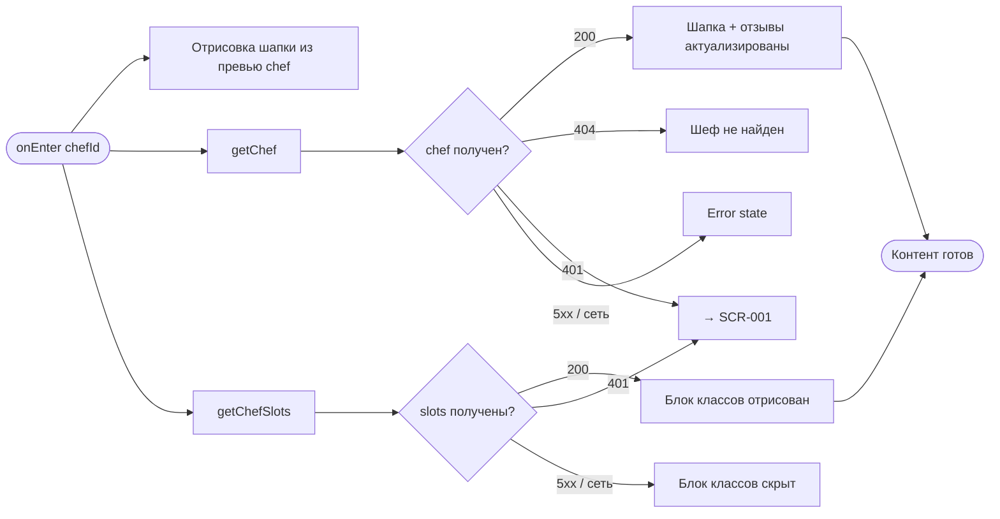
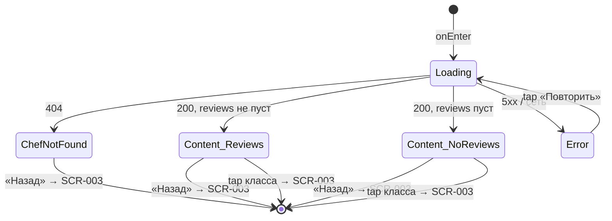

# Профиль шефа

**ID:** SCR-004  
**Тип:** Экран  
**Домен:** 02. Расписание  
**Приоритет:** Medium  
**Статус:** Черновик  
**Функциональные блоки:** FB-003-003 Блок шефа  
**Зона авторизации:** АЗ  
**Дизайн-бриф:** [SCR-004 Профиль шефа](../../3-design-brief/SCR-004-chef-profile.md)

---

## Содержание

- [История изменений](#история-изменений)
- [Обзор](#обзор)
- [Навигация](#навигация)
- [Входные данные](#входные-данные)
- [Применяемые логики](#применяемые-логики)
- [Инициализация](#инициализация)
- [Используемые запросы](#используемые-запросы)
- [Макет экрана](#макет-экрана)
- [Элементы экрана](#элементы-экрана)
- [Состояния экрана](#состояния-экрана)
- [Действия пользователя](#действия-пользователя)
- [Связанные требования](#связанные-требования)
- [Критерии приёмки](#критерии-приёмки)

---

## История изменений

| Релиз | ТЗ | Описание изменений |
|-------|-----|-------------------|
| — | — | Первоначальная документация |

---

## Обзор

Экран профиля шефа — побочная ветка от SCR-003 для клиентов, которым фактов «время + программа + цена» недостаточно для решения и важно понять, кто именно ведёт класс. Экран в основном для чтения: помогает оценить репутацию шефа через агрегированный рейтинг и реальные отзывы других клиентов. Отзывы — главный контент экрана; ниже отзывов расположен вспомогательный блок других актуальных классов этого же шефа.

Решение о записи здесь технически не принимается — только эмоционально. Оставить отзыв с этого экрана нельзя: отзыв привязан к конкретной завершённой брони клиента (SCR-011).

### User Story

> Как клиент, я хочу увидеть профиль шефа с рейтингом и отзывами,
> чтобы укрепиться (или разувериться) в решении записаться на его класс.

### Бизнес-ценность

- Поддерживает доверие клиента через прозрачность репутации шефа (FR-005, US-004).
- Публичные отзывы формируют агрегированный рейтинг и помогают новым клиентам выбрать шефа (FR-025).
- Блок других классов шефа стимулирует кросс-продажу — клиент находит ещё один интересный класс.

---

## Навигация

### Входящая (откуда открывается)

| Источник | Триггер | Условие | Передаваемые параметры |
|----------|---------|---------|------------------------|
| [SCR-003 Детали класса](SCR-003-slot-details.md) | Тап по фото/имени/рейтингу шефа | Всегда | `chefId`, `chef` (превью объекта Chef) |

### Исходящая (куда ведёт)

| Назначение | Триггер | Передаваемые параметры |
|------------|---------|------------------------|
| [SCR-003 Детали класса](SCR-003-slot-details.md) | Тап «Назад» | — |
| [SCR-003 Детали класса](SCR-003-slot-details.md) | Тап по карточке класса в блоке «Другие классы шефа» | `slotId`, `slot` (превью объекта Slot) |

---

## Входные данные

| Название | Тип | Возможные значения | Описание |
|----------|-----|-------------------|----------|
| `chefId` | Параметр маршрута | UUID | ID шефа, передаётся из SCR-003 |
| `chef` | Параметр маршрута (превью) | Объект Chef (частичный) | Превью шефа (фото, имя, рейтинг) для мгновенной отрисовки шапки до ответа getChef |

---

## Применяемые логики

| Логика | Элемент/Триггер | Описание |
|--------|-----------------|----------|
| [LOGIC-001 Сессия](../09-logics/LOGIC-001-auth-and-session.md) | Ответ 401 от любого запроса | Истечение сессии, переход на SCR-001 |
| [LOGIC-002 Доступность слота](../09-logics/LOGIC-002-slot-availability.md) | Карточка класса в блоке «Другие классы шефа» | Визуальное отличие доступных/недоступных слотов |

---

## Инициализация

### Диаграмма загрузки



### Запросы при открытии

| № | Запрос | Критичный | Зависит от | Условие |
|---|--------|-----------|------------|---------|
| 1 | [getChef](#getchef) | Да | — | Всегда |
| 2 | [getChefSlots](#getchefslots) | Нет | — | Всегда |

> Полное описание запросов см. в секции [Используемые запросы](#используемые-запросы).

---

## Используемые запросы

### getChef

**Тип:** REST  
**Метод:** GET  
**Спецификация:** [openapi.yaml](../../api/openapi.yaml) → `getChef` (GET /chefs/{chefId})

**Триггер:** Инициализация (onEnter)

**Параметры:**

| Параметр | Тип | Обязательность | Источник | Описание |
|----------|-----|----------------|----------|----------|
| `chefId` | string (uuid) | Да | Параметр маршрута | ID шефа из SCR-003 |

**Обработка ответа:**

| Результат | Условие | UI-реакция |
|-----------|---------|------------|
| Загрузка | — | Скелетон контента (шапка отрисована из превью `chef`) |
| Успех | `200` | Отрисовать шапку (актуализация), агрегированный рейтинг, список отзывов |
| HTTP 401 | — | Перенаправление на [SCR-001](../01-auth/SCR-001-login.md) (LOGIC-001) |
| HTTP 404 | `reason = chef_not_found` | Error state «Шеф не найден», кнопка «Назад» |
| HTTP 5xx | — | Error state с кнопкой «Повторить» |
| Сеть | Нет соединения | Error state с кнопкой «Повторить» |

---

### getChefSlots

**Тип:** REST  
**Метод:** GET  
**Спецификация:** [openapi.yaml](../../api/openapi.yaml) → `getChefSlots` (GET /chefs/{chefId}/slots)

**Триггер:** Инициализация (параллельно с getChef)

**Параметры:**

| Параметр | Тип | Обязательность | Источник | Описание |
|----------|-----|----------------|----------|----------|
| `chefId` | string (uuid) | Да | Параметр маршрута | ID шефа из SCR-003 |

**Обработка ответа:**

| Результат | Условие | UI-реакция |
|-----------|---------|------------|
| Загрузка | — | Скелетон блока «Другие классы шефа» |
| Успех | `200`, массив не пуст | Отрисовать список карточек классов |
| Успех | `200`, массив пуст | Текст «У этого шефа пока нет других ближайших классов» |
| HTTP 401 | — | Перенаправление на [SCR-001](../01-auth/SCR-001-login.md) (LOGIC-001) |
| HTTP 5xx | — | Блок классов скрыт, остальной контент отображается |
| Сеть | Нет соединения | Блок классов скрыт, остальной контент отображается |

---

## Макет экрана

### Структура

```
┌─────────────────────────────────────┐
│ [←] Профиль шефа                    │  ← Header
├─────────────────────────────────────┤
│                                     │
│  ┌─ Шапка шефа ───────────────────┐ │
│  │  [Фото]  Имя шефа              │ │
│  │          ★ 4.8                 │ │  ← агрегированный рейтинг
│  └────────────────────────────────┘ │
│                                     │
│  ┌─ Отзывы ───────────────────────┐ │
│  │ ★★★★★ «Отличный класс, всё…»   │ │
│  │            — Анна, 12.05       │ │
│  │                                 │ │
│  │ ★★★★☆ «Было интересно, но…»    │ │
│  │            — Иван, 10.05       │ │
│  └────────────────────────────────┘ │
│                                     │
│  ┌─ Другие классы шефа ───────────┐ │
│  │ ▸ Паста с нуля   20.06, 18:00  │ │
│  │ ▸ Десерты        22.06, 12:00  │ │
│  └────────────────────────────────┘ │
│                                     │
└─────────────────────────────────────┘
```

### Компоненты

| Компонент | Описание | Обязательность |
|-----------|----------|----------------|
| Header | Заголовок «Профиль шефа», кнопка «Назад» | Да |
| Шапка шефа | Фото, имя, агрегированный рейтинг | Да |
| Блок отзывов | Список публичных отзывов клиентов | Да |
| Блок других классов | Список актуальных слотов шефа | Опционально |

---

## Элементы экрана

### 1. Шапка шефа

| Элемент | Описание | Источник данных | Валидация | Действие |
|---------|----------|-----------------|-----------|----------|
| Фото | Аватар шефа | `chef.photoUrl` (превью → актуализация из getChef) | — | — |
| Имя | Имя шефа | `chef.name` (превью → актуализация из getChef) | — | — |
| Рейтинг | Агрегированный рейтинг (звёзды + число) | `chef.rating` (превью → актуализация из getChef) | — | — |

**Логика:**
- Шапка отрисовывается мгновенно из превью `chef` (переданного из SCR-003), затем актуализируется ответом getChef.
- При `chef.rating = 0` или отсутствии отзывов рейтинг не отображается как «0» — см. состояние «Без отзывов».

---

### 2. Блок отзывов

| Элемент | Описание | Источник данных | Валидация | Действие |
|---------|----------|-----------------|-----------|----------|
| Карточка отзыва | Оценка звёздами, текст, имя клиента, дата | `chef.reviews[]` из getChef | — | — |

**Логика:**
- Отзывы сортируются по рейтингу: сначала высокие оценки, затем низкие (РЕШЕНО в дизайн-брифе).
- Каждый отзыв отображает: оценку (звёзды), текст комментария (если есть), имя клиента (`clientName`, может быть анонимным), дату (`createdAt`).
- Отзывы публичны и видны без премодерации (NFR-017). Модерация/скрытие/жалобы на отзыв не предусмотрены.

**Условия видимости:**
- `chef.reviews` не пуст → список отзывов.
- `chef.reviews` пуст (или отсутствует) → состояние «Пока нет отзывов» (нейтральный тон, не «плохой шеф», а «нет данных»).

---

### 3. Блок других классов шефа

| Элемент | Описание | Источник данных | Валидация | Действие |
|---------|----------|-----------------|-----------|----------|
| Карточка класса | Название программы, дата/время | `slot.program.name`, `slot.startsAt` из getChefSlots | — | Открыть [SCR-003](SCR-003-slot-details.md) с `slotId`, `slot` |
| Визуальный статус | Доступность слота по [LOGIC-002](../09-logics/LOGIC-002-slot-availability.md) | `slot.status`, `slot.availableSeats` | — | — |

**Логика:**
- Карточки классов визуально отличаются по доступности ([LOGIC-002](../09-logics/LOGIC-002-slot-availability.md)): доступные для записи — кликабельны и ведут на SCR-003; недоступные (мест нет / отменён / завершён / менее 10 минут) — визуально приглушены, причина недоступности видна на карточке.
- Список отображает актуальные классы шефа, по которым возможна запись.

**Условия видимости:**
- Блок отображается при успешном ответе getChefSlots. При ошибке загрузки (5xx / сеть) блок скрывается — шапка и отзывы остаются доступными.

---

## Состояния экрана

### Таблица состояний

| Состояние | Условие | Отображение |
|-----------|---------|-------------|
| Loading | Ожидание getChef | Скелетон контента (шапка из превью) |
| Content (с отзывами) | getChef 200, `reviews` не пуст | Шапка + отзывы + блок классов |
| Content (без отзывов) | getChef 200, `reviews` пуст | Шапка + «Пока нет отзывов» + блок классов |
| ChefNotFound | getChef 404 | Error state «Шеф не найден», кнопка «Назад» |
| Error | getChef 5xx / нет сети | Error state с кнопкой «Повторить» |

### Диаграмма переходов



---

## Действия пользователя

| Действие | Элемент | Триггер | Результат |
|----------|---------|---------|-----------|
| Возврат к классу | Кнопка «Назад» | Tap | Переход на [SCR-003 Детали класса](SCR-003-slot-details.md) |
| Открыть другой класс | Карточка класса в блоке | Tap | Переход на [SCR-003 Детали класса](SCR-003-slot-details.md) с `slotId`, `slot` |

---

## Связанные требования

### Функциональные (FR / UC)

| ID | Название | Приоритет |
|----|----------|-----------|
| FR-005 | Карточка шефа: имя, фото, агрегированный рейтинг, публичные отзывы | Should |
| FR-025 | Публичное отображение текстовых отзывов другим клиентам | Must |
| UC-002 | Просмотр расписания классов (контекст: другие классы шефа) | Must |

### Интеграции (NFR / CON)

| ID | Название | Приоритет |
|----|----------|-----------|
| NFR-017 | Публичные отзывы видны всем без премодерации | Should |
| CON-001 | Приложение — read-only консьюмер API | Must |

### UI (US)

| ID | Название | Приоритет |
|----|----------|-----------|
| US-004 | Карточка шефа с фото, рейтингом и отзывами | Should |
| US-016 | Оценка/отзыв после класса (контекст: отзывы формируют рейтинг) | Should |

---

## Критерии приёмки

### Позитивные сценарии

| ID | Критерий | Приоритет |
|----|----------|-----------|
| AC-001 | **Дано** клиент перешёл с SCR-003 (тап по шефу), **Когда** открывается экран, **Тогда** шапка мгновенно отрисовывается из превью `chef`, отправляются getChef и getChefSlots | P0 |
| AC-002 | **Дано** getChef возвращает 200 с отзывами, **Когда** контент готов, **Тогда** отображаются шапка (фото, имя, рейтинг), список отзывов (отсортированных по рейтингу: высокие первыми), блок других классов | P0 |
| AC-003 | **Дано** на экране, **Когда** тап по карточке класса в блоке «Другие классы шефа», **Тогда** переход на SCR-003 с `slotId` и `slot` (превью) | P1 |
| AC-004 | **Дано** на экране, **Когда** тап «Назад», **Тогда** возврат на SCR-003 | P0 |

### Негативные сценарии

| ID | Критерий | Приоритет |
|----|----------|-----------|
| AC-N01 | **Дано** ошибка сети при открытии, **Когда** getChef не выполняется, **Тогда** отображается error state с кнопкой «Повторить» | P0 |
| AC-N02 | **Дано** шеф не существует, **Когда** getChef возвращает 404, **Тогда** отображается error state «Шеф не найден» с кнопкой «Назад» | P0 |
| AC-N03 | **Дано** сессия истекла, **Когда** getChef или getChefSlots возвращает 401, **Тогда** выполняется переход на SCR-001 (LOGIC-001) | P0 |
| AC-N04 | **Дано** getChefSlots завершился ошибкой 5xx, **Когда** данные загружены, **Тогда** блок классов скрыт, шапка и отзывы отображаются | P1 |

### Граничные условия (Edge Cases)

| ID | Критерий | Приоритет |
|----|----------|-----------|
| AC-E01 | **Дано** `chef.reviews` пуст (новый шеф), **Когда** getChef возвращает 200, **Тогда** блок отзывов показывает «Пока нет отзывов» (нейтральный тон) | P1 |
| AC-E02 | **Дано** getChefSlots возвращает пустой массив, **Когда** данные загружены, **Тогда** блок классов показывает «У этого шефа пока нет других ближайших классов» | P2 |
| AC-E03 | **Дано** среди классов шефа есть недоступные (мест нет / завершён), **Когда** отрисовывается блок классов, **Тогда** такие карточки визуально приглушены с указанием причины по LOGIC-002 | P2 |

---
