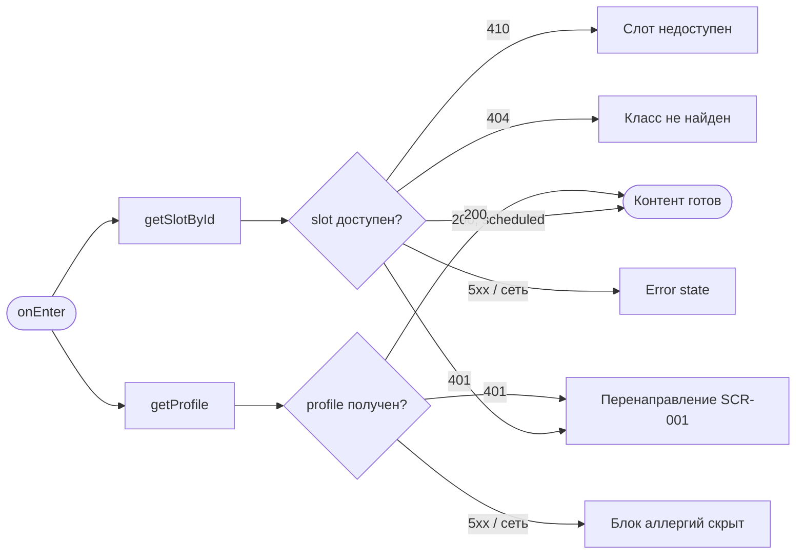
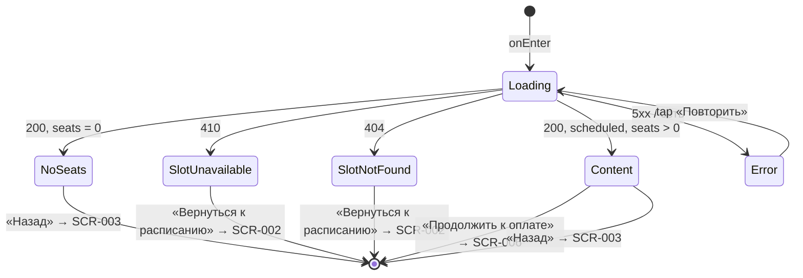

# Оформление брони: экипировка и сводка

**ID:** SCR-005  
**Тип:** Экран  
**Домен:** 03. Бронирование  
**Приоритет:** High  
**Статус:** Черновик  
**Функциональные блоки:** FB-003-001, FB-003-002  
**Зона авторизации:** АЗ  
**Дизайн-бриф:** [SCR-005 Оформление брони: экипировка и сводка](../../3-design-brief/SCR-005-booking-setup.md)

---

## Содержание

- [История изменений](#история-изменений)
- [Обзор](#обзор)
- [Навигация](#навигация)
- [Входные данные](#входные-данные)
- [Применяемые логики](#применяемые-логики)
- [Инициализация](#инициализация)
- [Используемые запросы](#используемые-запросы)
- [Макет экрана](#макет-экрана)
- [Элементы экрана](#элементы-экрана)
- [Состояния экрана](#состояния-экрана)
- [Действия пользователя](#действия-пользователя)
- [Связанные требования](#связанные-требования)
- [Критерии приёмки](#критерии-приёмки)

---

## История изменений

| Релиз | ТЗ | Описание изменений |
|-------|-----|-------------------|
| 1.0.0 | — | Первоначальная документация |

---

## Обзор

Экран оформления брони — промежуточный шаг между решением записаться (SCR-003) и оплатой (SCR-006). Здесь клиент делает обязательный выбор экипировки («своя» / «прокатная»), видит итоговую стоимость с мгновенным пересчётом и информационный блок аллергий, автоматически подставленных из профиля. Ручной ввод аллергий на этом экране запрещён — редактирование доступно только в профиле (SCR-012).

### User Story

> Как клиент, я хочу выбрать экипировку и увидеть итоговую стоимость до оплаты,
> чтобы принять взвешенное решение и правильно подготовиться к классу.

### Бизнес-ценность

- Обязательный шаг выбора экипировки снижает риск недопонимания при подготовке к классу (FR-008).
- Прозрачность стоимости до платежа повышает доверие клиента (FR-010, US-005).
- Прокат экипировки как источник дополнительного дохода студии (BR-005).

---

## Навигация

### Входящая (откуда открывается)

| Источник | Триггер | Условие | Передаваемые параметры |
|----------|---------|---------|------------------------|
| [SCR-003 Детали класса](../02-schedule/SCR-003-slot-details.md) | Тап «Записаться» | `slot.status = scheduled` И `availableSeats > 0` | `slotId` |

### Исходящая (куда ведёт)

| Назначение | Триггер | Передаваемые параметры |
|------------|---------|------------------------|
| [SCR-006 Оплата](SCR-006-payment.md) | Тап «Продолжить к оплате» (после выбора экипировки) | `slotId`, `equipmentChoice`, `totalAmount` |
| [SCR-003 Детали класса](../02-schedule/SCR-003-slot-details.md) | Тап «Назад» | — |

---

## Входные данные

| Название | Тип | Возможные значения | Описание |
|----------|-----|-------------------|----------|
| `slotId` | Параметр маршрута | UUID | ID выбранного слота, передаётся из SCR-003 |

---

## Применяемые логики

| Логика | Элемент/Триггер | Описание |
|--------|-----------------|----------|
| [LOGIC-004 Выбор экипировки и расчёт стоимости](../09-logics/LOGIC-004-equipment-and-pricing.md) | Блок выбора экипировки, блок итоговой стоимости | Расчёт доступности варианта rental и итоговой суммы |
| [LOGIC-007 Аллергии](../09-logics/LOGIC-007-allergies-management.md) | Блок аллергий | Чтение аллергий из профиля, read-only отображение |
| [LOGIC-002 Доступность слота](../09-logics/LOGIC-002-slot-availability.md) | Инициализация | Актуализация статуса слота перед бронированием |
| [LOGIC-001 Сессия](../09-logics/LOGIC-001-session.md) | Ответ 401 от любого запроса | Истечение сессии, переход на SCR-001 |

---

## Инициализация

### Диаграмма загрузки



### Запросы при открытии

| № | Запрос | Критичный | Зависит от | Условие |
|---|--------|-----------|------------|---------|
| 1 | [getSlotById](#getslotbyid) | Да | — | Всегда |
| 2 | [getProfile](#getprofile) | Нет | — | Всегда |

> Полное описание запросов см. в секции [Используемые запросы](#используемые-запросы).

---

## Используемые запросы

### getSlotById

**Тип:** REST  
**Метод:** GET  
**Спецификация:** [openapi.yaml](../../api/openapi.yaml) → `getSlotById` (GET /slots/{slotId})

**Триггер:** Инициализация (онтер)

**Параметры:**

| Параметр | Тип | Обязательность | Источник | Описание |
|----------|-----|----------------|----------|----------|
| `slotId` | string (uuid) | Да | Параметр маршрута | ID слота из SCR-003 |

**Обработка ответа:**

| Результат | Условие | UI-реакция |
|-----------|---------|------------|
| Загрузка | — | Скелетон контента |
| Успех | `200`, `slot.status = scheduled` И `availableSeats > 0` | Отобразить контент, включить выбор экипировки |
| Успех | `200`, `availableSeats = 0` | Сообщение «Все места на этот класс заняты», кнопка «Продолжить к оплате» заблокирована |
| Успех | `200`, `slot.status != scheduled` | Сообщение «Запись на этот класс закрыта» |
| HTTP 401 | — | Перенаправление на [SCR-001](../01-auth/SCR-001-login.md) (LOGIC-001) |
| HTTP 404 | `reason = slot_not_found` | Error state «Класс не найден», кнопка «Вернуться к расписанию» |
| HTTP 410 | `reason = slot_unavailable` | Error state «Запись на этот класс закрыта», кнопка «Вернуться к расписанию» |
| HTTP 5xx | — | Error state с кнопкой «Повторить» |
| Сеть | Нет соединения | Error state с кнопкой «Повторить» |

---

### getProfile

**Тип:** REST  
**Метод:** GET  
**Спецификация:** [openapi.yaml](../../api/openapi.yaml) → `getProfile` (GET /profile)

**Триггер:** Инициализация (параллельно с getSlotById)

**Параметры:** нет

**Обработка ответа:**

| Результат | Условие | UI-реакция |
|-----------|---------|------------|
| Загрузка | — | Скелетон блока аллергий |
| Успех | `200`, `allergies` не пуст | Отобразить список аллергий (read-only) |
| Успех | `200`, `allergies` пуст | Отобразить «Аллергии не указаны» |
| HTTP 401 | — | Перенаправление на [SCR-001](../01-auth/SCR-001-login.md) (LOGIC-001) |
| HTTP 5xx | — | Блок аллергий скрыт, остальной контент отображается |
| Сеть | Нет соединения | Блок аллергий скрыт, остальной контент отображается |

---

## Макет экрана

### Структура

```
┌─────────────────────────────────────┐
│ [←] Оформление брони                │  ← Header
├─────────────────────────────────────┤
│                                     │
│  Краткая информация о классе        │
│  (программа, дата/время, шеф)       │
│                                     │
│  ┌─ Выбор экипировки ─────────────┐ │
│  │ (•) Своя экипировка            │ │
│  │ ( ) Прокатная экипировка       │ │
│  │     Прокатный фонд исчерпан    │ │  ← если availableRentalKits = 0
│  └────────────────────────────────┘ │
│                                     │
│  ┌─ Итоговая стоимость ───────────┐ │
│  │ Стоимость участия     2 500 ₽  │ │
│  │ Прокатная экипировка    500 ₽  │ │  ← если выбран rental
│  │ ────────────────────────────── │ │
│  │ Итого                  3 000 ₽ │ │
│  └────────────────────────────────┘ │
│                                     │
│  ┌─ Аллергии ─────────────────────┐ │
│  │ Орехи, глютен                  │ │  ← read-only, из профиля
│  └────────────────────────────────┘ │
│                                     │
├─────────────────────────────────────┤
│         [Продолжить к оплате]       │  ← Fixed Bottom
└─────────────────────────────────────┘
```

### Компоненты

| Компонент | Описание | Обязательность |
|-----------|----------|----------------|
| Header | Заголовок «Оформление брони», кнопка «Назад» | Да |
| Сводка класса | Краткая информация: название программы, дата/время, шеф | Да |
| Блок выбора экипировки | Радио-кнопки «своя» / «прокатная» | Да |
| Блок итоговой стоимости | Расшифровка и итог | Да |
| Блок аллергий | Список аллергий из профиля, read-only | Опционально |
| Кнопка «Продолжить к оплате» | Primary, fixed bottom | Да |

---

## Элементы экрана

### 1. Сводка класса

| Элемент | Описание | Источник данных | Валидация | Действие |
|---------|----------|-----------------|-----------|----------|
| Название программы | Тема мастер-класса | `slot.program.name` из [getSlotById](#getslotbyid) | — | — |
| Дата и время | Дата и время начала | `slot.startsAt` из [getSlotById](#getslotbyid) | — | — |
| Длительность | Длительность в минутах | `slot.durationMinutes` из [getSlotById](#getslotbyid) | — | — |
| Шеф | Имя шефа | `slot.chef.name` из [getSlotById](#getslotbyid) | — | — |

**Логика:**
- Сводка носит информационный характер — полная карточка класса была показана на SCR-003; здесь достаточно краткого напоминания «когда и что».

---

### 2. Выбор экипировки

| Элемент | Описание | Источник данных | Валидация | Действие |
|---------|----------|-----------------|-----------|----------|
| Радио «Своя экипировка» | Выбор варианта `own` | — | — | Установить `equipmentChoice = own` |
| Радио «Прокатная экипировка» | Выбор варианта `rental` | — | — | Установить `equipmentChoice = rental` |
| Подпись блокировки | «Прокатный фонд на этот класс исчерпан» | `slot.availableRentalKits` | — | — |

**Логика:**
- Блок выбора экипировки: [LOGIC-004](../09-logics/LOGIC-004-equipment-and-pricing.md) — расчёт доступности варианта rental и итоговой суммы.

**Условия доступности:**
- Радио «Прокатная экипировка» заблокирована (disabled), если `slot.availableRentalKits = 0` (FR-009). Под заблокированным вариантом отображается подпись «Прокатный фонд на этот класс исчерпан».
- По умолчанию ни один вариант не выбран. Выбор экипировки — обязательный шаг, переход к оплате невозможен до явного выбора (FR-008).
- Выбор только один (взаимоисключающие варианты).

---

### 3. Итоговая стоимость

| Элемент | Описание | Источник данных | Валидация | Действие |
|---------|----------|-----------------|-----------|----------|
| Стоимость участия | Базовая стоимость класса | `slot.price` из [getSlotById](#getslotbyid) | — | — |
| Прокатная экипировка | Стоимость проката | Данные слота | — | — |
| Итого | Итоговая сумма к оплате | Расчёт по [LOGIC-004](../09-logics/LOGIC-004-equipment-and-pricing.md) | — | — |

**Логика:**
- Пересчёт итоговой суммы выполняется мгновенно при переключении выбора экипировки: [LOGIC-004](../09-logics/LOGIC-004-equipment-and-pricing.md).
- При выборе `own`: итого = `slot.price`.
- При выборе `rental`: итого = `slot.price` + прокатная составляющая. Стоимость проката является частью ценообразования слота и определяется бэкендом. В текущей схеме `Slot` (openapi.yaml) отдельное поле для стоимости проката не выделено — итоговая сумма при выборе rental формируется из данных слота, а финальное подтверждённое значение фиксируется в `payment.amount` ответа `createBooking`. Клиентское приложение не вычисляет стоимость проката самостоятельно и не выдумывает поле.
- Строка «Прокатная экипировка» в расшифровке отображается только при выбранном варианте `rental`.
- Детальный состав прокатного комплекта не показывается (РЕШЕНО в дизайн-брифе).

---

### 4. Аллергии

| Элемент | Описание | Источник данных | Валидация | Действие |
|---------|----------|-----------------|-----------|----------|
| Список аллергий | Перечень аллергий клиента | `profile.allergies` из [getProfile](#getprofile) | — | — |
| Текст «Аллергии не указаны» | Если список пуст | `profile.allergies` = `[]` | — | — |

**Логика:**
- Блок аллергий: [LOGIC-007](../09-logics/LOGIC-007-allergies-management.md) — чтение аллергий из профиля клиента (read-only).
- Ручной ввод и редактирование аллергий на этом экране запрещены (US-018). Аллергии автоматически подставляются бэкендом из профиля при создании брони (FR-027); клиентское приложение не передаёт аллергии в теле `createBooking`.
- Для изменения аллергий клиент переходит в профиль: [SCR-012 Профиль клиента](../06-profile/SCR-012-client-profile.md).

**Условия видимости:**
- Блок отображается при успешном ответе [getProfile](#getprofile). При ошибке загрузки (5xx / сеть) блок скрывается — остальной контент экрана остаётся доступным.

---

### Кнопка «Продолжить к оплате»

| Элемент | Описание | Источник данных | Валидация | Действие |
|---------|----------|-----------------|-----------|----------|
| Кнопка «Продолжить к оплате» | Primary, fixed bottom | — | — | Переход на [SCR-006 Оплата](SCR-006-payment.md) |

**Логика:**
- При тапе → проверка, что выбор экипировки сделан → переход на [SCR-006](SCR-006-payment.md) с параметрами `slotId`, `equipmentChoice`, `totalAmount`.

**Условия доступности:**
- Кнопка активна, если: `equipmentChoice` выбран (`own` или `rental`) И `slot.availableSeats > 0` И `slot.status = scheduled`.
- Кнопка заблокирована (disabled), если: выбор экипировки не сделан.
- Кнопка заблокирована, если: `slot.availableSeats = 0` (с сообщением «Все места на этот класс заняты»).

---

## Состояния экрана

### Таблица состояний

| Состояние | Условие | Отображение |
|-----------|---------|-------------|
| Loading | Ожидание getSlotById / getProfile | Скелетон-шиммер контента |
| Content | getSlotById 200 (scheduled, seats > 0) | Стандартный контент |
| Content (мест нет) | getSlotById 200, `availableSeats = 0` | Контент + сообщение «Все места заняты», кнопка заблокирована |
| SlotUnavailable | getSlotById 410 | Error state «Запись на этот класс закрыта», кнопка «Вернуться к расписанию» |
| SlotNotFound | getSlotById 404 | Error state «Класс не найден», кнопка «Вернуться к расписанию» |
| Error | getSlotById 5xx / нет сети | Error state с кнопкой «Повторить» |

### Диаграмма переходов



---

## Действия пользователя

| Действие | Элемент | Триггер | Результат |
|----------|---------|---------|-----------|
| Выбор «Своя экипировка» | Радио | Tap | `equipmentChoice = own`, пересчёт суммы |
| Выбор «Прокатная экипировка» | Радио | Tap | `equipmentChoice = rental`, пересчёт суммы |
| Переход к оплате | Кнопка «Продолжить к оплате» | Tap | Переход на [SCR-006 Оплата](SCR-006-payment.md), передача `slotId`, `equipmentChoice`, `totalAmount` |
| Возврат к деталям | Кнопка «Назад» | Tap | Переход на [SCR-003 Детали класса](../02-schedule/SCR-003-slot-details.md) |

---

## Связанные требования

### Функциональные (FR / UC)

| ID | Название | Приоритет |
|----|----------|-----------|
| FR-008 | Обязательный явный выбор экипировки | Must |
| FR-009 | Блокировка «прокатная» при исчерпанном фонде | Must |
| FR-010 | Отображение стоимости класса и проката до оплаты | Must |
| FR-027 | Автоподстановка аллергий из профиля в бронь | Must |
| UC-003 | Бронирование слота с оплатой (шаги 2–3, альт. поток 3a) | Must |

### Интеграции (NFR / CON)

| ID | Название | Приоритет |
|----|----------|-----------|
| NFR-015 | Актуализация данных слота перед бронированием | Must |
| CON-005 | Вместимость слота определяется бэкендом | Must |

### UI (US)

| ID | Название | Приоритет |
|----|----------|-----------|
| US-005 | Видеть стоимость класса и проката заранее | Must |
| US-006 | Явный выбор своей или прокатной экипировки | Must |
| US-007 | Видеть недоступность проката при исчерпанном фонде | Must |
| US-018 | Автоподстановка аллергий из профиля | Should |

### Данные (NFR / CON)

| ID | Название | Приоритет |
|----|----------|-----------|
| NFR-015 | Данные о местах и фонде не валидны между экранами | Must |
| CON-001 | Приложение — read-only консьюмер API бэкенда | Must |

---

## Критерии приёмки

### Позитивные сценарии

| ID | Критерий | Приоритет |
|----|----------|-----------|
| AC-001 | **Дано** клиент авторизован и перешёл с SCR-003, **Когда** открывается экран, **Тогда** отправляются getSlotById и getProfile, отображается скелетон | P0 |
| AC-002 | **Дано** данные слота получены (200, scheduled, seats > 0), **Когда** отрисовывается контент, **Тогда** отображаются сводка класса, блок выбора экипировки (оба варианта активны), итоговая стоимость (только участие), блок аллергий из профиля | P0 |
| AC-003 | **Дано** на экране, **Когда** клиент выбирает «Своя экипировка», **Тогда** итоговая сумма равна `slot.price`, строка проката скрыта, кнопка «Продолжить к оплате» активируется | P0 |
| AC-004 | **Дано** на экране с доступным прокатом, **Когда** клиент выбирает «Прокатная экипировка», **Тогда** итоговая сумма пересчитывается с учётом прокатной составляющей, отображается строка «Прокатная экипировка», кнопка активна | P0 |
| AC-005 | **Дано** выбрана экипировка, **Когда** клиент нажимает «Продолжить к оплате», **Тогда** выполняется переход на SCR-006 с параметрами `slotId`, `equipmentChoice`, `totalAmount` | P0 |
| AC-006 | **Дано** в профиле есть аллергии, **Когда** getProfile возвращает 200, **Тогда** аллергии отображаются в read-only блоке без возможности редактирования | P1 |

### Негативные сценарии

| ID | Критерий | Приоритет |
|----|----------|-----------|
| AC-N01 | **Дано** ошибка сети при открытии, **Когда** getSlotById не выполняется, **Тогда** отображается error state с кнопкой «Повторить» | P0 |
| AC-N02 | **Дано** слот недоступен (отменён/завершён/менее 10 минут), **Когда** getSlotById возвращает 410, **Тогда** отображается error state «Запись на этот класс закрыта» с кнопкой «Вернуться к расписанию» | P0 |
| AC-N03 | **Дано** слот не существует, **Когда** getSlotById возвращает 404, **Тогда** отображается error state «Класс не найден» с кнопкой «Вернуться к расписанию» | P0 |
| AC-N04 | **Дано** `availableRentalKits = 0`, **Когда** отрисовывается блок выбора, **Тогда** вариант «Прокатная экипировка» заблокирован с подписью «Прокатный фонд на этот класс исчерпан», доступен только выбор «Своя» | P0 |
| AC-N05 | **Дано** сессия истекла, **Когда** getSlotById или getProfile возвращает 401, **Тогда** выполняется переход на SCR-001 (LOGIC-001) | P0 |
| AC-N06 | **Дано** getProfile завершился ошибкой 5xx, **Когда** данные загружены, **Тогда** блок аллергий скрыт, остальной контент экрана доступен | P1 |

### Граничные условия (Edge Cases)

| ID | Критерий | Приоритет |
|----|----------|-----------|
| AC-E01 | **Дано** `availableSeats = 0` (места закончились после SCR-003), **Когда** getSlotById возвращает 200, **Тогда** отображается сообщение «Все места на этот класс заняты», кнопка «Продолжить к оплате» заблокирована | P1 |
| AC-E02 | **Дано** `profile.allergies` пустой массив, **Когда** getProfile возвращает 200, **Тогда** блок аллергий показывает «Аллергии не указаны» | P2 |
| AC-E03 | **Дано** клиент многократно переключает выбор экипировки, **Когда** каждое переключение, **Тогда** итоговая сумма мгновенно пересчитывается без задержек и запросов к API | P1 |
| AC-E04 | **Дано** выбор экипировки не сделан, **Когда** клиент пытается нажать «Продолжить к оплате», **Тогда** кнопка заблокирована (disabled) | P0 |
| AC-E05 | **Дано** слот доступен, но `status` не `scheduled`, **Когда** выполняется проверка, **Тогда** отображается сообщение «Запись на этот класс закрыта» | P1 |

---
