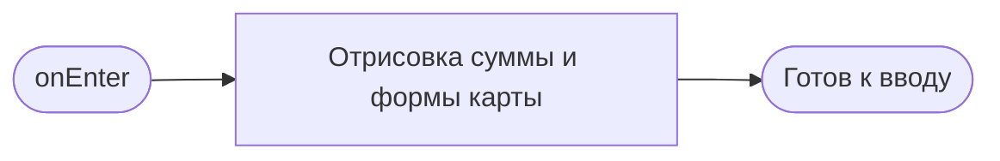
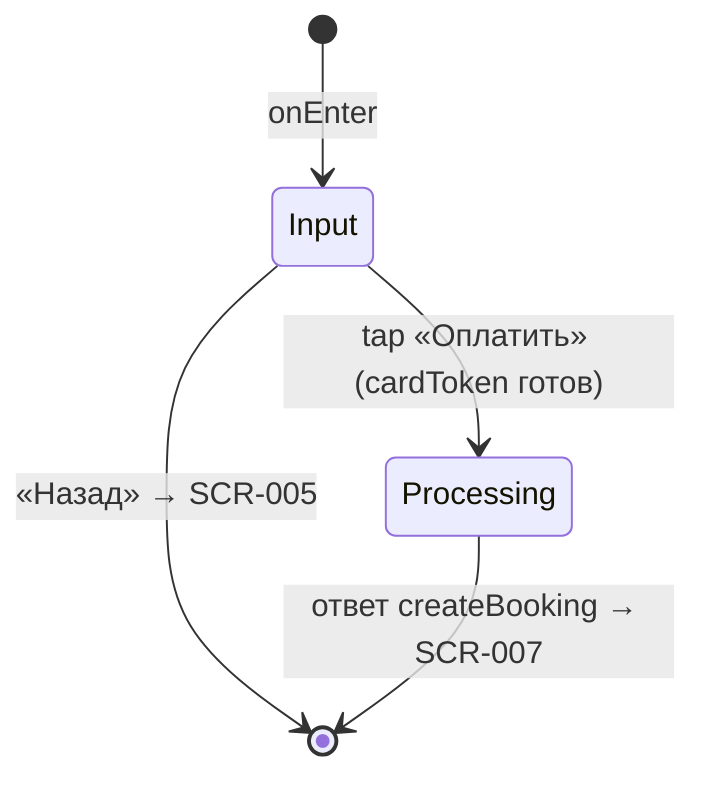

# Оплата

**ID:** SCR-006  
**Тип:** Экран  
**Домен:** 03. Бронирование  
**Приоритет:** High  
**Статус:** Черновик  
**Функциональные блоки:** FB-003-002 Оформление брони, FB-003-003 Оплата  
**Зона авторизации:** АЗ  
**Дизайн-бриф:** [SCR-006 Оплата](../../3-design-brief/SCR-006-payment.md)

---

## Содержание

- [История изменений](#история-изменений)
- [Обзор](#обзор)
- [Навигация](#навигация)
- [Входные данные](#входные-данные)
- [Применяемые логики](#применяемые-логики)
- [Инициализация](#инициализация)
- [Используемые запросы](#используемые-запросы)
- [Макет экрана](#макет-экрана)
- [Элементы экрана](#элементы-экрана)
- [Состояния экрана](#состояния-экрана)
- [Действия пользователя](#действия-пользователя)
- [Связанные требования](#связанные-требования)
- [Критерии приёмки](#критерии-приёмки)

---

## История изменений

| Релиз | ТЗ | Описание изменений |
|-------|-----|-------------------|
| — | — | Первоначальная документация |

---

## Обзор

Экран оплаты — последний шаг перед подтверждённой бронью. Клиент пришёл сюда с уже известной итоговой суммой (SCR-005), решение уже принято, остаётся техническое действие: ввести данные карты и оплатить. Сумма к оплате повторяется здесь для подтверждения доверия перед вводом карты.

Оплата синхронная: результат (успех / отказ по месту / ошибка оплаты) показывается на следующем экране (SCR-007). Во время обработки платежа UI блокируется, чтобы предотвратить повторную отправку. Конкретный набор полей карты и способ валидации определяются платёжной инфраструктурой бэкенда (CON-003) и не описываются в данном ТЗ.

### User Story

> Как клиент, я хочу ввести данные карты и быстро получить однозначный результат оплаты,
> чтобы моё место было гарантированно зарезервировано.

### Бизнес-ценность

- Минимальная длина флоу на самом чувствительном к доверию шаге (NFR-005).
- Синхронная оплата без редиректов на внешние страницы сохраняет ощущение пребывания в приложении (NFR-005).
- Блокировка повторной отправки защищает от двойного списания (FR-012).

---

## Навигация

### Входящая (откуда открывается)

| Источник | Триггер | Условие | Передаваемые параметры |
|----------|---------|---------|------------------------|
| [SCR-005 Оформление брони](SCR-005-booking-setup.md) | Тап «Продолжить к оплате» | Выбрана экипировка (`equipmentChoice ≠ null`) | `slotId`, `equipmentChoice`, `totalAmount` |

### Исходящая (куда ведёт)

| Назначение | Триггер | Передаваемые параметры |
|------------|---------|------------------------|
| [SCR-007 Результат бронирования](SCR-007-booking-result.md) | Тап «Оплатить» → ответ `createBooking` | Зависит от исхода (см. [LOGIC-005](../09-logics/LOGIC-005-booking-and-payment.md)): 201 → `booking`, `payment`; 402/409/410/404 → код исхода + `message` |
| [SCR-005 Оформление брони](SCR-005-booking-setup.md) | Тап «Назад» | — |

---

## Входные данные

| Название | Тип | Возможные значения | Описание |
|----------|-----|-------------------|----------|
| `slotId` | Параметр маршрута | UUID | ID выбранного слота, передаётся из SCR-005 |
| `equipmentChoice` | Параметр маршрута | `own`, `rental` | Выбранный вариант экипировки (не `null`) |
| `totalAmount` | Параметр маршрута | number ≥ 0 | Итоговая сумма с учётом экипировки (предварительная, из LOGIC-004) |

---

## Применяемые логики

| Логика | Элемент/Триггер | Описание |
|--------|-----------------|----------|
| [LOGIC-005 Создание брони и оплата](../09-logics/LOGIC-005-booking-and-payment.md) | Кнопка «Оплатить» | Валидация предусловий, вызов createBooking, обработка исходов, маршрут на SCR-007 |
| [LOGIC-001 Сессия](../09-logics/LOGIC-001-auth-and-session.md) | Ответ 401 от createBooking | Истечение сессии, переход на SCR-001 |

---

## Инициализация

Экран не выполняет запросов к API при открытии. Данные для отображения (`totalAmount`, `equipmentChoice`, `slotId`) передаются из SCR-005. Платёжная форма (поля карты) инициализируется платёжным SDK.

### Диаграмма загрузки



---

## Используемые запросы

### createBooking

**Тип:** REST  
**Метод:** POST  
**Спецификация:** [openapi.yaml](../../api/openapi.yaml) → `createBooking` (POST /bookings)

> Полная обработка запроса описана в [LOGIC-005 Создание брони и оплата](../09-logics/LOGIC-005-booking-and-payment.md). Экран SCR-006 инициирует запрос по тапу «Оплатить» и маршрутизирует на SCR-007 по ответу.

**Триггер:** Тап «Оплатить» (после получения `cardToken` от платёжного SDK).

**Параметры/Body:**

| Параметр | Тип | Обязательность | Источник | Описание |
|----------|-----|----------------|----------|----------|
| `slotId` | string (uuid) | Да | Параметр маршрута | ID слота |
| `equipmentChoice` | string (`own`, `rental`) | Да | Параметр маршрута | Выбор экипировки |
| `cardToken` | string | Да | Платёжный SDK | Токен карты |

**Обработка ответа:** см. [LOGIC-005](../09-logics/LOGIC-005-booking-and-payment.md) → шаг 3 (обработка исходов). Все исходы (201/402/409/410/404) маршрутизируют на SCR-007 с соответствующими параметрами.

---

## Макет экрана

### Структура

```
┌─────────────────────────────────────┐
│ [←] Оплата                          │  ← Header
├─────────────────────────────────────┤
│                                     │
│  ┌─ Сумма к оплате ───────────────┐ │
│  │  Итого              3 000 ₽    │ │  ← повторение из SCR-005
│  └────────────────────────────────┘ │
│                                     │
│  ┌─ Данные карты ─────────────────┐ │
│  │  Номер карты                   │ │
│  │  [____ ____ ____ ____]         │ │
│  │  Срок       CVC                │ │
│  │  [ММ/ГГ]    [___]              │ │
│  └────────────────────────────────┘ │
│                                     │
├─────────────────────────────────────┤
│           [Оплатить]                │  ← Fixed Bottom
└─────────────────────────────────────┘
```

### Компоненты

| Компонент | Описание | Обязательность |
|-----------|----------|----------------|
| Header | Заголовок «Оплата», кнопка «Назад» | Да |
| Блок суммы | Итоговая сумма к оплате (повторение) | Да |
| Форма карты | Поля ввода данных карты | Да |
| Кнопка «Оплатить» | Primary, fixed bottom | Да |

---

## Элементы экрана

### 1. Сумма к оплате

| Элемент | Описание | Источник данных | Валидация | Действие |
|---------|----------|-----------------|-----------|----------|
| Итого | Итоговая сумма к оплате | `totalAmount` из параметра маршрута | — | — |

**Логика:**
- Сумма — краткое повторение итога из SCR-005, без расшифровки состава (расшифровка была на предыдущем экране).
- `totalAmount` носит предварительный характер; авторитетное финальное значение фиксируется в `payment.amount` ответа createBooking и отображается на SCR-007 (см. [LOGIC-004](../09-logics/LOGIC-004-equipment-and-pricing.md)).

---

### 2. Данные карты

| Элемент | Описание | Источник данных | Валидация | Действие |
|---------|----------|-----------------|-----------|----------|
| Поля карты | Номер, срок, CVC | Ввод клиента | Платёжный SDK (CON-003) | Токенизация → `cardToken` |

**Логика:**
- Конкретный набор полей и способ валидации на лету определяются платёжной инфраструктурой бэкенда (CON-003) и не описываются в данном ТЗ.
- Поля карты — стандартны и не должны отвлекать дизайнерскими экспериментами: предсказуемость важнее выразительности.
- Введённые данные карты токенизируются платёжным SDK в `cardToken` до отправки createBooking.

**Условия доступности:**
- Кнопка «Оплатить» активна, когда `cardToken` получен (данные карты валидны). До этого — заблокирована.

---

### Кнопка «Оплатить»

| Элемент | Описание | Источник данных | Валидация | Действие |
|---------|----------|-----------------|-----------|----------|
| Кнопка «Оплатить» | Primary, fixed bottom | — | — | [LOGIC-005](../09-logics/LOGIC-005-booking-and-payment.md): вызов createBooking |

**Условия доступности:**
- Активна, если `cardToken` получен.
- Заблокирована (disabled), если данные карты невалидны / `cardToken` не получен.
- Во время выполнения запроса переводится в состояние загрузки, повторные тапы игнорируются (FR-012).

---

## Состояния экрана

### Таблица состояний

| Состояние | Условие | Отображение |
|-----------|---------|-------------|
| Input | Экран открыт, форма карты активна | Стандартный контент |
| Processing | Запрос createBooking выполняется | Кнопка «Оплатить» в состоянии загрузки, UI заблокирован |

> Результат (успех / отказ / ошибка оплаты) технически показывается на следующем экране (SCR-007), а не здесь. Состояние обработки не смешивается с результатом, чтобы избежать двойного «мигания» интерфейса.

### Диаграмма переходов



---

## Действия пользователя

| Действие | Элемент | Триггер | Результат |
|----------|---------|---------|-----------|
| Ввод данных карты | Поля карты | Ввод | Токенизация в `cardToken` |
| Оплата | Кнопка «Оплатить» | Tap | [LOGIC-005](../09-logics/LOGIC-005-booking-and-payment.md): вызов createBooking → переход на SCR-007 |
| Возврат к оформлению | Кнопка «Назад» | Tap | Переход на [SCR-005 Оформление брони](SCR-005-booking-setup.md) |

---

## Связанные требования

### Функциональные (FR / UC)

| ID | Название | Приоритет |
|----|----------|-----------|
| FR-011 | Оплата — обязательный шаг; без неё бронь не создана | Must |
| FR-012 | Блокировка повторной отправки во время запроса; при неуспехе — новая независимая попытка | Must |
| FR-013 | Обработка гонки (место занято) — автоматический возврат, сообщение клиенту | Must |
| UC-003 | Бронирование слота с оплатой (шаг 4 — оплата) | Must |

### Интеграции (NFR / CON)

| ID | Название | Приоритет |
|----|----------|-----------|
| NFR-005 | Синхронная оплата без редиректов на внешние страницы | Must |
| NFR-008 | Токенизация карты — на стороне платёжной инфраструктуры | Must |
| NFR-016 | Автоматический повтор попытки не предусмотрен; только явное действие | Must |
| CON-003 | Платёжная инфраструктура (эквайринг, токенизация) — вне скоупа клиента | Must |

### UI (US)

| ID | Название | Приоритет |
|----|----------|-----------|
| US-008 | Получить подтверждение после успешной оплаты | Must |

---

## Критерии приёмки

### Позитивные сценарии

| ID | Критерий | Приоритет |
|----|----------|-----------|
| AC-001 | **Дано** клиент перешёл с SCR-005, **Когда** открывается экран, **Тогда** отображается сумма к оплате (`totalAmount`), форма карты; запросы к API не выполняются | P0 |
| AC-002 | **Дано** данные карты введены и валидны, **Когда** платёжный SDK вернул `cardToken`, **Тогда** кнопка «Оплатить» активируется | P0 |
| AC-003 | **Дано** `cardToken` получен, **Когда** тап «Оплатить», **Тогда** выполняется POST /bookings с `slotId`, `equipmentChoice`, `cardToken`; аллергии в теле отсутствуют | P0 |

### Негативные сценарии

| ID | Критерий | Приоритет |
|----|----------|-----------|
| AC-N01 | **Дано** запрос createBooking выполняется, **Когда** ожидание ответа, **Тогда** UI заблокирован, кнопка «Оплатить» в состоянии загрузки, повторные тапы игнорируются | P0 |
| AC-N02 | **Дано** данные карты невалидны, **Когда** `cardToken` не получен, **Тогда** кнопка «Оплатить» заблокирована | P0 |
| AC-N03 | **Дано** сессия истекла, **Когда** createBooking возвращает 401, **Тогда** выполняется переход на SCR-001 (LOGIC-001) | P0 |

### Граничные условия (Edge Cases)

| ID | Критерий | Приоритет |
|----|----------|-----------|
| AC-E01 | **Дано** во время обработки клиент нажимает «Назад», **Когда** попытка прервана, **Тогда** текущая попытка обнуляется; возврат на SCR-005 позволяет заново пройти флоу | P1 |
| AC-E02 | **Дано** ответ 402 `payment_failed`, **Когда** оплата не прошла, **Тогда** переход на SCR-007 (ошибка оплаты) с кнопкой «Повторить оплату» | P0 |
| AC-E03 | **Дано** ответ 409 `no_capacity`, **Когда** место занято (гонка), **Тогда** переход на SCR-007 (место занято) с кнопкой «Выбрать другой класс» | P0 |

---
