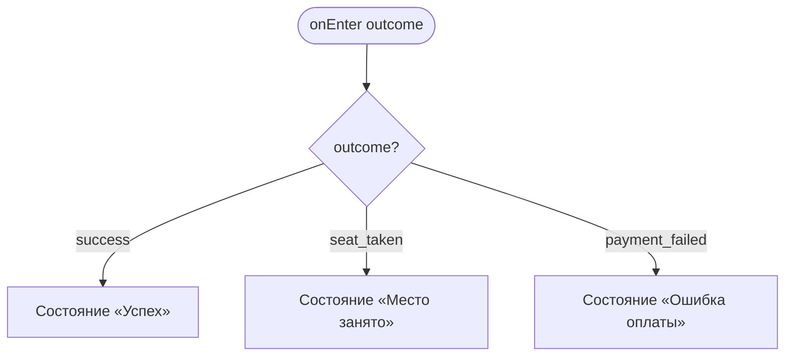
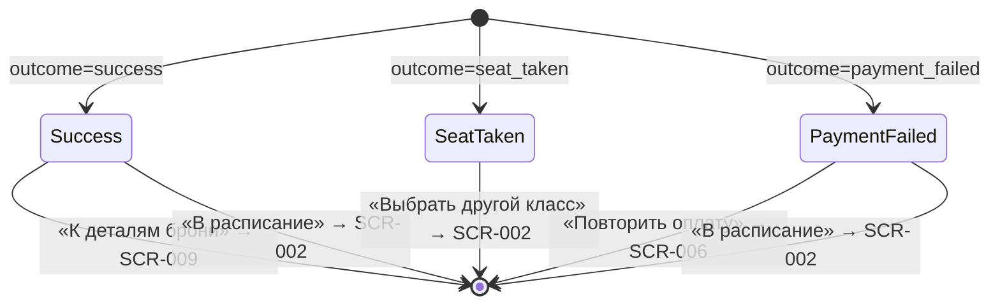

# Результат бронирования

**ID:** SCR-007  
**Тип:** Экран  
**Домен:** 03. Бронирование  
**Приоритет:** High  
**Статус:** Черновик  
**Функциональные блоки:** FB-003-003 Оплата  
**Зона авторизации:** АЗ  
**Дизайн-бриф:** [SCR-007 Результат бронирования](../../3-design-brief/SCR-007-booking-result.md)

---

## Содержание

- [История изменений](#история-изменений)
- [Обзор](#обзор)
- [Навигация](#навигация)
- [Входные данные](#входные-данные)
- [Применяемые логики](#применяемые-логики)
- [Инициализация](#инициализация)
- [Используемые запросы](#используемые-запросы)
- [Макет экрана](#макет-экрана)
- [Элементы экрана](#элементы-экрана)
- [Состояния экрана](#состояния-экрана)
- [Действия пользователя](#действия-пользователя)
- [Связанные требования](#связанные-требования)
- [Критерии приёмки](#критерии-приёмки)

---

## История изменений

| Релиз | ТЗ | Описание изменений |
|-------|-----|-------------------|
| — | — | Первоначальная документация |

---

## Обзор

Экран результата — развязка всего пути записи. Один переход из SCR-006, но три принципиально разных исхода, реализованных как один компонент с тремя взаимоисключающими состояниями (не последовательность, а альтернативы):

1. **Успех** — бронь подтверждена, класс зарезервирован, оплата проведена.
2. **Место занято** — место/прокат заняты раньше (гонка на бэкенде, 409) либо слот стал недоступен (410/404). Если оплата успела пройти — деньги возвращаются автоматически.
3. **Ошибка оплаты** — платёж не прошёл (402), бронь не создана, место не зарезервировано.

Общая структура (статус → что с деньгами → что делать дальше) одинакова для всех трёх состояний; различается наполнение и тон. Статус исхода — единственный по-настоящему громкий элемент экрана.

### User Story

> Как клиент, я хочу однозначно понять итог попытки записаться — место моё, деньги вернутся, или можно попробовать снова.

### Бизнес-ценность

- Снимает тревогу в самый чувствительный момент флоу (расставание с деньгами).
- При гонке/отмене явно сообщает об автоматическом возврате, снижая обращения в поддержку (BR-010).
- Честно объяснимая ситуация «место заняли на секунду раньше» — не вина клиента или продукта.

---

## Навигация

### Входящая (откуда открывается)

| Источник | Триггер | Условие | Передаваемые параметры |
|----------|---------|---------|------------------------|
| [SCR-006 Оплата](SCR-006-payment.md) | Тап «Оплатить» → ответ `createBooking` | Всегда — по любому исходу | Зависит от исхода (см. [Входные данные](#входные-данные)) |

### Исходящая (куда ведёт)

| Назначение | Триггер | Передаваемые параметры |
|------------|---------|------------------------|
| [SCR-009 Детали брони](../04-my-bookings/SCR-009-booking-details.md) | Тап «К деталям брони» (состояние «Успех») | `bookingId` |
| [SCR-002 Расписание классов](../02-schedule/SCR-002-schedule.md) | Тап «Выбрать другой класс» (состояние «Место занято») / «В расписание» (любое состояние) | — |
| [SCR-006 Оплата](SCR-006-payment.md) | Тап «Повторить оплату» (состояние «Ошибка оплаты») | `slotId`, `equipmentChoice`, `totalAmount` |

---

## Входные данные

| Название | Тип | Возможные значения | Описание |
|----------|-----|-------------------|----------|
| `outcome` | Параметр маршрута / Состояние | `success`, `seat_taken`, `payment_failed` | Код исхода попытки бронирования (из [LOGIC-005](../09-logics/LOGIC-005-booking-and-payment.md)) |
| `booking` | Объект Booking | — | Созданная бронь (только для `outcome = success`, ответ 201) |
| `payment` | Объект Payment | — | Платёж (только для `outcome = success`, ответ 201) |
| `message` | string | — | Человекочитаемое сообщение из ответа (для `seat_taken`, `payment_failed`) |
| `slotId` | UUID | — | ID слота (для возврата на SCR-006 при повторе оплаты) |
| `equipmentChoice` | `own`, `rental` | — | Выбор экипировки (для возврата на SCR-006 при повторе оплаты) |
| `totalAmount` | number | — | Предварительная сумма (для возврата на SCR-006 при повторе оплаты) |

---

## Применяемые логики

| Логика | Элемент/Триггер | Описание |
|--------|-----------------|----------|
| [LOGIC-005 Создание брони и оплата](../09-logics/LOGIC-005-booking-and-payment.md) | Инициализация (получение исхода) | Маршрутизация исходов из SCR-006 на три состояния экрана |

---

## Инициализация

Экран не выполняет запросов к API. Состояние определяется входным параметром `outcome`, переданным из SCR-006 через [LOGIC-005](../09-logics/LOGIC-005-booking-and-payment.md).

### Диаграмма загрузки



---

## Используемые запросы

Экран не инициирует запросы к API. Все данные получены из ответа `createBooking` на SCR-006 и переданы как входные параметры.

---

## Макет экрана

### Структура (общая для всех состояний)

```
┌─────────────────────────────────────┐
│                                     │
│         [Иконка статуса]             │  ← громкий визуальный сигнал
│         ЗАГОЛОВОК ИСХОДА            │
│                                     │
│   Что с деньгами: ...               │  ← про деньги
│                                     │
│   Что делать дальше: ...            │  ← про действия
│                                     │
├─────────────────────────────────────┤
│        [Действие]                   │  ← Fixed Bottom
└─────────────────────────────────────┘
```

### Состояние «Успех»

```
┌─────────────────────────────────────┐
│              ✓                       │
│      Бронь подтверждена!             │
│                                     │
│   Паста с нуля                       │  ← краткое «когда и что»
│   20 июня, 18:00                     │
│   Оплачено: 3 000 ₽                  │  ← payment.amount
│                                     │
│   [К деталям брони]                  │
│   [В расписание]                     │
└─────────────────────────────────────┘
```

### Состояние «Место занято»

```
┌─────────────────────────────────────┐
│              ⚠                       │
│     Место уже занято                 │
│                                     │
│   Место заняли на секунду раньше.    │
│   Бронь не создана.                  │
│   Деньги вернутся автоматически.     │  ← снятие тревоги
│                                     │
│   [Выбрать другой класс]             │
└─────────────────────────────────────┘
```

### Состояние «Ошибка оплаты»

```
┌─────────────────────────────────────┐
│              ✕                       │
│      Оплата не прошла                │
│                                     │
│   Бронь не создана, место            │
│   не зарезервировано.                │
│   Деньги не списались — можно        │  ← снятие тревоги
│   попробовать снова без последствий. │
│                                     │
│   [Повторить оплату]                 │
│   [В расписание]                     │
└─────────────────────────────────────┘
```

### Компоненты

| Компонент | Описание | Обязательность |
|-----------|----------|----------------|
| Иконка статуса | Визуальный сигнал исхода (галочка / предупреждение / крест) | Да |
| Заголовок исхода | Однозначный статус («Бронь подтверждена» / «Место занято» / «Оплата не прошла») | Да |
| Блок «Что с деньгами» | Информация о деньгах (оплачено / возвращается / не списалось) | Да |
| Блок «Что делать дальше» | Краткое описание доступных действий | Да |
| Кнопки действий | Primary/Secondary, fixed bottom | Да |

---

## Элементы экрана

### Состояние «Успех»

| Элемент | Описание | Источник данных | Валидация | Действие |
|---------|----------|-----------------|-----------|----------|
| Заголовок | «Бронь подтверждена!» | — | — | — |
| Краткая сводка | Название программы, дата/время | `booking.slot.program.name`, `booking.slot.startsAt` | — | — |
| Сумма | Оплаченная сумма | `payment.amount` (из ответа, авторитетная) | — | — |
| Кнопка «К деталям брони» | Primary | — | — | Переход на [SCR-009](../04-my-bookings/SCR-009-booking-details.md) с `bookingId` |
| Кнопка «В расписание» | Secondary | — | — | Переход на [SCR-002](../02-schedule/SCR-002-schedule.md) |

**Логика:**
- Факт подтверждения важнее деталей класса (они уже видны раньше) — достаточно краткого «когда и что».
- Сумма отображается из `payment.amount` ответа (авторитетное значение, см. [LOGIC-004](../09-logics/LOGIC-004-equipment-and-pricing.md)).
- Тон тёплый, короткое подтверждение.

---

### Состояние «Место занято»

| Элемент | Описание | Источник данных | Валидация | Действие |
|---------|----------|-----------------|-----------|----------|
| Заголовок | «Место уже занято» | — | — | — |
| Объяснение | «Место заняли на секунду раньше. Бронь не создана.» | `message` (из ответа 409/410/404) | — | — |
| Информация о возврате | «Деньги вернутся автоматически.» | — | — | — |
| Кнопка «Выбрать другой класс» | Primary | — | — | Переход на [SCR-002](../02-schedule/SCR-002-schedule.md) |

**Логика:**
- Если оплата успела пройти до обнаружения гонки — деньги возвращаются автоматически (FR-013). Пользователь узнаёт об этом здесь же, а не в поддержке.
- Тон сочувственный, но не извиняющийся сверх меры.
- Применимо к исходам 409 (`no_capacity`), 410 (`slot_unavailable`), 404 (`slot_not_found`) — все ведут на это состояние.

---

### Состояние «Ошибка оплаты»

| Элемент | Описание | Источник данных | Валидация | Действие |
|---------|----------|-----------------|-----------|----------|
| Заголовок | «Оплата не прошла» | — | — | — |
| Объяснение | «Бронь не создана, место не зарезервировано.» | `message` (из ответа 402) | — | — |
| Снятие тревоги | «Деньги не списались — можно попробовать снова без последствий.» | — | — | — |
| Кнопка «Повторить оплату» | Primary | — | — | Переход на [SCR-006](SCR-006-payment.md) с `slotId`, `equipmentChoice`, `totalAmount` |
| Кнопка «В расписание» | Secondary | — | — | Переход на [SCR-002](../02-schedule/SCR-002-schedule.md) |

**Логика:**
- Пользователь понимает, что можно попробовать ещё раз без последствий (новая независимая попытка, FR-012).
- Предупреждение: место могло за это время уйти к другому клиенту — успех повтора не гарантирован.
- Тон ободряющий, прямо снимающий страх «а вдруг деньги списались непонятно куда».
- Технические детали причины отказа (коды ошибок эквайринга) не показываются (CON-003).

---

## Состояния экрана

### Таблица состояний

| Состояние | Условие | Отображение |
|-----------|---------|-------------|
| Success | `outcome = success` (createBooking 201) | Иконка-галочка, «Бронь подтверждена», сводка, сумма, кнопки «К деталям брони» / «В расписание» |
| SeatTaken | `outcome = seat_taken` (createBooking 409/410/404) | Иконка-предупреждение, «Место занято», объяснение + возврат, кнопка «Выбрать другой класс» |
| PaymentFailed | `outcome = payment_failed` (createBooking 402) | Иконка-крест, «Оплата не прошла», объяснение + снятие тревоги, кнопки «Повторить оплату» / «В расписание» |

### Диаграмма переходов



---

## Действия пользователя

| Действие | Элемент | Триггер | Результат |
|----------|---------|---------|-----------|
| К деталям брони | Кнопка (Success) | Tap | Переход на [SCR-009 Детали брони](../04-my-bookings/SCR-009-booking-details.md) с `bookingId` |
| Выбрать другой класс | Кнопка (SeatTaken) | Tap | Переход на [SCR-002 Расписание](../02-schedule/SCR-002-schedule.md) |
| Повторить оплату | Кнопка (PaymentFailed) | Tap | Переход на [SCR-006 Оплата](SCR-006-payment.md) с `slotId`, `equipmentChoice`, `totalAmount` |
| В расписание | Кнопка (любое состояние) | Tap | Переход на [SCR-002 Расписание](../02-schedule/SCR-002-schedule.md) |

---

## Связанные требования

### Функциональные (FR / UC)

| ID | Название | Приоритет |
|----|----------|-----------|
| FR-012 | При неуспешной оплате бронь не создаётся; новая независимая попытка | Must |
| FR-013 | При гонке (место занято) — автоматический возврат, сообщение клиенту | Must |
| UC-003 | Бронирование слота с оплатой (постусловие успеха, альт. потоки 4a/4b) | Must |

### Интеграции (NFR / CON)

| ID | Название | Приоритет |
|----|----------|-----------|
| CON-003 | Технические детали отказа платежа не показываются клиенту | Must |
| CON-007 | Бронь и оплата — атомарная операция | Must |
| NFR-016 | Автоматический повтор попытки не предусмотрен; только явное действие | Must |

### UI (US)

| ID | Название | Приоритет |
|----|----------|-----------|
| US-008 | Получить подтверждение после успешной оплаты | Must |
| US-009 | Чёткий результат при гонке/ошибке с понятными дальнейшими действиями | Must |

### Бизнес (BR)

| ID | Название | Приоритет |
|----|----------|-----------|
| BR-010 | Автоматизация возврата средств без ручных обращений | Must |

---

## Критерии приёмки

### Позитивные сценарии

| ID | Критерий | Приоритет |
|----|----------|-----------|
| AC-001 | **Дано** createBooking вернул 201, **Когда** открывается экран, **Тогда** отображается состояние «Успех»: иконка-галочка, «Бронь подтверждена», краткая сводка (программа, дата/время), сумма из `payment.amount`, кнопки «К деталям брони» и «В расписание» | P0 |
| AC-002 | **Дано** состояние «Успех», **Когда** тап «К деталям брони», **Тогда** переход на SCR-009 с `bookingId` | P0 |

### Негативные сценарии

| ID | Критерий | Приоритет |
|----|----------|-----------|
| AC-N01 | **Дано** createBooking вернул 409 `no_capacity`, **Когда** открывается экран, **Тогда** отображается состояние «Место занято»: иконка-предупреждение, объяснение, «Деньги вернутся автоматически», кнопка «Выбрать другой класс» | P0 |
| AC-N02 | **Дано** createBooking вернул 402 `payment_failed`, **Когда** открывается экран, **Тогда** отображается состояние «Ошибка оплаты»: иконка-крест, объяснение, «Деньги не списались», кнопки «Повторить оплату» и «В расписание» | P0 |
| AC-N03 | **Дано** состояние «Место занято», **Когда** тап «Выбрать другой класс», **Тогда** переход на SCR-002 | P0 |
| AC-N04 | **Дано** состояние «Ошибка оплаты», **Когда** тап «Повторить оплату», **Тогда** переход на SCR-006 с `slotId`, `equipmentChoice`, `totalAmount` | P0 |

### Граничные условия (Edge Cases)

| ID | Критерий | Приоритет |
|----|----------|-----------|
| AC-E01 | **Дано** createBooking вернул 410 `slot_unavailable`, **Когда** открывается экран, **Тогда** отображается состояние «Место занято» (запись закрыта) с кнопкой «В расписание» | P1 |
| AC-E02 | **Дано** createBooking вернул 404 `slot_not_found`, **Когда** слот не существует, **Тогда** отображается состояние «Место занято» (класс не найден) с кнопкой «В расписание» | P1 |
| AC-E03 | **Дано** `totalAmount` (SCR-005/006) ≠ `payment.amount` (ответ), **Когда** состояние «Успех», **Тогда** отображается сумма из `payment.amount` (авторитетное значение) | P1 |

---
