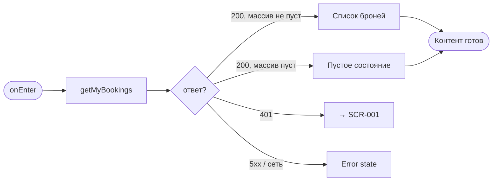
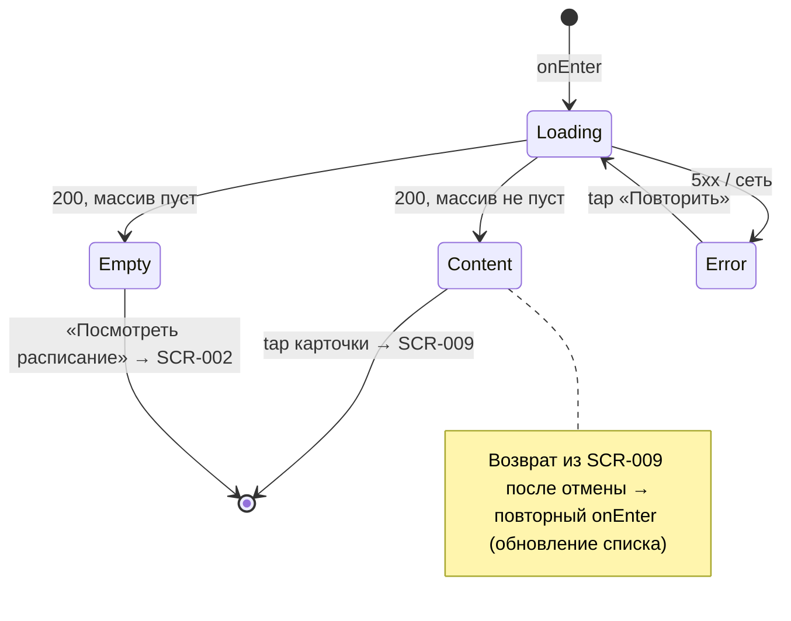

# Мои брони (активные)

**ID:** SCR-008  
**Тип:** Экран  
**Домен:** 04. Мои брони  
**Приоритет:** High  
**Статус:** Черновик  
**Функциональные блоки:** FB-004-001 Список активных броней  
**Зона авторизации:** АЗ  
**Дизайн-бриф:** [SCR-008 Мои брони](../../3-design-brief/SCR-008-my-bookings.md)

---

## Содержание

- [История изменений](#история-изменений)
- [Обзор](#обзор)
- [Навигация](#навигация)
- [Входные данные](#входные-данные)
- [Применяемые логики](#применяемые-логики)
- [Инициализация](#инициализация)
- [Используемые запросы](#используемые-запросы)
- [Макет экрана](#макет-экрана)
- [Элементы экрана](#элементы-экрана)
- [Состояния экрана](#состояния-экрана)
- [Действия пользователя](#действия-пользователя)
- [Связанные требования](#связанные-требования)
- [Критерии приёмки](#критерии-приёмки)

---

## История изменений

| Релиз | ТЗ | Описание изменений |
|-------|-----|-------------------|
| — | — | Первоначальная документация |

---

## Обзор

Раздел «Мои брони» — точка, в которую клиент возвращается, когда думает о запланированном: «когда следующий класс», «хочу отменить», «свериться со всеми планами». Один из основных пунктов навигации, наравне с расписанием. Здесь — простой хронологический список активных броней (ближайшая первой), без разделения на группы «Сегодня / Ближайшие / Остальные».

Прошедшие/завершённые классы сюда не попадают — это отдельный раздел «История» (SCR-010). Отмена прямо из списка свайпом не предусмотрена: необратимое действие заслуживает подтверждающего экрана (SCR-009).

> **Примечание о push-навигации:** push с деталями конкретной брони ведёт напрямую на SCR-009, минуя этот список. Сюда клиент попадает по push только в редком резервном случае, если бэкенд/приложение не смогли определить конкретную бронь.

### User Story

> Как клиент, я хочу увидеть все свои предстоящие подтверждённые записи
> и быстро попасть в ту, которая нужна прямо сейчас.

### Бизнес-ценность

- Организационная опора клиента: быстрый доступ к своим обязательствам.
- Брони, отменённые студией, явно помечены — клиент не считает, что место за ним сохранено (FR-017).
- Пустое состояние мягко подталкивает к расписанию, не давя.

---

## Навигация

### Входящая (откуда открывается)

| Источник | Триггер | Условие | Передаваемые параметры |
|----------|---------|---------|------------------------|
| Основная навигация (нижняя вкладка) | Переключение вкладки | Всегда | — |
| [LOGIC-006 Отмена брони](../09-logics/LOGIC-006-booking-cancellation.md) | Возврат после успешной отмены | — | — |
| Push-уведомление (резервный сценарий) | Тап по push | Конкретная бронь не определена | — |

### Исходящая (куда ведёт)

| Назначение | Триггер | Передаваемые параметры |
|------------|---------|------------------------|
| [SCR-009 Детали брони](SCR-009-booking-details.md) | Тап по карточке брони | `bookingId` |
| [SCR-002 Расписание классов](../02-schedule/SCR-002-schedule.md) | Тап «Посмотреть расписание» (пустое состояние) | — |

---

## Входные данные

| Название | Тип | Возможные значения | Описание |
|----------|-----|-------------------|----------|
| `token` | Защищённое хранилище | JWT | Bearer-токен авторизованного клиента (LOGIC-001) |

---

## Применяемые логики

| Логика | Элемент/Триггер | Описание |
|--------|-----------------|----------|
| [LOGIC-001 Сессия](../09-logics/LOGIC-001-auth-and-session.md) | Ответ 401 от getMyBookings | Истечение сессии, переход на SCR-001 |

---

## Инициализация

### Диаграмма загрузки



### Запросы при открытии

| № | Запрос | Критичный | Зависит от | Условие |
|---|--------|-----------|------------|---------|
| 1 | [getMyBookings](#getmybookings) | Да | — | Всегда |

> Полное описание запросов см. в секции [Используемые запросы](#используемые-запросы).

---

## Используемые запросы

### getMyBookings

**Тип:** REST  
**Метод:** GET  
**Спецификация:** [openapi.yaml](../../api/openapi.yaml) → `getMyBookings` (GET /bookings)

**Триггер:** Инициализация (onEnter), возврат на экран после отмены (из SCR-009)

**Параметры:** нет

**Обработка ответа:**

| Результат | Условие | UI-реакция |
|-----------|---------|------------|
| Загрузка | — | Скелетон списка |
| Успех | `200`, массив не пуст | Отрисовать список карточек броней (сортировка: ближайшая первой) |
| Успех | `200`, массив пуст | Пустое состояние |
| HTTP 401 | — | Перенаправление на [SCR-001](../01-auth/SCR-001-login.md) (LOGIC-001) |
| HTTP 5xx | — | Error state с кнопкой «Повторить» |
| Сеть | Нет соединения | Error state с кнопкой «Повторить» |

---

## Макет экрана

### Структура

```
┌─────────────────────────────────────┐
│ Мои брони                            │  ← Header
├─────────────────────────────────────┤
│                                     │
│  ┌─ Карточка брони ───────────────┐ │
│  │ 20 июня, 18:00    [Подтверждена]│ │  ← дата/время, статус
│  │ Паста с нуля                    │ │  ← программа
│  └────────────────────────────────┘ │
│                                     │
│  ┌─ Карточка брони (отмена студии)┐ │
│  │ 25 июня, 12:00  [Отменена студ.]│ │  ← визуально отлична
│  │ Десерты                         │ │
│  └────────────────────────────────┘ │
│                                     │
└─────────────────────────────────────┘
```

### Пустое состояние

```
┌─────────────────────────────────────┐
│                                     │
│         [Иллюстрация]                │
│      У вас пока нет броней           │
│   Запишитесь на ближайший класс      │
│                                     │
│       [Посмотреть расписание]        │
│                                     │
└─────────────────────────────────────┘
```

### Компоненты

| Компонент | Описание | Обязательность |
|-----------|----------|----------------|
| Header | Заголовок «Мои брони» | Да |
| Карточка брони | Дата/время, статус, программа | Да |
| Пустое состояние | Иллюстрация + текст + кнопка | Да |

---

## Элементы экрана

### 1. Карточка брони

| Элемент | Описание | Источник данных | Валидация | Действие |
|---------|----------|-----------------|-----------|----------|
| Дата и время | Дата и время начала класса | `booking.slot.startsAt` из getMyBookings | — | Открыть [SCR-009](SCR-009-booking-details.md) с `bookingId` |
| Статус | Статус брони (подтверждена / отменена студией) | `booking.status` (`active` / `cancelled_by_studio`) | — | Открыть [SCR-009](SCR-009-booking-details.md) с `bookingId` |
| Программа | Название класса | `booking.slot.program.name` из getMyBookings | — | Открыть [SCR-009](SCR-009-booking-details.md) с `bookingId` |

**Логика:**
- Список — простой хронологический (ближайшая бронь первой), без группировки (РЕШЕНО в дизайн-брифе).
- Карточки `cancelled_by_studio` визуально отличны (приглушены/бейдж), но не спрятаны и не наказаны визуально «как ошибка клиента».
- Статус виден без открытия деталей: если бронь не подтверждена в обычном смысле, это должно быть видно сразу (FR-017).
- Тап по любой карточке → SCR-009.

---

### 2. Пустое состояние

| Элемент | Описание | Источник данных | Валидация | Действие |
|---------|----------|-----------------|-----------|----------|
| Иллюстрация | Нейтральная иконка/иллюстрация | — | — | — |
| Текст | «У вас пока нет броней» | — | — | — |
| Подзаголовок | «Запишитесь на ближайший класс» | — | — | — |
| Кнопка «Посмотреть расписание» | Primary | — | — | Переход на [SCR-002](../02-schedule/SCR-002-schedule.md) |

**Логика:**
- Пустое состояние — нормальная ситуация, не ошибка. Тон — мягко подталкивающий к расписанию, не давящий.

---

## Состояния экрана

### Таблица состояний

| Состояние | Условие | Отображение |
|-----------|---------|-------------|
| Loading | Ожидание getMyBookings | Скелетон списка |
| Content | getMyBookings 200, массив не пуст | Список карточек броней |
| Empty | getMyBookings 200, массив пуст | Пустое состояние + кнопка «Посмотреть расписание» |
| Error | getMyBookings 5xx / нет сети | Error state с кнопкой «Повторить» |

### Диаграмма переходов



---

## Действия пользователя

| Действие | Элемент | Триггер | Результат |
|----------|---------|---------|-----------|
| Открыть детали брони | Карточка брони | Tap | Переход на [SCR-009 Детали брони](SCR-009-booking-details.md) с `bookingId` |
| Перейти к расписанию | Кнопка (пустое состояние) | Tap | Переход на [SCR-002 Расписание](../02-schedule/SCR-002-schedule.md) |
| Обновить список | Кнопка «Повторить» (error state) / pull-to-refresh | Tap | Повторный запрос getMyBookings |

---

## Связанные требования

### Функциональные (FR / UC)

| ID | Название | Приоритет |
|----|----------|-----------|
| FR-017 | Отображение статуса «Отменена студией» с причиной | Must |
| UC-004 | Просмотр моих активных броней (предусловие) | Must |
| UC-005 | Обработка отмены слота студией (постусловие: пометка в списке) | Must |

### Интеграции (NFR / CON)

| ID | Название | Приоритет |
|----|----------|-----------|
| CON-001 | Приложение — read-only консьюмер API | Must |
| NFR-015 | Данные актуальны только из свежего ответа бэкенда | Must |

### UI (US)

| ID | Название | Приоритет |
|----|----------|-----------|
| US-010 | Видеть список своих активных броней | Must |
| US-011 | Видеть отменённые студией брони с явной пометкой | Must |
| US-013 | Быстрый доступ к деталям брони из списка | Must |

---

## Критерии приёмки

### Позитивные сценарии

| ID | Критерий | Приоритет |
|----|----------|-----------|
| AC-001 | **Дано** клиент на вкладке «Мои брони», **Когда** открывается экран, **Тогда** выполняется getMyBookings, отображается скелетон списка | P0 |
| AC-002 | **Дано** getMyBookings возвращает 200 с массивом броней, **Когда** данные загружены, **Тогда** отображается список карточек (дата/время, статус, программа), отсортированный по времени (ближайшая первой) | P0 |
| AC-003 | **Дано** на экране, **Когда** тап по карточке брони, **Тогда** переход на SCR-009 с `bookingId` | P0 |
| AC-004 | **Дано** возврат из SCR-009 после успешной отмены, **Когда** экран открыт, **Тогда** список обновляется (отменённая бронь исчезает из активных) | P1 |

### Негативные сценарии

| ID | Критерий | Приоритет |
|----|----------|-----------|
| AC-N01 | **Дано** ошибка сети при открытии, **Когда** getMyBookings не выполняется, **Тогда** отображается error state с кнопкой «Повторить» | P0 |
| AC-N02 | **Дано** сессия истекла, **Когда** getMyBookings возвращает 401, **Тогда** выполняется переход на SCR-001 (LOGIC-001) | P0 |

### Граничные условия (Edge Cases)

| ID | Критерий | Приоритет |
|----|----------|-----------|
| AC-E01 | **Дано** getMyBookings возвращает пустой массив, **Когда** данных нет, **Тогда** отображается пустое состояние с кнопкой «Посмотреть расписание» | P1 |
| AC-E02 | **Дано** среди броней есть `cancelled_by_studio`, **Когда** отрисовывается список, **Тогда** такая карточка визуально отлична (бейдж «Отменена студией»), но не скрыта | P1 |
| AC-E03 | **Дано** pull-to-refresh, **Когда** жест выполнен, **Тогда** выполняется повторный запрос getMyBookings, список обновляется | P2 |

---
