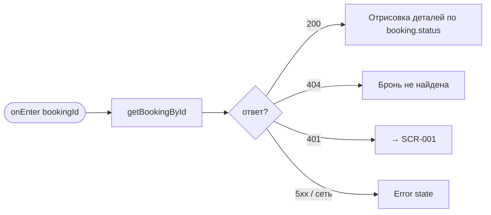
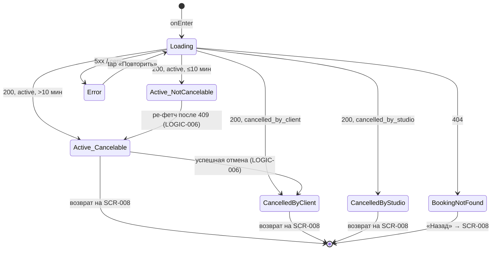

# Детали брони

**ID:** SCR-009  
**Тип:** Экран  
**Домен:** 04. Мои брони  
**Приоритет:** High  
**Статус:** Черновик  
**Функциональные блоки:** FB-004-002 Детали брони, FB-004-003 Отмена брони  
**Зона авторизации:** АЗ  
**Дизайн-бриф:** [SCR-009 Детали брони](../../3-design-brief/SCR-009-booking-details.md)

---

## Содержание

- [История изменений](#история-изменений)
- [Обзор](#обзор)
- [Навигация](#навигация)
- [Входные данные](#входные-данные)
- [Применяемые логики](#применяемые-логики)
- [Инициализация](#инициализация)
- [Используемые запросы](#используемые-запросы)
- [Макет экрана](#макет-экрана)
- [Элементы экрана](#элементы-экрана)
- [Состояния экрана](#состояния-экрана)
- [Действия пользователя](#действия-пользователя)
- [Связанные требования](#связанные-требования)
- [Критерии приёмки](#критерии-приёмки)

---

## История изменений

| Релиз | ТЗ | Описание изменений |
|-------|-----|-------------------|
| — | — | Первоначальная документация |

---

## Обзор

Единственное место, где клиент может распользоваться уже сделанной записью: посмотреть подробности и, если ещё не поздно, отменить её. Статус брони определяет весь дальнейший путь на экране:

- **Активна, отмена доступна** (более 10 минут до начала) — полный набор информации + доступное действие отмены.
- **Активна, отмена недоступна** (менее 10 минут до начала) — та же информация, но отмена явно недоступна с понятной причиной.
- **Отменена клиентом** — финальное состояние после подтверждения отмены.
- **Отменена студией** — финальное состояние с обязательной видимой причиной и подтверждением автоматического возврата средств.

Подтверждение отмены оформляется как модальное окно поверх экрана (РЕШЕНО в дизайн-брифе), чётко сообщающее о необратимости и возврате денег до нажатия кнопки подтверждения.

### User Story

> Как клиент, я хочу увидеть детали своей брони и при необходимости отменить её,
> понимая, что будет с деньгами.

### Бизнес-ценность

- Самообслуживание при отказе от класса снижает нагрузку на поддержку (BR-010).
- Жёсткий порог 10 минут защищает студию от финансовых потерь (BR-003, CON-006).
- При отмене студией явная причина и подтверждение возврата снимают тревогу клиента (FR-017, FR-018).

---

## Навигация

### Входящая (откуда открывается)

| Источник | Триггер | Условие | Передаваемые параметры |
|----------|---------|---------|------------------------|
| [SCR-008 Мои брони](SCR-008-my-bookings.md) | Тап по карточке брони | — | `bookingId` |
| [SCR-007 Результат бронирования](../03-booking/SCR-007-booking-result.md) | Тап «К деталям брони» (состояние «Успех») | — | `bookingId` |
| Push-уведомление любого типа | Тап по push (подтверждение/напоминание/отмена студией) | Бэкенд передаёт ID конкретной брони | `bookingId` |

### Исходящая (куда ведёт)

| Назначение | Триггер | Передаваемые параметры |
|------------|---------|------------------------|
| [SCR-008 Мои брони](SCR-008-my-bookings.md) | Возврат после успешной отмены / кнопка «Назад» | — |
| [SCR-011 Оценка и отзыв](../05-history-and-ratings/SCR-011-rating.md) | Тап «Оставить отзыв» (завершённый класс без оценки) | `bookingId` |

---

## Входные данные

| Название | Тип | Возможные значения | Описание |
|----------|-----|-------------------|----------|
| `bookingId` | Параметр маршрута | UUID | ID брони, передаётся из SCR-008 / SCR-007 / push |
| `token` | Защищённое хранилище | JWT | Bearer-токен авторизованного клиента (LOGIC-001) |

---

## Применяемые логики

| Логика | Элемент/Триггер | Описание |
|--------|-----------------|----------|
| [LOGIC-006 Отмена брони клиентом](../09-logics/LOGIC-006-booking-cancellation.md) | Кнопка «Отменить бронь» + модальное окно | Проверка порога, подтверждение, вызов cancelBooking, обработка ответа |
| [LOGIC-002 Доступность слота](../09-logics/LOGIC-002-slot-availability.md) | Кнопка «Отменить бронь» | Локальная проверка порога 10 минут для блокировки UI |
| [LOGIC-001 Сессия](../09-logics/LOGIC-001-auth-and-session.md) | Ответ 401 от любого запроса | Истечение сессии, переход на SCR-001 |

---

## Инициализация

### Диаграмма загрузки



### Запросы при открытии

| № | Запрос | Критичный | Зависит от | Условие |
|---|--------|-----------|------------|---------|
| 1 | [getBookingById](#getbookingbyid) | Да | — | Всегда |

> Полное описание запросов см. в секции [Используемые запросы](#используемые-запросы).

---

## Используемые запросы

### getBookingById

**Тип:** REST  
**Метод:** GET  
**Спецификация:** [openapi.yaml](../../api/openapi.yaml) → `getBookingById` (GET /bookings/{bookingId})

**Триггер:** Инициализация (onEnter); ре-фетч после ошибки отмены (409, см. [LOGIC-006](../09-logics/LOGIC-006-booking-cancellation.md))

**Параметры:**

| Параметр | Тип | Обязательность | Источник | Описание |
|----------|-----|----------------|----------|----------|
| `bookingId` | string (uuid) | Да | Параметр маршрута | ID брони |

**Обработка ответа:**

| Результат | Условие | UI-реакция |
|-----------|---------|------------|
| Загрузка | — | Скелетон контента |
| Успех | `200`, `status = active` | Детали + кнопка отмены (доступность по LOGIC-002) |
| Успех | `200`, `status = cancelled_by_client` | Детали в состоянии «отменена клиентом» |
| Успех | `200`, `status = cancelled_by_studio` | Детали в состоянии «отменена студией» + причина |
| HTTP 401 | — | Перенаправление на [SCR-001](../01-auth/SCR-001-login.md) (LOGIC-001) |
| HTTP 404 | `reason = booking_not_found` | Error state «Бронь не найдена», кнопка «Назад» |
| HTTP 5xx | — | Error state с кнопкой «Повторить» |
| Сеть | Нет соединения | Error state с кнопкой «Повторить» |

---

### cancelBooking

**Тип:** REST  
**Метод:** POST  
**Спецификация:** [openapi.yaml](../../api/openapi.yaml) → `cancelBooking` (POST /bookings/{bookingId}/cancel)

> Полная обработка запроса описана в [LOGIC-006 Отмена брони клиентом](../09-logics/LOGIC-006-booking-cancellation.md). Экран SCR-009 инициирует запрос из модального окна подтверждения.

**Триггер:** Подтверждение в модальном окне «Отменить бронь».

---

## Макет экрана

### Структура (активная бронь)

```
┌─────────────────────────────────────┐
│ [←] Детали брони                     │  ← Header
├─────────────────────────────────────┤
│                                     │
│  ┌─ Статус ───────────────────────┐ │
│  │  ● Активна                      │ │
│  └────────────────────────────────┘ │
│                                     │
│  ┌─ Класс ────────────────────────┐ │
│  │ Паста с нуля                    │ │
│  │ 20 июня, 18:00 · 90 мин         │ │
│  │ Шеф: Анна Иванова               │ │
│  └────────────────────────────────┘ │
│                                     │
│  ┌─ Оплата ───────────────────────┐ │
│  │ Оплачено: 3 000 ₽              │ │
│  │ Статус: оплачено                │ │
│  └────────────────────────────────┘ │
│                                     │
│  ┌─ Экипировка ───────────────────┐ │
│  │ Прокатная экипировка            │ │
│  └────────────────────────────────┘ │
│                                     │
│  ┌─ Аллергии ─────────────────────┐ │
│  │ Орехи, глютен                   │ │
│  └────────────────────────────────┘ │
│                                     │
├─────────────────────────────────────┤
│         [Отменить бронь]            │  ← Fixed Bottom
└─────────────────────────────────────┘
```

### Структура (отменена студией)

```
┌─────────────────────────────────────┐
│ [←] Детали брони                     │
├─────────────────────────────────────┤
│                                     │
│  ┌─ Статус ───────────────────────┐ │
│  │  ⚠ Отменена студией             │ │  ← акцентный элемент
│  │  Причина: класс отменён студией │ │
│  └────────────────────────────────┘ │
│                                     │
│  ┌─ Оплата ───────────────────────┐ │
│  │ Деньги возвращены (refunded)    │ │  ← снятие тревоги
│  └────────────────────────────────┘ │
│                                     │
│  ┌─ Класс ────────────────────────┐ │
│  │ Паста с нуля · 20 июня          │ │
│  └────────────────────────────────┘ │
│                                     │
└─────────────────────────────────────┘
```

### Модальное окно подтверждения отмены

```
┌─────────────────────────────────────┐
│           Отменить бронь?            │
│                                     │
│  Действие необратимо.               │
│  Деньги вернутся автоматически      │
│  после подтверждения.               │
│                                     │
│      [Не отменять]  [Отменить]      │
└─────────────────────────────────────┘
```

### Компоненты

| Компонент | Описание | Обязательность |
|-----------|----------|----------------|
| Header | Заголовок «Детали брони», кнопка «Назад» | Да |
| Блок статуса | Текущий статус брони (акцентный при отмене студией) | Да |
| Блок класса | Программа, дата/время, длительность, шеф | Да |
| Блок оплаты | Сумма и статус оплаты | Да |
| Блок экипировки | Выбранный вариант экипировки | Да |
| Блок аллергий | Аллергии, зафиксированные в брони (справочно) | Опционально |
| Кнопка «Отменить бронь» | Primary/danger, fixed bottom (при доступности) | Опционально |

---

## Элементы экрана

### 1. Блок статуса

| Элемент | Описание | Источник данных | Валидация | Действие |
|---------|----------|-----------------|-----------|----------|
| Индикатор статуса | Активна / Отменена клиентом / Отменена студией | `booking.status` из getBookingById | — | — |
| Причина отмены (при `cancelled_by_studio`) | Видимая причина отмены | `booking.slot.status` / текст причины | — | — |

**Логика:**
- Статус брони — первичный элемент для всех сценариев входа (определяет путь).
- При `cancelled_by_studio` причина отмены — самый заметный элемент экрана (клиент пришёл за этим после push).

---

### 2. Блок класса

| Элемент | Описание | Источник данных | Валидация | Действие |
|---------|----------|-----------------|-----------|----------|
| Программа | Название класса | `booking.slot.program.name` | — | — |
| Дата и время | Дата и время начала | `booking.slot.startsAt` | — | — |
| Длительность | Длительность в минутах | `booking.slot.durationMinutes` | — | — |
| Шеф | Имя шефа | `booking.slot.chef.name` | — | — |

---

### 3. Блок оплаты

| Элемент | Описание | Источник данных | Валидация | Действие |
|---------|----------|-----------------|-----------|----------|
| Сумма | Оплаченная сумма | `booking.payment.amount` | — | — |
| Статус оплаты | Оплачено / Возвращено | `booking.payment.status` (`paid` / `refunded`) | — | — |

**Логика:**
- Деньги прослеживаемы без перехода в отдельный «финансовый» раздел.
- При `cancelled_by_studio` и `cancelled_by_client` статус оплаты — `refunded` (деньги возвращены), что явно отображается для снятия тревоги.

---

### 4. Блок экипировки

| Элемент | Описание | Источник данных | Валидация | Действие |
|---------|----------|-----------------|-----------|----------|
| Вариант экипировки | Своя / Прокатная | `booking.equipmentChoice` (`own` / `rental`) | — | — |

---

### 5. Блок аллергий

| Элемент | Описание | Источник данных | Валидация | Действие |
|---------|----------|-----------------|-----------|----------|
| Список аллергий | Аллергии, зафиксированные в этой брони (справочно) | `booking.allergies` | — | — |
| Текст «Аллергии не указаны» | Если список пуст | `booking.allergies = []` | — | — |

**Логика:**
- Аллергии зафиксированы в брони на момент её создания (FR-027) и не меняются при изменении профиля. Отображаются справочно.

---

### Кнопка «Отменить бронь»

| Элемент | Описание | Источник данных | Валидация | Действие |
|---------|----------|-----------------|-----------|----------|
| Кнопка «Отменить бронь» | Primary/danger, fixed bottom | — | — | Открыть модальное окно подтверждения |

**Условия доступности (по [LOGIC-002](../09-logics/LOGIC-002-slot-availability.md) и [LOGIC-006](../09-logics/LOGIC-006-booking-cancellation.md)):**
- Кнопка отображается, если `booking.status = active`.
- Кнопка доступна, если `booking.slot.startsAt − now > 10 минут`.
- Кнопка заблокирована (disabled) с указанием причины, если до начала ≤ 10 минут: «Отмена доступна не позднее чем за 10 минут до начала класса».
- Кнопка скрыта, если `booking.status = cancelled_by_client` или `cancelled_by_studio`.

---

## Состояния экрана

### Таблица состояний

| Состояние | Условие | Отображение |
|-----------|---------|-------------|
| Loading | Ожидание getBookingById | Скелетон контента |
| Active_Cancelable | `status = active`, до `startsAt` > 10 мин | Детали + активная кнопка «Отменить бронь» |
| Active_NotCancelable | `status = active`, до `startsAt` ≤ 10 мин | Детали + заблокированная кнопка с причиной |
| CancelledByClient | `status = cancelled_by_client` | Детали в статусе «отменена клиентом», оплата `refunded`, кнопки отмены нет |
| CancelledByStudio | `status = cancelled_by_studio` | Детали в статусе «отменена студией» + причина, оплата `refunded`, кнопки отмены нет |
| BookingNotFound | getBookingById 404 | Error state «Бронь не найдена», кнопка «Назад» |
| Error | getBookingById 5xx / нет сети | Error state с кнопкой «Повторить» |

### Диаграмма переходов



---

## Действия пользователя

| Действие | Элемент | Триггер | Результат |
|----------|---------|---------|-----------|
| Открыть отмену | Кнопка «Отменить бронь» | Tap | Открыть модальное окно подтверждения |
| Подтвердить отмену | Кнопка «Отменить» (в модалке) | Tap | [LOGIC-006](../09-logics/LOGIC-006-booking-cancellation.md): вызов cancelBooking |
| Отказаться от отмены | Кнопка «Не отменять» / закрытие модалки | Tap | Закрыть модалку без запроса |
| Возврат к списку | Кнопка «Назад» | Tap | Переход на [SCR-008](SCR-008-my-bookings.md) |
| Оставить отзыв | Кнопка «Оставить отзыв» | Tap | Переход на [SCR-011](../05-history-and-ratings/SCR-011-rating.md) с `bookingId` (если класс завершён и отзыв не оставлен) |

---

## Связанные требования

### Функциональные (FR / UC)

| ID | Название | Приоритет |
|----|----------|-----------|
| FR-014 | Запрет отмены менее чем за 10 минут до начала | Must |
| FR-015 | Отмена брони не позднее чем за 10 минут до начала | Must |
| FR-016 | Автоматический перевод оплаты `paid → refunded` при отмене клиентом | Must |
| FR-017 | Отображение статуса «Отменена студией» с причиной | Must |
| FR-018 | Автоматический возврат при отмене слота студией | Must |
| FR-019 | Запрет повторной записи на слот, отменённый студией | Must |
| FR-027 | Аллергии зафиксированы в брони на момент создания (справочно) | Must |
| UC-004 | Отмена брони клиентом | Must |
| UC-005 | Обработка отмены слота студией | Must |

### Интеграции (NFR / CON)

| ID | Название | Приоритет |
|----|----------|-----------|
| NFR-013 | Порог 10 мин в UI — вспомогательная мера; финальную проверку делает бэкенд | Must |
| NFR-015 | Данные актуальны только из свежего ответа бэкенда | Must |
| CON-006 | Порог отмены — ровно 10 минут до начала; не настраивается | Must |
| CON-008 | Отсутствие статуса «поздняя отмена» / «no-show» | Must |

### UI (US)

| ID | Название | Приоритет |
|----|----------|-----------|
| US-010 | Отмена брони не позднее чем за 10 минут до начала | Must |
| US-011 | Видимая недоступность кнопок за 10 минут до начала | Must |
| US-013 | Быстрый доступ к деталям брони | Must |
| US-014 | Автоматический возврат денег при отмене без обращения в поддержку | Must |

### Бизнес (BR)

| ID | Название | Приоритет |
|----|----------|-----------|
| BR-003 | Защита студии от финансовых потерь via порога времени | Must |
| BR-010 | Автоматизация возврата средств без ручных обращений | Must |

---

## Критерии приёмки

### Позитивные сценарии

| ID | Критерий | Приоритет |
|----|----------|-----------|
| AC-001 | **Дано** клиент перешёл с SCR-008 / по push, **Когда** открывается экран, **Тогда** выполняется getBookingById, отображается скелетон | P0 |
| AC-002 | **Дано** бронь `active`, до `startsAt` более 10 минут, **Когда** данные загружены, **Тогда** отображаются детали (статус, класс, оплата, экипировка, аллергии) и активная кнопка «Отменить бронь» | P0 |
| AC-003 | **Дано** бронь `active`, отмена доступна, **Когда** тап «Отменить бронь», **Тогда** открывается модальное окно с предупреждением о необратимости и возврате денег | P0 |
| AC-004 | **Дано** подтверждение в модалке, **Когда** тап «Отменить», **Тогда** выполняется cancelBooking ([LOGIC-006](../09-logics/LOGIC-006-booking-cancellation.md)); при успехе — переход в состояние CancelledByClient, возврат на SCR-008 | P0 |

### Негативные сценарии

| ID | Критерий | Приоритет |
|----|----------|-----------|
| AC-N01 | **Дано** бронь `active`, до `startsAt` ≤ 10 минут, **Когда** данные загружены, **Тогда** кнопка «Отменить бронь» заблокирована с причиной «Отмена доступна не позднее чем за 10 минут до начала класса» | P0 |
| AC-N02 | **Дано** бронь `cancelled_by_studio`, **Когда** данные загружены, **Тогда** отображается причина отмены (акцентно), статус оплаты `refunded`, кнопки отмены нет | P0 |
| AC-N03 | **Дано** бронь не найдена, **Когда** getBookingById возвращает 404, **Тогда** отображается error state «Бронь не найдена» с кнопкой «Назад» | P0 |
| AC-N04 | **Дано** сессия истекла, **Когда** getBookingById или cancelBooking возвращает 401, **Тогда** выполняется переход на SCR-001 (LOGIC-001) | P0 |
| AC-N05 | **Дано** в модалке нажата «Не отменять», **Когда** подтверждение не дано, **Тогда** запрос cancelBooking не отправляется, бронь без изменений | P0 |

### Граничные условия (Edge Cases)

| ID | Критерий | Приоритет |
|----|----------|-----------|
| AC-E01 | **Дано** бронь `active`, ровно 10 минут до `startsAt`, **Когда** проверка LOGIC-002, **Тогда** кнопка отмены заблокирована (строгое `> 10 минут`) | P1 |
| AC-E02 | **Дано** `booking.allergies` пуст, **Когда** данные загружены, **Тогда** блок аллергий показывает «Аллергии не указаны» | P2 |
| AC-E03 | **Дано** cancelBooking возвращает 409 `cancellation_not_allowed`, **Когда** порог пройден на бэкенде, **Тогда** снек «Отмена доступна не позднее чем за 10 минут до начала класса», модалка закрывается, бронь ре-фетчится ([LOGIC-006](../09-logics/LOGIC-006-booking-cancellation.md)) | P1 |
| AC-E04 | **Дано** push привёл на экран завершённого класса без оценки, **Когда** данные загружены, **Тогда** доступна кнопка «Оставить отзыв» → переход на SCR-011 | P2 |

---
