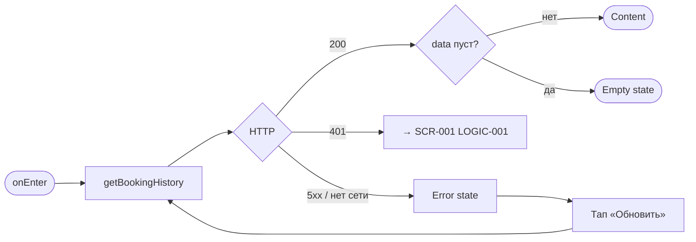
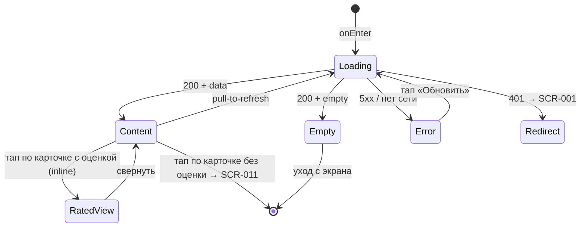

# История прошлых классов

**ID:** SCR-010  
**Тип:** Экран  
**Домен:** 05. История и отзывы  
**Приоритет:** Low  
**Статус:** Черновик  
**Функциональные блоки:** —  
**Зона авторизации:** АЗ  
**Дизайн-бриф:** [SCR-010 История прошлых классов](../../3-design-brief/SCR-010-history.md)

---

## Содержание

- [История изменений](#история-изменений)
- [Обзор](#обзор)
- [Навигация](#навигация)
- [Входные данные](#входные-данные)
- [Применяемые логики](#применяемые-логики)
- [Инициализация](#инициализация)
- [Используемые запросы](#используемые-запросы)
- [Макет экрана](#макет-экрана)
- [Элементы экрана](#элементы-экрана)
- [Состояния экрана](#состояния-экрана)
- [Действия пользователя](#действия-пользователя)
- [Связанные требования](#связанные-требования)
- [Критерии приёмки](#критерии-приёмки)

---

## История изменений

| Релиз | ТЗ | Описание изменений |
|-------|-----|-------------------|
| 1.0.0 | [ТЗ клиентского приложения](../../../) | Первоначальная документация |

---

## Обзор

Архивный раздел, в котором клиент видит уже посещённые (завершённые по времени) классы. Это не рабочий список обязательств (активные брони находятся в SCR-008), а приятный, слегка ностальгический раздел для воспоминаний. Здесь же — мягкая точка входа к тому, чтобы оставить отзыв о недавнем классе, если он ещё не оставлен.

### User Story

> Как клиент, я хочу видеть историю моих прошлых посещённых классов,
> чтобы вспомнить, где я уже был.

### Бизнес-ценность

- Закрывает потребность клиента в воспоминании о прошедшем опыте студии.
- Формирует тёплое отношение к бренду через приятный архивный раздел.
- Служит мягким, ненавязчивым каналом напоминания о возможности оставить отзыв (Could-приоритет).

---

## Навигация

### Входящая (откуда открывается)

| Источник | Триггер | Условие | Передаваемые параметры |
|----------|---------|---------|------------------------|
| Основная навигация (таб-бар) | Тап по табу «История» | Авторизован | — |

### Исходящая (куда ведёт)

| Назначение | Триггер | Передаваемые параметры |
|------------|---------|------------------------|
| [SCR-011 Оценка и отзыв](SCR-011-rating.md) | Тап по карточке завершённого класса без оценки | `bookingId` |

---

## Входные данные

| Название | Тип | Возможные значения | Описание |
|----------|-----|-------------------|----------|
| `token` | Защищённое хранилище | JWT | Bearer-токен авторизованного клиента (LOGIC-001) |

> Список истории всегда загружается с бэкенда по запросу (NFR-003, CON-001); локальный кэш как источник истины не используется.

---

## Применяемые логики

| Логика | Элемент/Триггер | Описание |
|--------|-----------------|----------|
| [LOGIC-001 Сессия](../09-logics/LOGIC-001-session.md) | При открытии / на 401 | Проверка авторизованности и редирект на SCR-001 при истечении сессии |

---

## Инициализация

> При открытии экрана единственный запрос — загрузка истории завершённых классов.

### Диаграмма загрузки



### Запросы при открытии

| № | Запрос | Критичный | Зависит от | Условие |
|---|--------|-----------|------------|---------|
| 1 | [getBookingHistory](#getbookinghistory) | Да | — | Всегда |

> Полное описание запросов см. в секции [Используемые запросы](#используемые-запросы).

---

## Используемые запросы

### getBookingHistory

**Тип:** REST  
**Метод:** GET  
**Спецификация:** [openapi.yaml](../../api/openapi.yaml) → `getBookingHistory` (GET /bookings/history)

**Триггер:** Инициализация (onEnter), pull-to-refresh, повтор после ошибки.

**Параметры:**

| Параметр | Тип | Обязательность | Источник | Описание |
|----------|-----|----------------|----------|----------|
| `Authorization` | string (header) | Да | Защищённое хранилище | `Bearer {token}` |

**Обработка ответа:**

| Результат | Условие | UI-реакция |
|-----------|---------|------------|
| Загрузка | — | Скелетон / шиммер списка карточек |
| Успех | `data` не пуст | Отобразить список карточек (от последнего к раннему) |
| Успех | `data` пуст | Empty state «Вы ещё не посещали классы. Когда посетите первый класс, он появится здесь» |
| HTTP 401 | — | Переход на [SCR-001](../01-auth/SCR-001-login.md) (LOGIC-001) |
| HTTP 5xx | — | Error state с кнопкой «Обновить» |
| Сеть | Нет соединения | Error state с кнопкой «Обновить» |

---

## Макет экрана

### Структура

```
┌─────────────────────────────────────┐
│        История                      │  ← Header (заголовок таба)
├─────────────────────────────────────┤
│  ┌───────────────────────────────┐  │
│  │ Дата · Программа              │  │
│  │ Шеф                           │  │  ← Карточка класса
│  │ [Сигнал оценки]               │  │
│  └───────────────────────────────┘  │
│  ┌───────────────────────────────┐  │
│  │ ...                           │  │  ← Scrollable
│  └───────────────────────────────┘  │
└─────────────────────────────────────┘
```

### Компоненты

| Компонент | Описание | Обязательность |
|-----------|----------|----------------|
| Header | Заголовок раздела «История» | Да |
| Список карточек | Хронологический список завершённых классов (от последнего к раннему), без группировки по месяцам/шефам | Да |
| Карточка класса | Дата и программа, шеф, сигнал оценки | Да |
| Empty state | Заглушка для нового пользователя | Опционально (при пустом `data`) |
| Error state | Заглушка с кнопкой «Обновить» | Опционально (при ошибке) |

---

## Элементы экрана

### 1. Карточка завершённого класса

| Элемент | Описание | Источник данных | Валидация | Действие |
|---------|----------|-----------------|-----------|----------|
| Дата и программа | Дата и название программы завершённого класса | `booking.slot.startsAt`, `booking.slot.program.name` | — | — |
| Шеф | Имя шефа (опционально — фото) | `booking.slot.chef.name`, `booking.slot.chef.photoUrl` | — | — |
| Сигнал оценки | Индикатор: «Оставить отзыв» (оценки нет) либо звёзды выставленной оценки (оценка есть) | `booking.rating` (Rating \| null) | — | См. логику ниже |

**Логика:**
- Карточка: сигнал оценки определяется признаком наличия связанного отзыва `booking.rating` (сущность `Rating` из openapi.yaml). Если оценка отсутствует (`booking.rating == null`) — мягко выделенный призыв «Оставить отзыв» (Could-приоритет, не навязчиво). Если оценка есть — отображаются выставленные звёзды `booking.rating.rating`.
- Тап по карточке без оценки (`booking.rating == null`): переход на [SCR-011](SCR-011-rating.md) с передачей `bookingId`.
- Тап по карточке с оценкой (`booking.rating != null`): раскрытие карточки (inline) с просмотром отправленного отзыва — звёзды `booking.rating.rating` и текст `booking.rating.comment` (если есть), дата `booking.rating.createdAt`. Просмотр только для чтения, без кнопки «Редактировать» (FR-024, NFR-014).

**Условия доступности:**
- Повторная запись «в один тап» на класс из истории отсутствует — запись всегда идёт через актуальный слот в расписании (слоты не переиспользуются).

### 2. Заглушки состояний

| Элемент | Описание | Источник данных | Валидация | Действие |
|---------|----------|-----------------|-----------|----------|
| Empty state | Иллюстрация + текст «Вы ещё не посещали классы. Когда посетите первый класс, он появится здесь» — мягко, без требования действия | — | — | — |
| Error state | Текст ошибки + кнопка «Обновить» | — | — | Повторный запрос [getBookingHistory](#getbookinghistory) |
| Скелетон/шиммер | Плейсхолдеры карточек при загрузке | — | — | — |

---

## Состояния экрана

### Таблица состояний

| Состояние | Условие | Отображение |
|-----------|---------|-------------|
| Loading | Ожидание getBookingHistory | Скелетон-шиммер карточек |
| Content | 200 + `data` не пуст | Список карточек от последнего к раннему |
| Empty | 200 + `data` пуст | Заглушка «Вы ещё не посещали классы. Когда посетите первый класс, он появится здесь» |
| Error | 5xx / нет сети | Error state с кнопкой «Обновить» |
| Redirect | 401 | Переход на SCR-001 (LOGIC-001) |

### Диаграмма переходов



---

## Действия пользователя

| Действие | Элемент | Триггер | Результат |
|----------|---------|---------|-----------|
| Открыть оценку класса без отзыва | Карточка без оценки | Tap | Переход на [SCR-011](SCR-011-rating.md), передаётся `bookingId` |
| Посмотреть отправленный отзыв | Карточка с оценкой | Tap | Inline-раскрытие карточки с отзывом (только чтение) |
| Обновить список | Список | Pull-to-refresh | Повторный запрос getBookingHistory |
| Повторить загрузку | Error state | Tap «Обновить» | Повторный запрос getBookingHistory |

---

## Связанные требования

### Функциональные (REQ-FUNC)

| ID | Название | Приоритет |
|----|----------|-----------|
| FR-026 | Раздел «История» с прошлыми завершёнными классами | High |
| UC-007 | Просмотр истории прошлых классов | Low |

### Интеграции (REQ-INT)

| ID | Название | Приоритет |
|----|----------|-----------|
| NFR-003 | Приложение — read-only консьюмер API бэкенда | Critical |
| CON-001 | Приложение не является источником истины ни для одной сущности | Critical |

### UI (REQ-UI)

| ID | Название | Приоритет |
|----|----------|-----------|
| US-017 | Видеть историю прошлых посещённых классов | Low |

### Данные (REQ-DATA)

| ID | Название | Приоритет |
|----|----------|-----------|
| NFR-003 | Актуальность данных — только из свежего ответа бэкенда | Critical |
| CON-001 | Справочные данные управляются бэкендом | Critical |

---

## Критерии приёмки

### Позитивные сценарии

| ID | Критерий | Приоритет |
|----|----------|-----------|
| AC-001 | **Дано** авторизованный клиент с завершёнными классами, **Когда** открывает таб «История», **Тогда** видит хронологический список карточек (от последнего к раннему) без группировки по месяцам/шефам | P0 |
| AC-002 | **Дано** карточка с датой, программой и шефом, **Когда** список отрисован, **Тогда** каждая карточка показывает дату и программу, шефа и сигнал наличия/отсутствия оценки | P0 |
| AC-003 | **Дано** карточка завершённого класса без оценки, **Когда** тап по карточке, **Тогда** переход на SCR-011 с передачей `bookingId` | P0 |
| AC-004 | **Дано** карточка завершённого класса с оценкой, **Когда** тап по карточке, **Тогда** раскрывается inline-просмотр отправленного отзыва (звёзды и текст, если есть) без кнопки «Редактировать» | P1 |
| AC-005 | **Дано** список загружен, **Когда** pull-to-refresh, **Тогда** повторный запрос и обновление списка | P1 |

### Негативные сценарии

| ID | Критерий | Приоритет |
|----|----------|-----------|
| AC-N01 | **Дано** новый пользователь без завершённых классов, **Когда** открывает «Историю», **Тогда** отображается empty state «Вы ещё не посещали классы. Когда посетите первый класс, он появится здесь» без требования действия | P0 |
| AC-N02 | **Дано** ошибка сети/5xx, **Когда** открытие или обновление, **Тогда** отображается error state с кнопкой «Обновить» | P0 |
| AC-N03 | **Дано** токен истёк/невалиден, **Когда** любой запрос, **Тогда** переход на SCR-001 (LOGIC-001) | P0 |

### Граничные условия (Edge Cases)

| ID | Критерий | Приоритет |
|----|----------|-----------|
| AC-E01 | **Дано** ровно один завершённый класс, **Когда** открытие, **Тогда** список из одной карточки (не empty state) | P1 |
| AC-E02 | **Дано** оценка есть, но текстовый комментарий пуст, **Когда** просмотр отзыва, **Тогда** показаны только звёзды (без пустого текстового блока) | P1 |
| AC-E03 | **Дано** большая история, **Когда** прокрутка, **Тогда** плавный скролл списка без группировки | P2 |
| AC-E04 | **Дано** активные/предстоящие брони существуют, **Когда** просмотр «Истории», **Тогда** они не отображаются (это зона SCR-008) | P1 |

---
