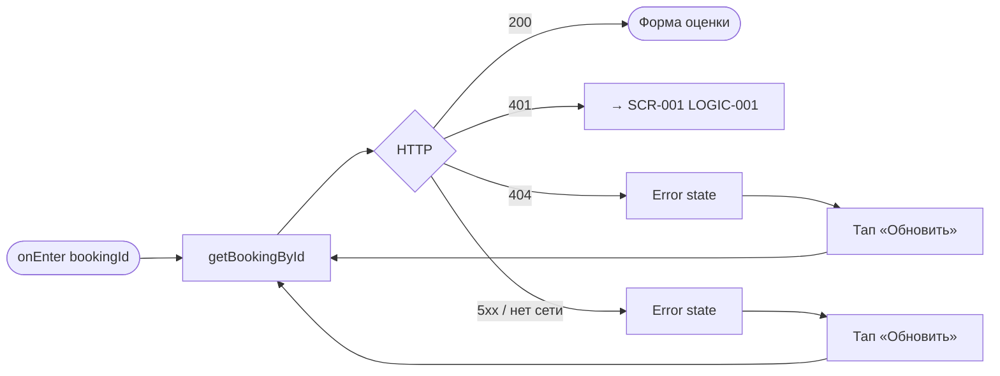
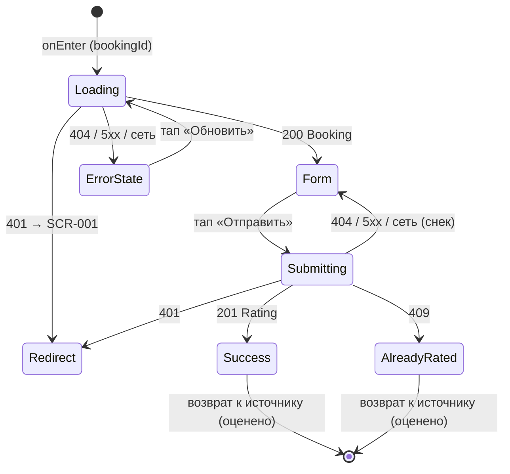

# Оценка и отзыв

**ID:** SCR-011  
**Тип:** Экран  
**Домен:** 05. История и отзывы  
**Приоритет:** Medium  
**Статус:** Черновик  
**Функциональные блоки:** —  
**Зона авторизации:** АЗ  
**Дизайн-бриф:** [SCR-011 Оценка и отзыв](../../3-design-brief/SCR-011-rating.md)

---

## Содержание

- [История изменений](#история-изменений)
- [Обзор](#обзор)
- [Навигация](#навигация)
- [Входные данные](#входные-данные)
- [Применяемые логики](#применяемые-логики)
- [Инициализация](#инициализация)
- [Используемые запросы](#используемые-запросы)
- [Макет экрана](#макет-экрана)
- [Элементы экрана](#элементы-экрана)
- [Состояния экрана](#состояния-экрана)
- [Действия пользователя](#действия-пользователя)
- [Связанные требования](#связанные-требования)
- [Критерии приёмки](#критерии-приёмки)

---

## История изменений

| Релиз | ТЗ | Описание изменений |
|-------|-----|-------------------|
| 1.0.0 | [ТЗ клиентского приложения](../../../) | Первоначальная документация |

---

## Обзор

Разовый экран оценки и отзыва по конкретному завершённому классу. Контекст (какой класс, какой шеф) виден сразу — это оценка конкретного опыта, а не абстрактной студии. Оценка звёздами обязательна, текстовый отзыв опционален. Действие окончательное: после отправки отзыв публикуется немедленно и публично, без премодерации, без возможности редактирования или удаления. Предупреждение о необратимости отображается заметно до отправки.

### User Story

> Как клиент, я хочу оставить оценку и текстовый отзыв шефу сразу
> после завершения посещённого класса, чтобы поделиться впечатлением.

### Бизнес-ценность

- Собирает публичные отзывы, формирующие агрегированный рейтинг шефа (FR-005, FR-025).
- Даёт клиенту легальный канал поделиться свежим впечатлением.
- Поддерживает доверие новых клиентов через публичные отзывы без премодерации (NFR-017).

---

## Навигация

### Входящая (откуда открывается)

| Источник | Триггер | Условие | Передаваемые параметры |
|----------|---------|---------|------------------------|
| [SCR-010 История прошлых классов](SCR-010-history.md) | Тап по карточке завершённого класса без оценки | `booking.rating == null` | `bookingId` |
| [SCR-009 Детали брони](../04-my-bookings/SCR-009-booking-details.md) | Тап по карточке завершённого класса без оценки | слот `completed`, оценка не оставлена | `bookingId` |

### Исходящая (куда ведёт)

| Назначение | Триггер | Передаваемые параметры |
|------------|---------|------------------------|
| Источник (SCR-010 или SCR-009) | Успешная отправка (201) либо состояние «уже оценено» (409) | `bookingId` (карточка отображается в статусе «оценено») |

---

## Входные данные

| Название | Тип | Возможные значения | Описание |
|----------|-----|-------------------|----------|
| `bookingId` | Параметр экрана | UUID | Идентификатор завершённой брони, по которой оставляется отзыв |
| `token` | Защищённое хранилище | JWT | Bearer-токен авторизованного клиента (LOGIC-001) |

---

## Применяемые логики

| Логика | Элемент/Триггер | Описание |
|--------|-----------------|----------|
| [LOGIC-008 Оценка и отзыв по завершённому классу](../09-logics/LOGIC-008-rating-submission.md) | Кнопка «Отправить» | Валидация оценки, отправка, обработка 201/404/409, публикация без премодерации |
| [LOGIC-001 Сессия](../09-logics/LOGIC-001-session.md) | На 401 | Редирект на SCR-001 при истечении сессии |

---

## Инициализация

> При открытии экран загружает контекст класса (getBookingById), чтобы сразу показать, какой класс и какой шеф оценивается.

### Диаграмма загрузки



### Запросы при открытии

| № | Запрос | Критичный | Зависит от | Условие |
|---|--------|-----------|------------|---------|
| 1 | [getBookingById](#getbookingbyid) | Да | — | Всегда (для контекста класса/шефа) |

> Полное описание запросов см. в секции [Используемые запросы](#используемые-запросы).

---

## Используемые запросы

### getBookingById

**Тип:** REST  
**Метод:** GET  
**Спецификация:** [openapi.yaml](../../api/openapi.yaml) → `getBookingById` (GET /bookings/{bookingId})

**Триггер:** Инициализация (onEnter).

**Параметры:**

| Параметр | Тип | Обязательность | Источник | Описание |
|----------|-----|----------------|----------|----------|
| `bookingId` | string (path) | Да | Параметр экрана | Идентификатор брони |
| `Authorization` | string (header) | Да | Защищённое хранилище | `Bearer {token}` |

**Обработка ответа:**

| Результат | Условие | UI-реакция |
|-----------|---------|------------|
| Загрузка | — | Скелетон/шиммер карточки контекста |
| Успех | 200 | Отобразить контекст класса/шефа + форму оценки |
| HTTP 401 | — | Переход на [SCR-001](../01-auth/SCR-001-login.md) (LOGIC-001) |
| HTTP 404 | — | Error state с кнопкой «Обновить» |
| HTTP 5xx / сеть | — | Error state с кнопкой «Обновить» |

---

### createRating

**Тип:** REST  
**Метод:** POST  
**Спецификация:** [openapi.yaml](../../api/openapi.yaml) → `createRating` (POST /bookings/{bookingId}/rating)

**Триггер:** Тап на кнопку «Отправить» (после выбора оценки).

**Параметры:**

| Параметр | Тип | Обязательность | Источник | Описание |
|----------|-----|----------------|----------|----------|
| `bookingId` | string (path) | Да | Параметр экрана | Идентификатор завершённой брони |
| `rating` | integer (1–5) | Да | Выбор звёзд | Оценка звёздами |
| `comment` | string | Нет | Поле отзыва | Текстовый отзыв (опционально) |
| `Authorization` | string (header) | Да | Защищённое хранилище | `Bearer {token}` |

**Обработка ответа:**

| Результат | Условие | UI-реакция |
|-----------|---------|------------|
| Загрузка | — | Лоадер на кнопке «Отправить», блокировка формы |
| Успех | 201 | Отзыв опубликован немедленно и публично (FR-005, FR-025, NFR-017); возврат к карточке-источнику в статусе «оценено» |
| HTTP 401 | — | Переход на [SCR-001](../01-auth/SCR-001-login.md) (LOGIC-001) |
| HTTP 404 | — | Снек «Класс не найден или ещё не завершён» |
| HTTP 409 | — | Состояние «Отзыв уже оставлен»: оценка дана и неизменяема (FR-024, NFR-014) |
| HTTP 5xx / сеть | — | Снек «Произошла ошибка. Попробуйте позже» / «Нет соединения. Проверьте подключение» |

---

## Макет экрана

### Структура

```
┌─────────────────────────────────────┐
│ [←] Оценить класс                   │  ← Header
├─────────────────────────────────────┤
│  ┌───────────────────────────────┐  │
│  │ Дата · Программа              │  │  ← Контекст (read-only)
│  │ Шеф (фото, имя)               │  │
│  └───────────────────────────────┘  │
│                                     │
│  Поставьте оценку                   │
│  ☆ ☆ ☆ ☆ ☆        ← 1–5 звёзд      │  ← Обязательный выбор
│                                     │
│  Поделитесь впечатлением (опц.)     │
│  ┌───────────────────────────────┐  │
│  │ Текстовый отзыв               │  │  ← Опционально
│  └───────────────────────────────┘  │
│                                     │
│  ⚠ После отправки изменить отзыв    │  ← Заметное предупреждение
│    будет нельзя                     │
├─────────────────────────────────────┤
│         [Отправить]                 │  ← Fixed Bottom
└─────────────────────────────────────┘
```

### Компоненты

| Компонент | Описание | Обязательность |
|-----------|----------|----------------|
| Header | Заголовок «Оценить класс» + кнопка «Назад» | Да |
| Карточка контекста | Дата, программа, шеф (фото, имя) — рамка оценки | Да |
| Селектор звёзд | Выбор оценки 1–5 (обязательно) | Да |
| Поле отзыва | Многострочное текстовое поле (опционально) | Опционально |
| Предупреждение о необратимости | Заметный блок над кнопкой | Да |
| Кнопка «Отправить» | Primary, закреплена снизу | Да |

---

## Элементы экрана

### 1. Карточка контекста (read-only)

| Элемент | Описание | Источник данных | Валидация | Действие |
|---------|----------|-----------------|-----------|----------|
| Дата и программа | Дата и название программы завершённого класса | `booking.slot.startsAt`, `booking.slot.program.name` | — | — |
| Шеф | Фото и имя шефа | `booking.slot.chef.photoUrl`, `booking.slot.chef.name` | — | — |

**Логика:**
- Карточка контекста неизменяема и служит рамкой, однозначно показывающей, что оценка относится к конкретному завершённому классу и шефу.

### 2. Форма оценки

| Элемент | Описание | Источник данных | Валидация | Действие |
|---------|----------|-----------------|-----------|----------|
| Селектор звёзд | 5 звёзд, выбираемых тапом | Локальное состояние | Обязательное, целое 1–5 (FR-023). Без значения — кнопка «Отправить» неактивна | — |
| Поле «Текстовый отзыв» | Опциональный многострочный отзыв | Локальное состояние | Необязательное. Клиентский лимит/счётчик символов не отображается (РЕШЕНО) | — |
| Предупреждение о необратимости | «После отправки изменить отзыв будет нельзя» — заметно, не мелким текстом | — | — | — |
| Кнопка «Отправить» | Primary | — | — | Валидация → [createRating](#createrating) (LOGIC-008) |

**Момент валидации:** При выборе оценки (мгновенно отражается на доступности кнопки) и при отправке.

**Логика:**
- Кнопка «Отправить»: [LOGIC-008](../09-logics/LOGIC-008-rating-submission.md) — при тапе проверяется, что выбрана оценка 1–5, затем отправляется запрос [createRating](#createrating).
- Успех (201): отзыв публикуется немедленно и публично, без премодерации (FR-025, NFR-017); возврат к карточке-источнику в статусе «оценено».
- 404: снек «Класс не найден или ещё не завершён».
- 409: состояние «Отзыв уже оставлен» — оценка дана и неизменяема (FR-024, NFR-014).

**Условия доступности:**
- Кнопка «Отправить» активна, если: выбрана оценка 1–5 И запрос не находится в процессе отправки.
- Кнопка «Отправить» неактивна, если: оценка не выбрана.
- Кнопка «Редактировать», приватный/анонимный режим, статус «отправлено на проверку» отсутствуют (FR-024, NFR-014, NFR-017).

### 3. Состояние «Уже оценено» (409)

| Элемент | Описание | Источник данных | Валидация | Действие |
|---------|----------|-----------------|-----------|----------|
| Сообщение | «Отзыв уже оставлен» с пояснением, что оценка неизменяема | Ответ 409 | — | — |
| Возврат | Закрытие экрана к карточке-источнику | — | — | — |

**Логика:**
- 409 трактуется как уже оставленная, неизменяемая оценка (FR-024, NFR-014): форма оценки скрывается/блокируется, явно показывается, что оценка дана и изменить её нельзя (без ощущения бага или запрета что-то доделать).

---

## Состояния экрана

### Таблица состояний

| Состояние | Условие | Отображение |
|-----------|---------|-------------|
| Loading | Ожидание getBookingById | Скелетон карточки контекста |
| Form | 200 (контекст загружен) | Карточка контекста + форма (звёзды, отзыв, предупреждение, кнопка) |
| Submitting | Ожидание createRating | Лоадер на кнопке «Отправить», форма заблокирована |
| Success | createRating 201 | Краткое подтверждение, возврат к карточке-источнику (статус «оценено») |
| AlreadyRated | createRating 409 | Состояние «Отзыв уже оставлен», оценка неизменяема |
| Error (снек) | createRating 404 / 5xx / нет сети | Снек, форма остаётся доступной |
| Error state | getBookingById 404 / 5xx / нет сети | Error state с кнопкой «Обновить» |
| Redirect | 401 | Переход на SCR-001 (LOGIC-001) |

### Диаграмма переходов



---

## Действия пользователя

| Действие | Элемент | Триггер | Результат |
|----------|---------|---------|-----------|
| Выбрать оценку | Селектор звёзд | Tap по звезде | Выбор 1–5, кнопка «Отправить» становится активной |
| Ввести отзыв | Поле отзыва | Ввод текста | Опциональное сохранение текста |
| Отправить отзыв | Кнопка «Отправить» | Tap | [LOGIC-008](../09-logics/LOGIC-008-rating-submission.md) → [createRating](#createrating) |
| Вернуться | Кнопка «Назад» | Tap | Возврат к источнику без отправки |
| Повторить загрузку контекста | Error state | Tap «Обновить» | Повторный запрос getBookingById |

---

## Связанные требования

### Функциональные (REQ-FUNC)

| ID | Название | Приоритет |
|----|----------|-----------|
| FR-023 | Оценка и текстовый отзыв по завершённой брони | Critical |
| FR-024 | Запрет редактирования оценки/отзыва после отправки | Critical |
| FR-025 | Публичное отображение текстовых отзывов другим клиентам | Critical |
| UC-006 | Оставление оценки и отзыва по завершённому классу | High |

### Интеграции (REQ-INT)

| ID | Название | Приоритет |
|----|----------|-----------|
| NFR-014 | Оценка после отправки неизменяема | Critical |
| NFR-017 | Отзыв виден всем без приватности/премодерации | High |
| CON-001 | Приложение не источник истины, отправляет действие бэкенду | Critical |

### UI (REQ-UI)

| ID | Название | Приоритет |
|----|----------|-----------|
| US-015 | Оставить оценку и текстовый отзыв сразу после класса | High |
| US-016 | Видеть публичные отзывы других клиентов на карточке шефа | High |

### Данные (REQ-DATA)

| ID | Название | Приоритет |
|----|----------|-----------|
| NFR-003 | Приложение — read-only консьюмер, опирается на свежий ответ бэкенда | Critical |

---

## Критерии приёмки

### Позитивные сценарии

| ID | Критерий | Приоритет |
|----|----------|-----------|
| AC-001 | **Дано** вход с `bookingId` завершённого класса, **Когда** экран открыт, **Тогда** сразу виден контекст: дата, программа, шеф (фото, имя) | P0 |
| AC-002 | **Дано** форма открыта, оценка не выбрана, **Когда** просмотр кнопки, **Тогда** кнопка «Отправить» неактивна | P0 |
| AC-003 | **Дано** выбрана оценка 1–5, **Когда** тап «Отправить», **Тогда** POST createRating с `rating` (и `comment`, если введён) | P0 |
| AC-004 | **Дано** успешный ответ 201, **Когда** отзыв отправлен, **Тогда** отзыв публикуется немедленно и публично (без премодерации), возврат к карточке-источнику в статусе «оценено» | P0 |
| AC-005 | **Дано** форма открыта, **Когда** просмотр, **Тогда** заметно отображается предупреждение «После отправки изменить отзыв будет нельзя» | P0 |
| AC-006 | **Дано** отзыв оставлен без текста, **Когда** отправка только со звёздами, **Тогда** запрос проходит успешно (текст опционален) | P1 |

### Негативные сценарии

| ID | Критерий | Приоритет |
|----|----------|-----------|
| AC-N01 | **Дано** оценка уже оставлена, **Когда** отправка, **Тогда** 409 → состояние «Отзыв уже оставлен», оценка неизменяема, без кнопки «Редактировать» | P0 |
| AC-N02 | **Дано** бронь не найдена/не завершена, **Когда** отправка, **Тогда** 404 → снек «Класс не найден или ещё не завершён» | P0 |
| AC-N03 | **Дано** токен истёк/невалиден, **Когда** любой запрос, **Тогда** переход на SCR-001 (LOGIC-001) | P0 |
| AC-N04 | **Дано** ошибка сети/5xx при отправке, **Когда** ответ получен, **Тогда** снек об ошибке, форма остаётся доступной для повтора | P1 |

### Граничные условия (Edge Cases)

| ID | Критерий | Приоритет |
|----|----------|-----------|
| AC-E01 | **Дано** оценка 1 (минимум), **Когда** отправка, **Тогда** запрос проходит (валидный диапазон 1–5) | P1 |
| AC-E02 | **Дано** оценка 5 (максимум), **Когда** отправка, **Тогда** запрос проходит | P1 |
| AC-E03 | **Дано** длинный текст отзыва, **Когда** ввод, **Тогда** счётчик/предупреждение о лимите не показываются как значимый элемент (РЕШЕНО) | P1 |
| AC-E04 | **Дано** повторный тап «Отправить» во время запроса, **Когда** идёт отправка, **Тогда** повторная отправка блокируется (лоадер, UI заблокирован) | P1 |
| AC-E05 | **Дано** отсутствует кнопка «Редактировать»/анонимный режим/премодерация, **Когда** любой сценарий, **Тогда** эти элементы не появляются (FR-024, NFR-014, NFR-017) | P0 |

---
