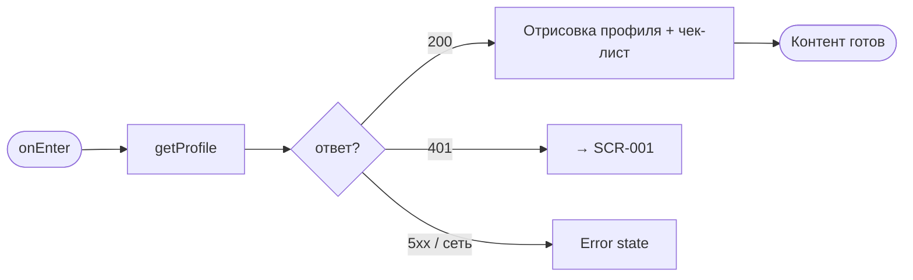
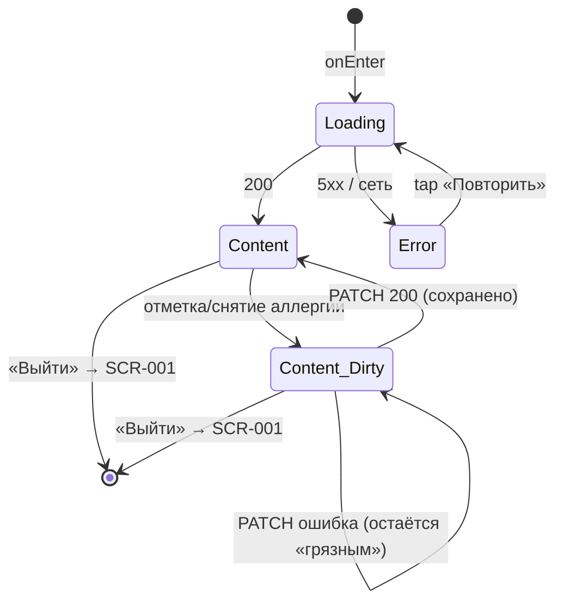

# Профиль клиента

**ID:** SCR-012  
**Тип:** Экран  
**Домен:** 06. Профиль  
**Приоритет:** Medium  
**Статус:** Черновик  
**Функциональные блоки:** FB-006-001 Профиль клиента  
**Зона авторизации:** АЗ  
**Дизайн-бриф:** [SCR-012 Профиль клиента](../../3-design-brief/SCR-012-client-profile.md)

---

## Содержание

- [История изменений](#история-изменений)
- [Обзор](#обзор)
- [Навигация](#навигация)
- [Входные данные](#входные-данные)
- [Применяемые логики](#применяемые-логики)
- [Инициализация](#инициализация)
- [Используемые запросы](#используемые-запросы)
- [Макет экрана](#макет-экрана)
- [Элементы экрана](#элементы-экрана)
- [Состояния экрана](#состояния-экрана)
- [Действия пользователя](#действия-пользователя)
- [Связанные требования](#связанные-требования)
- [Критерии приёмки](#критерии-приёмки)

---

## История изменений

| Релиз | ТЗ | Описание изменений |
|-------|-----|-------------------|
| — | — | Первоначальная документация |

---

## Обзор

Второстепенный, редко посещаемый раздел. Клиент заходит сюда не в процессе записи на класс (там аллергии просто отображаются готовыми, SCR-005), а отдельно, когда хочет привести свои данные в порядок или выйти из аккаунта. Состав профиля ограничен аллергиями, базовыми учётными данными для входа и действием выхода — без дополнительных полей (имя, телефон и т.п.).

Чек-лист аллергий — центральный и практически единственный содержательный элемент с точки зрения требований: от него зависит безопасность на классе. Аллергии, заданные здесь, автоматически подставляются бэкендом во все новые брони (FR-027); на уже существующие активные брони изменение не влияет (аллергии фиксируются в брони на момент создания).

### User Story

> Как клиент, я хочу проверить и обновить чек-лист своих аллергий,
> чтобы он корректно подставлялся в будущие брони.

### Бизнес-ценность

- Безопасность клиента: аллергии доводятся до шефа до начала класса (FR-027, BR-001).
- Единый источник правды: аллергии задаются один раз и применяются ко всем будущим броням.
- Предзаданный чек-лист снижает ошибки ручного ввода и упрощает обработку на стороне студии.

---

## Навигация

### Входящая (откуда открывается)

| Источник | Триггер | Условие | Передаваемые параметры |
|----------|---------|---------|------------------------|
| Основная навигация (нижняя вкладка) | Переключение вкладки | Всегда | — |
| [SCR-005 Оформление брони](../03-booking/SCR-005-booking-setup.md) | Ссылка «Изменить в профиле» (из блока аллергий) | Всегда | — |

### Исходящая (куда ведёт)

| Назначение | Триггер | Передаваемые параметры |
|------------|---------|------------------------|
| [SCR-001 Логин](../01-auth/SCR-001-login.md) | Тап «Выйти из аккаунта» | — |

---

## Входные данные

| Название | Тип | Возможные значения | Описание |
|----------|-----|-------------------|----------|
| `token` | Защищённое хранилище | JWT | Bearer-токен авторизованного клиента (LOGIC-001) |

---

## Применяемые логики

| Логика | Элемент/Триггер | Описание |
|--------|-----------------|----------|
| [LOGIC-007 Управление аллергиями](../09-logics/LOGIC-007-allergies-management.md) | Блок аллергий (чек-лист), кнопка «Сохранить» | Чтение и редактирование аллергий через getProfile / updateProfile |
| [LOGIC-001 Сессия](../09-logics/LOGIC-001-auth-and-session.md) | Ответ 401 от любого запроса; действие «Выйти» | Истечение сессии / явный выход, переход на SCR-001 |

---

## Инициализация

### Диаграмма загрузки



### Запросы при открытии

| № | Запрос | Критичный | Зависит от | Условие |
|---|--------|-----------|------------|---------|
| 1 | [getProfile](#getprofile) | Да | — | Всегда |

> Полное описание запросов см. в секции [Используемые запросы](#используемые-запросы).

---

## Используемые запросы

### getProfile

**Тип:** REST  
**Метод:** GET  
**Спецификация:** [openapi.yaml](../../api/openapi.yaml) → `getProfile` (GET /profile)

**Триггер:** Инициализация (onEnter)

**Параметры:** нет

**Обработка ответа:**

| Результат | Условие | UI-реакция |
|-----------|---------|------------|
| Загрузка | — | Скелетон контента |
| Успех | `200` | Отрисовать базовые данные + чек-лист аллергий (предзаполнен по `profile.allergies`) |
| HTTP 401 | — | Перенаправление на [SCR-001](../01-auth/SCR-001-login.md) (LOGIC-001) |
| HTTP 5xx | — | Error state с кнопкой «Повторить» |
| Сеть | Нет соединения | Error state с кнопкой «Повторить» |

---

### updateProfile

**Тип:** REST  
**Метод:** PATCH  
**Спецификация:** [openapi.yaml](../../api/openapi.yaml) → `updateProfile` (PATCH /profile)

> Полная обработка запроса описана в [LOGIC-007 Управление аллергиями](../09-logics/LOGIC-007-allergies-management.md).

**Триггер:** Тап «Сохранить» (после изменения чек-листа).

**Параметры/Body:**

| Параметр | Тип | Обязательность | Источник | Описание |
|----------|-----|----------------|----------|----------|
| `allergies` | array of string | Да | Локальное состояние после изменений | Полный итоговый список аллергий |

**Обработка ответа:**

| Результат | Условие | UI-реакция |
|-----------|---------|------------|
| Загрузка | — | Индикатор на кнопке «Сохранить» |
| Успех | `200` | Обновить чек-лист из ответа, снек «Сохранено» |
| HTTP 401 | — | Перенаправление на [SCR-001](../01-auth/SCR-001-login.md) (LOGIC-001) |
| HTTP 5xx | — | Снек ошибки, изменения не применены |
| Сеть | Нет соединения | Снек ошибки, изменения не применены |

---

## Макет экрана

### Структура

```
┌─────────────────────────────────────┐
│ Профиль                              │  ← Header
├─────────────────────────────────────┤
│                                     │
│  ┌─ Учётные данные ───────────────┐ │
│  │ Логин: client@example.com       │ │
│  └────────────────────────────────┘ │
│                                     │
│  ┌─ Аллергии ─────────────────────┐ │
│  │ Какие продукты вам противопоказаны? │
│  │                                 │ │
│  │ [✓] Орехи                       │ │
│  │ [✓] Глютен                      │ │
│  │ [ ] Лактоза                     │ │
│  │ [ ] Морепродукты                │ │
│  │ [ ] Яйца                        │ │
│  │ [ ] Соя                         │ │
│  └────────────────────────────────┘ │
│                                     │
│  [Сохранить]                        │  ← при наличии изменений
│                                     │
│  ─────────────────────────────────  │
│                                     │
│  Выйти из аккаунта                  │  ← служебное действие
│                                     │
└─────────────────────────────────────┘
```

### Компоненты

| Компонент | Описание | Обязательность |
|-----------|----------|----------------|
| Header | Заголовок «Профиль» | Да |
| Блок учётных данных | Логин клиента (только для чтения) | Да |
| Блок аллергий (чек-лист) | Предзаданный чек-лист аллергенов | Да |
| Кнопка «Сохранить» | Primary (при наличии изменений) | Опционально |
| Действие «Выйти из аккаунта» | Служебное | Да |

---

## Элементы экрана

### 1. Блок учётных данных

| Элемент | Описание | Источник данных | Валидация | Действие |
|---------|----------|-----------------|-----------|----------|
| Логин | Логин клиента (выдан студией) | `profile.login` из getProfile | — | — |

**Логика:**
- Базовые данные аккаунта — второстепенны. Логин выдаётся студией вне приложения на этапе выдачи учётных данных; регистрация нового клиента в приложении не предусмотрена.
- Данные доступны только для чтения; редактирование логина/пароля не предусмотрено.

---

### 2. Блок аллергий (чек-лист)

| Элемент | Описание | Источник данных | Валидация | Действие |
|---------|----------|-----------------|-----------|----------|
| Чек-лист аллергенов | Фиксированный перечень распространённых аллергенов | Предзаданный список + `profile.allergies` (отметки) | — | Отметить/снять аллергию |
| Кнопка «Сохранить» | Primary | — | — | [LOGIC-007](../09-logics/LOGIC-007-allergies-management.md): PATCH /profile |

**Логика:**
- Перечень чек-листа зафиксирован в приложении (не приходит из API): орехи, глютен, лактоза, морепродукты, яйца, соя.
- Чекбоксы предзаполнены значениями из `profile.allergies`. Клиент не может добавить произвольную аллергию свободным текстом — только отметить из списка.
- Аллергии — единственный элемент, где точность критична (последствия — физическая безопасность), поэтому это не «мелкая настройка».
- Изменения применяются только после успешного PATCH /profile; до этого отображается «грязное» состояние с активной кнопкой «Сохранить».

**Условия видимости:**
- Чек-лист отображается всегда (даже при пустом `profile.allergies` — просто без отметок). «Не заполнено» не равно «есть скрытая опасность» — нейтральный тон.

---

### 3. Действие «Выйти из аккаунта»

| Элемент | Описание | Источник данных | Валидация | Действие |
|---------|----------|-----------------|-----------|----------|
| «Выйти из аккаунта» | Служебное действие | — | — | Очистка токена ([LOGIC-001](../09-logics/LOGIC-001-auth-and-session.md)), переход на SCR-001 |

**Логика:**
- Выход очищает Bearer-токен из защищённого хранилища и выполняет переход на SCR-001 (LOGIC-001).
- Служебное действие, не главное на экране; визуально приглушено.

---

## Состояния экрана

### Таблица состояний

| Состояние | Условие | Отображение |
|-----------|---------|-------------|
| Loading | Ожидание getProfile | Скелетон контента |
| Content | getProfile 200 | Базовые данные + чек-лист (предзаполнен) |
| Content (Dirty) | Есть несохранённые изменения | Активная кнопка «Сохранить» |
| Error | getProfile 5xx / нет сети | Error state с кнопкой «Повторить» |

### Диаграмма переходов



---

## Действия пользователя

| Действие | Элемент | Триггер | Результат |
|----------|---------|---------|-----------|
| Отметить/снять аллергию | Чекбокс чек-листа | Tap | Локальное изменение, активация кнопки «Сохранить» (переход в Content_Dirty) |
| Сохранить аллергии | Кнопка «Сохранить» | Tap | [LOGIC-007](../09-logics/LOGIC-007-allergies-management.md): PATCH /profile с полным массивом `allergies` |
| Выйти из аккаунта | «Выйти из аккаунта» | Tap | Очистка токена (LOGIC-001), переход на [SCR-001](../01-auth/SCR-001-login.md) |

---

## Связанные требования

### Функциональные (FR / UC)

| ID | Название | Приоритет |
|----|----------|-----------|
| FR-027 | Автоподстановка аллергий из профиля в новые брони (бэкенд) | Must |
| UC-009 | Управление профилем (аллергии) | Should |

### Интеграции (NFR / CON)

| ID | Название | Приоритет |
|----|----------|-----------|
| CON-001 | Приложение — read-only консьюмер API | Must |
| CON-009 | Приложение одноязычное и монолитное по валюте | Must |

### UI (US)

| ID | Название | Приоритет |
|----|----------|-----------|
| US-018 | Автоподстановка аллергий из профиля; редактирование только в профиле | Should |

---

## Критерии приёмки

### Позитивные сценарии

| ID | Критерий | Приоритет |
|----|----------|-----------|
| AC-001 | **Дано** клиент на вкладке «Профиль», **Когда** открывается экран, **Тогда** выполняется getProfile, отображается скелетон | P0 |
| AC-002 | **Дано** getProfile возвращает 200, **Когда** данные загружены, **Тогда** отображаются логин (read-only) и чек-лист аллергий с предзаполненными отметками по `profile.allergies` | P0 |
| AC-003 | **Дано** на экране, **Когда** клиент отмечает/снимает аллергию, **Тогда** локальное состояние меняется, активируется кнопка «Сохранить» | P0 |
| AC-004 | **Дано** есть несохранённые изменения, **Когда** тап «Сохранить», **Тогда** выполняется PATCH /profile с полным итоговым массивом `allergies` ([LOGIC-007](../09-logics/LOGIC-007-allergies-management.md)); при успехе — снек «Сохранено» | P0 |
| AC-005 | **Дано** на экране, **Когда** тап «Выйти из аккаунта», **Тогда** токен очищается, выполняется переход на SCR-001 | P1 |

### Негативные сценарии

| ID | Критерий | Приоритет |
|----|----------|-----------|
| AC-N01 | **Дано** ошибка сети при открытии, **Когда** getProfile не выполняется, **Тогда** отображается error state с кнопкой «Повторить» | P0 |
| AC-N02 | **Дано** сессия истекла, **Когда** getProfile или updateProfile возвращает 401, **Тогда** выполняется переход на SCR-001 (LOGIC-001) | P0 |
| AC-N03 | **Дано** PATCH /profile возвращает 5xx / нет сети, **Когда** ошибка сохранения, **Тогда** показывается снек ошибки, локальные изменения не применяются, кнопка «Сохранить» остаётся активной | P1 |

### Граничные условия (Edge Cases)

| ID | Критерий | Приоритет |
|----|----------|-----------|
| AC-E01 | **Дано** `profile.allergies` пуст, **Когда** getProfile возвращает 200, **Тогда** чек-лист отображается без отметок (нейтральный тон, не тревожный) | P1 |
| AC-E02 | **Дано** клиент снял все аллергии и сохранил, **Когда** PATCH отправляет пустой массив, **Тогда** `profile.allergies` становится пустым, чек-лист без отметок | P2 |
| AC-E03 | **Дано** изменение аллергий в профиле, **Когда** есть активная бронь, **Тогда** аллергии в существующей броне не меняются (фиксируются на момент создания, FR-027) | P1 |

---
