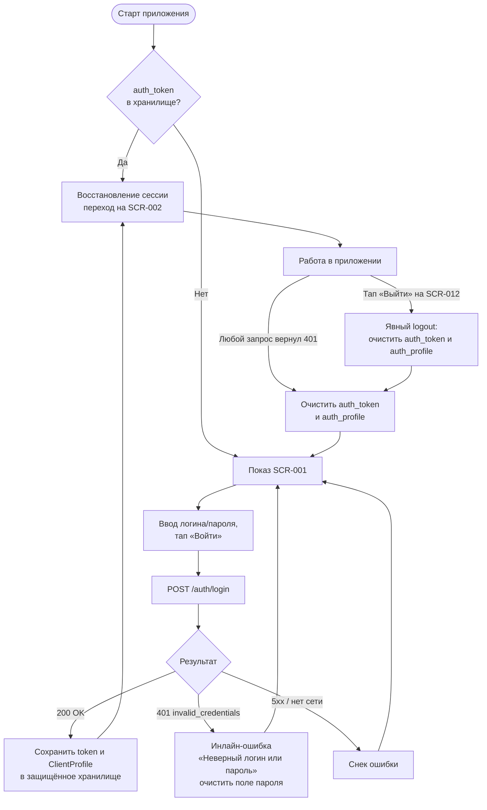

# Авторизация и управление сессией

**ID:** LOGIC-001  
**Тип:** Логика  
**Домен:** 09. Логики  
**Приоритет:** Critical  
**Статус:** Актуален  
**Функциональные блоки:** FB-001-001

---

## История изменений

| Релиз | ТЗ | Описание изменений |
|-------|-----|-------------------|
| 1.0.0 | [SCR-001 Авторизация](../01-auth/SCR-001-login.md) | Первоначальная документация логики авторизации и управления сессией |

---

## Входные данные

| Название | Тип | Возможные значения | Описание |
|----------|-----|-------------------|----------|
| `auth_token` | Защищённое хранилище | Наличие / отсутствие JWT | Токен сессии; определяет восстановление сессии при старте приложения и признак авторизованности запросов |
| `auth_profile` | Защищённое хранилище | `ClientProfile` / отсутствие | Профиль клиента (`id`, `login`, `allergies`), сохранённый при входе |

---

## Обзор

Логика описывает полный жизненный цикл клиентской сессии: вход через `POST /auth/login`, сохранение JWT и профиля в защищённое хранилище, восстановление сессии при старте приложения, глобальную обработку 401 на любых авторизованных запросах (очистка сессии и возврат на SCR-001), а также явный выход из SCR-012. Применяется на экране авторизации, экране профиля и глобально в сетевом слое приложения.

### User Story

> Как клиент, я хочу оставаться авторизованным между запусками приложения
> и автоматически возвращаться на экран входа при истечении сессии,
> чтобы не входить повторно без причины и не видеть ошибок доступа.

### Бизнес-ценность

- Бесшовное восстановление сессии снижает трение для постоянных клиентов.
- Гарантия, что доступ к данным приложения имеют только клиенты с действительным токеном.
- Предсказуемое поведение при истечении/аннулировании сессии — единый сценарий возврата на SCR-001.

---

## Точки применения

| Экран/Компонент | Элемент/Триггер | Условие |
|-----------------|-----------------|---------|
| [SCR-001 Авторизация](../01-auth/SCR-001-login.md) | onEnter | Всегда — проверка `auth_token` для восстановления сессии |
| [SCR-001 Авторизация](../01-auth/SCR-001-login.md) | Кнопка «Войти» | Отправка `POST /auth/login` при отсутствии токена |
| [SCR-012 Профиль клиента](../06-profile/SCR-012-client-profile.md) | Кнопка «Выйти из аккаунта» | Явный выход по инициативе клиента |
| Глобально (любой авторизованный экран) | Перехват 401 в ответе любого запроса | Токен недействителен/истёк |

---

## Флоу

---

## Описание логики

### Шаг 1: Восстановление сессии при старте

При запуске приложения (и при открытии SCR-001) выполняется локальная проверка `auth_token` в защищённом хранилище. Если токен присутствует — осуществляется прямой переход на [SCR-002](../02-schedule/SCR-002-schedule.md) без показа формы входа. Если токен отсутствует — показывается форма входа SCR-001. Удалённые запросы на этом шаге не отправляются.

### Шаг 2: Вход через POST /auth/login

При тапе «Войти» на SCR-001 (оба поля непустые) отправляется `POST /auth/login` с телом `{login, password}`. При 200 OK в защищённое хранилище сохраняются полученные `token` (JWT) и `user` (ClientProfile), после чего выполняется переход на [SCR-002](../02-schedule/SCR-002-schedule.md). При 401 показывается общее сообщение «Неверный логин или пароль», поле пароля очищается, поле логина сохраняется. При 5xx/отсутствии сети показывается соответствующий снек, поля не очищаются (подробная обработка — в [SCR-001](../01-auth/SCR-001-login.md)).

### Шаг 3: Глобальная обработка 401

Сетевой слой приложения единообразно обрабатывает HTTP 401 на любом авторизованном запросе (недействительный/истёкший токен): выполняется очистка `auth_token` и `auth_profile` из защищённого хранилища, текущий экран выгружается, клиент возвращается на SCR-001. Поведение одинаково для всех экранов и не зависит от того, какой именно запрос вернул 401.

### Шаг 4: Явный выход (logout)

При тапе «Выйти из аккаунта» на [SCR-012](../06-profile/SCR-012-client-profile.md) выполняется очистка `auth_token` и `auth_profile` из защищённого хранилища и переход на SCR-001. Запросы к бэкенду для инвалидации токена на стороне сервера в скоупе клиента не выполняются (сервер признаёт токен недействительным по истечении срока действия).

---

## API запросы

### POST /auth/login

**Триггер:** Тап на кнопку «Войти» на [SCR-001](../01-auth/SCR-001-login.md)

**Headers:**

| Поле | Описание |
|------|----------|
| `Content-Type` | `application/json` |

> Заголовок `authorization: Bearer <token>` на данном запросе не передаётся — это запрос получения токена.

**Параметры/Body:**

| Параметр | Тип | Описание | Значение/Источник |
|----------|-----|----------|-------------------|
| `login` | string | Логин клиента | Поле «Логин» на SCR-001 |
| `password` | string | Пароль клиента | Поле «Пароль» на SCR-001 |

**Обработка ответа:**

| Результат | Действие |
|-----------|----------|
| Загрузка | Лоадер на кнопке «Войти», блокировка полей и кнопки |
| Успех (200) | Сохранить `token` и `user` (ClientProfile) в защищённое хранилище → переход на SCR-002 |
| Ошибка 401 (`invalid_credentials`) | Инлайн-ошибка/снек «Неверный логин или пароль» (текст из `ErrorResponse.message`); очистить поле «Пароль»; поле «Логин» оставить |
| Ошибка 5xx | Снек «Произошла ошибка. Попробуйте позже» |
| Ошибка сети | Снек «Нет соединения. Проверьте подключение к интернету» |

---

## Локальное хранение

| Ключ | Тип хранения | Описание |
|------|--------------|----------|
| `auth_token` | Защищённое хранилище | JWT-токен сессии, полученный из `POST /auth/login` → `token`. Используется в заголовке `authorization: Bearer <token>` для всех авторизованных запросов |
| `auth_profile` | Защищённое хранилище | `ClientProfile` (`id`, `login`, `allergies`), полученный из `POST /auth/login` → `user`. Очищается при выходе и при глобальном 401 |

> Платёжные реквизиты клиента не хранятся (NFR-008). В защищённом хранилище находятся только токен и профиль.

---

## Связанные требования

### Функциональные

| ID | Название | Приоритет |
|----|----------|-----------|
| FR-001 | Обязательная авторизация до показа расписания; экран логина — первый экран, гостевого режима нет | Must |
| UC-001 | Авторизация клиента | Must |

### Интеграции

| ID | Название | Приоритет |
|----|----------|-----------|
| NFR-008 | Платёжная инфраструктура и реквизиты — вне клиента; в защищённом хранилище держится только токен и профиль | Must |

### UI

| ID | Название | Приоритет |
|----|----------|-----------|
| US-001 | Вход по логину и паролю для доступа к расписанию | Must |

### Данные

| ID | Название | Приоритет |
|----|----------|-----------|
| CON-009 | Одноязычный (русский) интерфейс, без мультиязычности/мультивалютности | Must |

---

## Критерии приёмки

| ID | Критерий |
|----|----------|
| AC-001 | **Дано** клиент на SCR-001 ввёл валидные логин и пароль, **Когда** нажимает «Войти», **Тогда** `POST /auth/login` возвращает 200, `token` и `user` (ClientProfile) сохраняются в защищённое хранилище, выполняется переход на SCR-002 |
| AC-002 | **Дано** клиент ввёл неверные учётные данные, **Когда** нажимает «Войти», **Тогда** `POST /auth/login` возвращает 401 `invalid_credentials`, показывается «Неверный логин или пароль», поле пароля очищается, поле логина сохраняется, перехода на SCR-002 нет |
| AC-003 | **Дано** клиент авторизован и работает в приложении, **Когда** любой авторизованный запрос возвращает 401 (истёкшая/недействительная сессия), **Тогда** `auth_token` и `auth_profile` очищаются из защищённого хранилища и клиент возвращается на SCR-001 |
| AC-004 | **Дано** клиент ранее успешно вошёл (в хранилище есть `auth_token`), **Когда** он перезапускает приложение, **Тогда** форма входа не показывается, выполняется прямой переход на SCR-002 (восстановление сессии) |
| AC-005 | **Дано** клиент на SCR-012, **Когда** нажимает «Выйти из аккаунта», **Тогда** `auth_token` и `auth_profile` очищаются из защищённого хранилища и выполняется переход на SCR-001 |
| AC-006 | **Дано** `auth_token` отсутствует в хранилище, **Когда** клиент запускает приложение, **Тогда** показывается SCR-001 (восстановления сессии нет) |

---

## Обработка ошибок

| Тип ошибки | Контекст | Действие |
|------------|----------|----------|
| HTTP 401 `invalid_credentials` | Запрос `POST /auth/login` на SCR-001 | Инлайн-ошибка/снек «Неверный логин или пароль» (`ErrorResponse.message`); очистить пароль; логин оставить |
| HTTP 401 (любой авторизованный запрос) | Работа в приложении, сессия истекла/аннулирована | Очистить `auth_token` и `auth_profile`; переход на SCR-001 |
| HTTP 5xx | Запрос `POST /auth/login` | Снек «Произошла ошибка. Попробуйте позже»; поля не очищать |
| Нет соединения | Запрос `POST /auth/login` | Снек «Нет соединения. Проверьте подключение к интернету»; поля не очищать |

---
