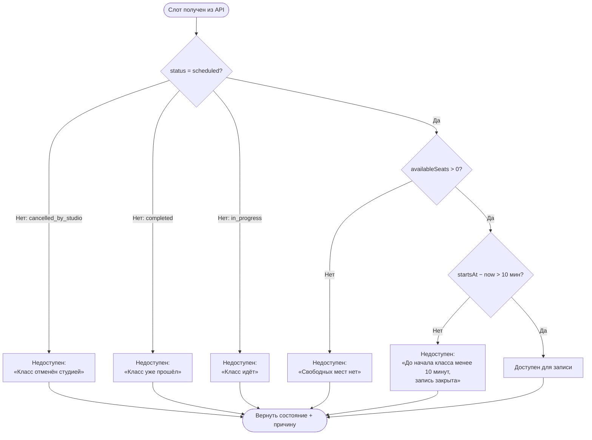

# Доступность слота для записи

**ID:** LOGIC-002  
**Тип:** Логика  
**Домен:** 09. Логики  
**Приоритет:** Critical  
**Статус:** Черновик  
**Функциональные блоки:** FB-003-002

---

## История изменений

| Релиз | ТЗ | Описание изменений |
|-------|-----|-------------------|
| — | — | Первоначальная документация |

---

## Входные данные

| Название | Тип | Возможные значения | Описание |
|----------|-----|-------------------|----------|
| `Slot.status` | Состояние (из ответа `getSlots` / `getSlotById`) | `scheduled`, `cancelled_by_studio`, `in_progress`, `completed` | Текущий статус слота. Запись возможна только при `scheduled`. |
| `Slot.availableSeats` | Состояние (из ответа `getSlots` / `getSlotById`) | Целое ≥ 0 | Количество свободных мест. Запись возможна при `> 0`. |
| `Slot.startsAt` | Состояние (из ответа `getSlots` / `getSlotById`) | ISO 8601, дата-время | Время начала класса. Используется для проверки порога 10 минут. |
| `now` | Локальное время устройства | ISO 8601 | Текущее время на устройстве клиента. |

---

## Обзор

Логика определяет, доступен ли слот для записи клиентом, и формирует причину недоступности, если запись закрыта. Логика является переиспользуемой: применяется на карточке слота в расписании (SCR-002), на экране деталей класса (SCR-003) и на экране оформления брони (SCR-005). Результат логики управляет визуальным состоянием карточки/кнопки и текстом причины.

Локальная проверка порога 10 минут — вспомогательная мера (NFR-013); финальную проверку выполняет бэкенд при обработке `createBooking` и `cancelBooking`. Локальная проверка не блокирует отправку запроса насильно при расхождении часов клиента и сервера.

### User Story

> Как клиент, я хочу понимать, доступна ли ещё запись на класс
> и почему — если нет, чтобы не тратить время на попытку записаться на недоступный слот.

### Бизнес-ценность

- Снимает неоднозначность: причина недоступности записи показана явно, а не скрыта.
- Предотвращает попытки бронирования заведомо недоступных слотов, снижая нагрузку на бэкенд.
- Единая точка проверки доступности для всех экранов, работающих со слотами.

---

## Точки применения

| Экран/Компонент | Элемент/Триггер | Условие |
|-----------------|-----------------|---------|
| [SCR-002 Расписание классов](../02-schedule/SCR-002-schedule.md) | Карточка слота в списке | Всегда — визуальное отличие карточки |
| [SCR-003 Детали класса](../02-schedule/SCR-003-slot-details.md) | Блок доступности, кнопка «Записаться» | Всегда — управление кнопкой и причиной |
| [SCR-005 Оформление брони](../03-booking/SCR-005-booking-setup.md) | Кнопка «Продолжить к оплате» | Всегда — проверка перед оформлением |
| [LOGIC-006 Отмена брони](LOGIC-006-booking-cancellation.md) | Кнопка «Отменить бронь» | Использует порог 10 минут для проверки доступности отмены |

---

## Флоу

---

## Описание логики

### Правило доступности

Слот считается **доступным для записи** тогда и только тогда, когда выполняются все три условия одновременно:

1. `Slot.status = scheduled` — слот не отменён, не идёт и не завершён.
2. `Slot.availableSeats > 0` — есть хотя бы одно свободное место.
3. `Slot.startsAt − now > 10 минут` — до начала класса остаётся более 10 минут (строгое неравенство, CON-006).

Если хотя бы одно условие не выполнено — слот **недоступен**, и логика формирует причину недоступности (первое сработавшее из списка причин по приоритету: статус → места → время).

### Приоритет проверки причин

Причины недоступности формируются в следующем порядке (первая сработавшая):

| Приоритет | Условие | Текст причины |
|-----------|---------|---------------|
| 1 | `status = cancelled_by_studio` | «Класс отменён студией» |
| 2 | `status = completed` | «Класс уже прошёл» |
| 3 | `status = in_progress` | «Класс идёт» |
| 4 | `availableSeats = 0` | «Свободных мест нет» |
| 5 | `startsAt − now ≤ 10 мин` | «До начала класса менее 10 минут, запись закрыта» |

### Порог 10 минут

Порог проверяется локально по времени устройства клиента: `startsAt − now > 10 минут` (строгое неравенство). Ровно 10 минут считается недоступным (FR-014, CON-006). Локальная проверка — вспомогательная мера UX (NFR-013), не единственный механизм защиты; финальное решение принимает бэкенд.

### Источник данных

Все входные значения берутся из свежего ответа бэкенда (`getSlots` или `getSlotById`). Данные о местах и статусе не считаются валидными между экранами/сессиями (NFR-015) — при каждом открытии экрана выполняется свежий запрос.

---

## Связанные требования

### Функциональные (FR / UC)

| ID | Название | Приоритет |
|----|----------|-----------|
| FR-006 | Отображение статуса слота | Must |
| FR-007 | Блокировка записи при `availableSeats = 0` без листа ожидания | Must |
| FR-014 | Запрет записи и отмены менее чем за 10 минут до начала | Must |
| UC-003 | Бронирование слота (предусловие: доступность слота) | Must |

### Интеграции (NFR / CON)

| ID | Название | Приоритет |
|----|----------|-----------|
| NFR-013 | Порог 10 мин в UI — вспомогательная мера; финальную проверку делает бэкенд | Must |
| NFR-015 | Данные о местах актуальны только из свежего ответа бэкенда | Must |
| CON-001 | Приложение — read-only консьюмер API | Must |
| CON-005 | Вместимость слота определяется бэкендом | Must |
| CON-006 | Порог 10 минут до начала; не настраивается | Must |

### UI (US)

| ID | Название | Приоритет |
|----|----------|-----------|
| US-011 | Видимая недоступность кнопок записи за 10 минут до начала | Must |

---

## Критерии приёмки

| ID | Критерий |
|----|----------|
| AC-001 | **Дано** слот с `status = scheduled`, `availableSeats > 0`, до `startsAt` более 10 минут, **Когда** логика применена, **Тогда** слот определяется как доступный для записи. |
| AC-002 | **Дано** слот с `status = cancelled_by_studio`, **Когда** логика применена, **Тогда** слот недоступен, причина — «Класс отменён студией». |
| AC-003 | **Дано** слот с `status = completed`, **Когда** логика применена, **Тогда** слот недоступен, причина — «Класс уже прошёл». |
| AC-004 | **Дано** слот с `status = in_progress`, **Когда** логика применена, **Тогда** слот недоступен, причина — «Класс идёт». |
| AC-005 | **Дано** слот с `availableSeats = 0` (остальные условия выполнены), **Когда** логика применена, **Тогда** слот недоступен, причина — «Свободных мест нет». |
| AC-006 | **Дано** до `startsAt` осталось ровно 10 минут, **Когда** логика применена, **Тогда** слот недоступен (строгое `> 10 минут`), причина — «До начала класса менее 10 минут, запись закрыта». |
| AC-007 | **Дано** слот с `status = cancelled_by_studio` и `availableSeats = 0`, **Когда** логика применена, **Тогда** причина — «Класс отменён студией» (приоритет статуса выше приоритета мест). |

---

## Обработка ошибок

| Тип ошибки | Контекст | Действие |
|------------|----------|----------|
| Расхождение часов клиента и сервера | Локальная проверка порога 10 мин | Локальная проверка не блокирует запрос насильно; финальное решение принимает бэкенд (NFR-013). При ответе 410 `slot_unavailable` причина обновляется из ответа. |
| Устаревшие данные слота | Данные загружены на предыдущем экране | Данные о местах и статусе не валидны между экранами (NFR-015); требуется свежий запрос к бэкенду. |

---
