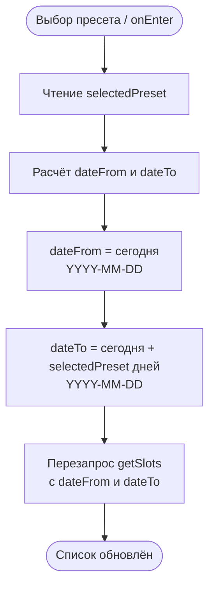

# Фильтр расписания по диапазону дат

**ID:** LOGIC-003  
**Тип:** Логика  
**Домен:** 09. Логики  
**Приоритет:** High  
**Статус:** Черновик  
**Функциональные блоки:** FB-002-003

---

## История изменений

| Релиз | ТЗ | Описание изменений |
|-------|-----|-------------------|
| — | — | Первоначальная документация |

---

## Входные данные

| Название | Тип | Возможные значения | Описание |
|----------|-----|-------------------|----------|
| `selectedPreset` | Состояние / Локальный кэш | `7`, `14`, `30` | Активный пресет диапазона. По умолчанию `7`. |

---

## Обзор

Логика расчёта параметров `dateFrom` и `dateTo` для запроса списка слотов на [SCR-002](../02-schedule/SCR-002-schedule.md). Пресеты — фиксированные значения (7, 14, 30 дней от текущей даты); пользовательского выбора произвольных дат нет. Смена пресета вызывает перезапрос `getSlots` с новыми параметрами.

### User Story

> Как клиент, я хочу расширить горизонт просмотра расписания фильтром по датам,
> чтобы найти классы позже, чем через 7 дней.

### Бизнес-ценность

- Даёт клиенту быстрый доступ к более далёим классам без лишних шагов.
- Предсказуемые пресеты вместо произвольного выбора дат упрощают интерфейс.
- Единая точка расчёта диапазона для всех запросов расписания.

---

## Точки применения

| Экран/Компонент | Элемент/Триггер | Условие |
|-----------------|-----------------|---------|
| [SCR-002 Расписание классов](../02-schedule/SCR-002-schedule.md) | Переключатель пресетов 7/14/30 | Всегда — при открытии экрана и при смене пресета |

---

## Флоу

---

## Описание логики

### Шаг 1: Расчёт диапазона

При открытии SCR-002 (onEnter) или при смене пресета выполняется расчёт:

- `dateFrom = сегодня` (в формате YYYY-MM-DD, включительно).
- `dateTo = сегодня + selectedPreset дней` (в формате YYYY-MM-DD, включительно).
- `selectedPreset` принимает значения `7` (по умолчанию), `14`, `30`.

### Шаг 2: Перезапрос

После расчёта вызывается `getSlots` с параметрами `dateFrom` и `dateTo`. Смена пресета во время выполнения предыдущего запроса отменяет предыдущий результат — активен только последний запрос (см. [SCR-002](../02-schedule/SCR-002-schedule.md), AC-E01).

### Шаг 3: Сохранение пресета

Активный пресет сохраняется в локальном состоянии/кэше (`selectedPreset`), чтобы при возврате на SCR-002 восстановить последний выбор.

---

## API запросы

### GET /slots

**Триггер:** Расчёт диапазона (при открытии SCR-002 или смене пресета).

**Спецификация:** [openapi.yaml](../../api/openapi.yaml) → `getSlots` (GET /slots)

**Параметры:**

| Параметр | Тип | Описание | Значение/Источник |
|----------|-----|----------|-------------------|
| `dateFrom` | string (date) | Начальная дата (включительно), YYYY-MM-DD | `сегодня` |
| `dateTo` | string (date) | Конечная дата (включительно), YYYY-MM-DD | `сегодня + selectedPreset` |
| `Authorization` | string (header) | Bearer-токен | Защищённое хранилище |

**Обработка ответа:** см. [SCR-002](../02-schedule/SCR-002-schedule.md) → [getSlots](../02-schedule/SCR-002-schedule.md#getslots).

---

## Локальное хранение

| Ключ | Тип хранения | Описание |
|------|--------------|----------|
| `selectedPreset` | Локальный кэш / Состояние | Последний выбранный пресет (7, 14, 30). По умолчанию `7`. Восстанавливается при возврате на SCR-002. |

---

## Связанные требования

### Функциональные (FR / UC)

| ID | Название | Приоритет |
|----|----------|-----------|
| FR-002 | Список слотов на 7 дней по умолчанию + фильтр по датам | Must |
| UC-002 | Просмотр расписания классов | Must |

### UI (US)

| ID | Название | Приоритет |
|----|----------|-----------|
| US-002 | Список классов на ближайшие 7 дней | Must |
| US-003 | Расширение горизонта фильтром по датам | Should |

---

## Критерии приёмки

| ID | Критерий |
|----|----------|
| AC-001 | **Дано** открытие SCR-002, **Когда** onEnter, **Тогда** `dateFrom = сегодня`, `dateTo = сегодня + 7` (пресет по умолчанию), выполняется запрос getSlots. |
| AC-002 | **Дано** активный пресет 7, **Когда** выбор пресета «14 дней», **Тогда** `dateTo` пересчитывается на `сегодня + 14`, getSlots перезапрашивается. |
| AC-003 | **Дано** активный пресет 14, **Когда** выбор пресета «30 дней», **Тогда** `dateTo` пересчитывается на `сегодня + 30`, getSlots перезапрашивается. |
| AC-004 | **Дано** пресет выбран, **Когда** возврат на SCR-002, **Тогда** восстанавливается последний выбранный пресет из локального кэша. |
| AC-005 | **Дано** смена пресета во время выполнения предыдущего запроса, **Когда** повторный выбор, **Тогда** активен только последний запрос (предыдущий результат игнорируется). |

---

## Обработка ошибок

| Тип ошибки | Контекст | Действие |
|------------|----------|----------|
| 401 | getSlots | Переход на SCR-001 ([LOGIC-001](LOGIC-001-auth-and-session.md)). |
| 5xx / нет сети | getSlots | Error state с кнопкой «Обновить»; пресет сохраняется, повтор использует тот же диапазон. |

---
