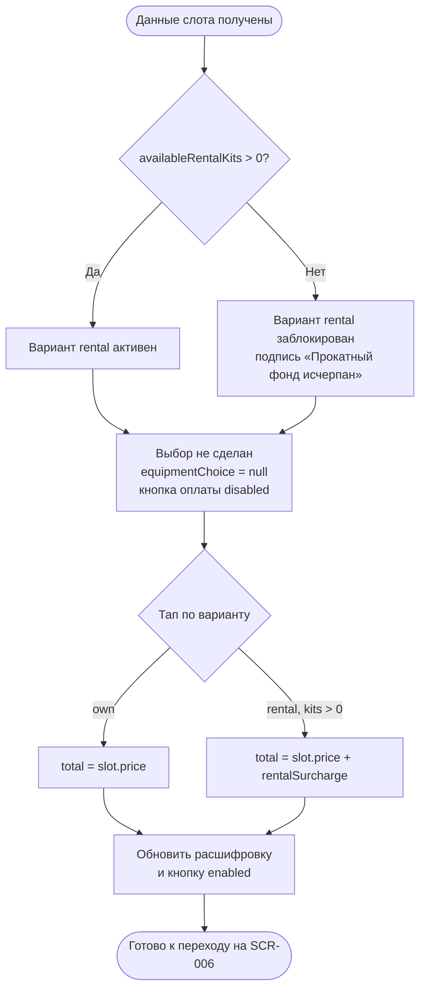

# Выбор экипировки и расчёт стоимости

**ID:** LOGIC-004  
**Тип:** Логика  
**Домен:** 09. Логики  
**Приоритет:** High  
**Статус:** Черновик  
**Функциональные блоки:** FB-003-001, FB-003-002

---

## История изменений

| Релиз | ТЗ | Описание изменений |
|-------|-----|-------------------|
| — | — | Первоначальная документация |

---

## Входные данные

| Название | Тип | Возможные значения | Описание |
|----------|-----|-------------------|----------|
| `slot.price` | Состояние (из ответа `getSlotById`) | number ≥ 0 | Базовая стоимость участия в классе. |
| `slot.availableRentalKits` | Состояние (из ответа `getSlotById`) | Целое ≥ 0 | Количество доступных прокатных комплектов. Определяет доступность варианта `rental`. |
| `equipmentChoice` | Состояние экрана | `null`, `own`, `rental` | Текущий выбор экипировки. `null` — выбор не сделан (по умолчанию). |

---

## Обзор

Логика управляет двумя аспектами экрана оформления брони (SCR-005): доступностью варианта «Прокатная экипировка» и расчётом итоговой суммы. Расчёт выполняется локально и мгновенно при переключении выбора, без обращений к API. Выбор экипировки — обязательный шаг: переход к оплате невозможен, пока `equipmentChoice = null`.

### User Story

> Как клиент, я хочу выбрать свою или прокатную экипировку и сразу увидеть итоговую стоимость,
> чтобы принять взвешенное решение перед оплатой.

### Бизнес-ценность

- Обязательный явный выбор экипировки снижает недопонимание при подготовке к классу (FR-008).
- Прозрачность стоимости до платежа повышает доверие (FR-010, US-005).
- Прокат экипировки как источник дополнительного дохода студии (BR-005).

---

## Точки применения

| Экран/Компонент | Элемент/Триггер | Условие |
|-----------------|-----------------|---------|
| [SCR-005 Оформление брони](../03-booking/SCR-005-booking-setup.md) | Блок выбора экипировки, блок итоговой стоимости, кнопка «Продолжить к оплате» | Всегда — при открытии экрана и при каждом переключении выбора |

---

## Флоу

---

## Описание логики

### Шаг 1: Доступность варианта rental

Сразу после получения данных слота определяется доступность варианта «Прокатная экипировка»:

- `slot.availableRentalKits > 0` → радио «Прокатная экипировка» активна, доступна для выбора.
- `slot.availableRentalKits = 0` → радио «Прокатная экипировка» заблокирована (disabled), под вариантом отображается подпись «Прокатный фонд на этот класс исчерпан» (FR-009, US-007).

Вариант «Своя экипировка» всегда активен.

### Шаг 2: Расчёт итоговой суммы

По умолчанию `equipmentChoice = null` — ни один вариант не выбран, кнопка «Продолжить к оплате» заблокирована (FR-008). При выборе варианта выполняется мгновенный пересчёт:

| `equipmentChoice` | Итоговая сумма `totalAmount` | Строка проката в расшифровке |
|-------------------|------------------------------|------------------------------|
| `null` | — (расчёт не выполним, кнопка disabled) | скрыта |
| `own` | `slot.price` | скрыта |
| `rental` | `slot.price` + прокатная составляющая | отображается |

Строка «Прокатная экипировка» в расшифровке отображается **только** при выбранном `rental`.

### Замечание о стоимости проката

> **Решённый вопрос (см. [SCR-005](../03-booking/SCR-005-booking-setup.md), блок «Итоговая стоимость»):**
> В текущей схеме `Slot` (openapi.yaml) отдельное поле для стоимости проката не выделено. Прокатная составляющая является частью ценообразования слота и определяется бэкендом. Клиентское приложение не вычисляет стоимость проката самостоятельно и не выдумывает поле.

Сумма `totalAmount`, отображаемая на SCR-005, носит предварительный характер. Авторитетное финальное значение фиксируется в `payment.amount` ответа `createBooking` (201) и отображается на [SCR-007 Результат бронирования](../03-booking/SCR-007-booking-result.md). При расхождении между предварительной суммой на SCR-005 и `payment.amount` из ответа приоритет у `payment.amount`.

---

## Связанные требования

### Функциональные (FR / UC)

| ID | Название | Приоритет |
|----|----------|-----------|
| FR-008 | Обязательный явный выбор экипировки | Must |
| FR-009 | Блокировка «прокатная» при исчерпанном фонде (`availableRentalKits = 0`) | Must |
| FR-010 | Отображение стоимости класса и проката до оплаты | Must |
| UC-003 | Бронирование слота с оплатой (шаг 2 — выбор экипировки) | Must |

### UI (US)

| ID | Название | Приоритет |
|----|----------|-----------|
| US-005 | Видеть стоимость класса и проката заранее | Must |
| US-006 | Явный выбор своей или прокатной экипировки | Must |
| US-007 | Видеть недоступность проката при исчерпанном фонде | Must |

### Данные (NFR / CON)

| ID | Название | Приоритет |
|----|----------|-----------|
| CON-001 | Приложение — read-only консьюмер API бэкенда (не вычисляет цену проката) | Must |

---

## Критерии приёмки

| ID | Критерий |
|----|----------|
| AC-001 | **Дано** данные слота получены, `availableRentalKits > 0`, **Когда** отрисовывается блок выбора, **Тогда** оба варианта активны, выбор не сделан (`equipmentChoice = null`), кнопка оплаты заблокирована. |
| AC-002 | **Дано** `availableRentalKits = 0`, **Когда** отрисовывается блок выбора, **Тогда** вариант «Прокатная экипировка» заблокирован с подписью «Прокатный фонд на этот класс исчерпан», доступен только выбор «Своя». |
| AC-003 | **Дано** выбор не сделан, **Когда** клиент пытается нажать «Продолжить к оплате», **Тогда** кнопка заблокирована (disabled). |
| AC-004 | **Дано** на экране, **Когда** клиент выбирает «Своя экипировка», **Тогда** `equipmentChoice = own`, `totalAmount = slot.price`, строка проката скрыта, кнопка оплаты активируется. |
| AC-005 | **Дано** на экране с доступным прокатом, **Когда** клиент выбирает «Прокатная экипировка», **Тогда** `equipmentChoice = rental`, итоговая сумма включает прокатную составляющую, отображается строка «Прокатная экипировка», кнопка активна. |
| AC-006 | **Дано** клиент многократно переключает выбор экипировки, **Когда** каждое переключение, **Тогда** итоговая сумма мгновенно пересчитывается без задержек и без запросов к API. |

---

## Обработка ошибок

| Тип ошибки | Контекст | Действие |
|------------|----------|----------|
| Расхождение предварительной и финальной суммы | `totalAmount` на SCR-005 ≠ `payment.amount` из ответа `createBooking` | Приоритет у `payment.amount` из ответа; финальная сумма отображается на SCR-007. На SCR-005 приоритет — отображение, не финальная фиксация. |

---
