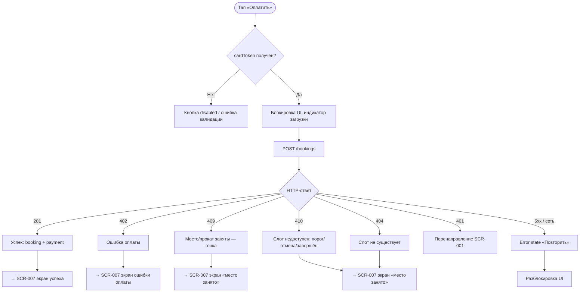

# Создание брони и оплата

**ID:** LOGIC-005  
**Тип:** Логика  
**Домен:** 09. Логики  
**Приоритет:** Critical  
**Статус:** Черновик  
**Функциональные блоки:** FB-003-002, FB-003-003

---

## История изменений

| Релиз | ТЗ | Описание изменений |
|-------|-----|-------------------|
| — | — | Первоначальная документация |

---

## Входные данные

| Название | Тип | Возможные значения | Описание |
|----------|-----|-------------------|----------|
| `slotId` | Параметр маршрута / Состояние | UUID | ID слота, на который оформляется бронь. Передаётся из SCR-005. |
| `equipmentChoice` | Состояние | `own`, `rental` | Выбранный вариант экипировки (не `null`). |
| `cardToken` | Состояние | string | Токен карты, полученный через платёжную инфраструктуру. |

---

## Обзор

Логика описывает вызов `createBooking` — атомарной операции бронирования с синхронной оплатой. Один запрос объединяет резервирование места, выбор экипировки и списание средств. Бэкенд обрабатывает гонки (двойную запись), порог 10 минут, несуществующие слоты и ошибки оплаты. Логика определяет реакцию UI на каждый из возможных исходов и маршрут на соответствующий результат (SCR-007).

Аллергии **не передаются** в теле `createBooking`: бэкенд автоматически подставляет их из профиля клиента на момент создания (FR-027).

### User Story

> Как клиент, я хочу оплатить класс и получить подтверждение брони,
> чтобы моё место было гарантированно зарезервировано.

### Бизнес-ценность

- Атомарная операция гарантирует согласованность брони и платежа (CON-007).
- Обработка гонок на бэкенде снимает с клиента ответственность за состояния гонки.
- Единый запрос снижает количество ошибок промежуточных состояний.

---

## Точки применения

| Экран/Компонент | Элемент/Триггер | Условие |
|-----------------|-----------------|---------|
| [SCR-006 Оплата](../03-booking/SCR-006-payment.md) | Кнопка «Оплатить» | Всегда — после ввода данных карты и токенизации |
| [LOGIC-001 Сессия](LOGIC-001-auth-and-session.md) | Ответ 401 | Истечение сессии |

---

## Флоу

---

## Описание логики

### Шаг 1: Предусловия

Перед вызовом `createBooking` проверяются локальные предусловия:

- `equipmentChoice` выбран (`own` или `rental`, не `null`) — гарантируется LOGIC-004.
- `cardToken` получен от платёжной инфраструктуры — гарантируется экраном оплаты (SCR-006).
- [LOGIC-002 Доступность слота](LOGIC-002-slot-availability.md) проверена при открытии SCR-005.

Если предусловия не выполнены — кнопка «Оплатить» заблокирована.

### Шаг 2: Запрос

Выполняется `POST /bookings`. Тело запроса содержит `slotId`, `equipmentChoice`, `cardToken`. Аллергии в теле **не передаются** — бэкенд подставляет их из профиля автоматически (FR-027).

Во время запроса UI блокируется: кнопка «Оплатить» переводится в состояние загрузки, повторные тапы игнорируются (предотвращение двойной отправки).

### Шаг 3: Обработка исходов

| HTTP | `reason` | Смысл | Действие |
|------|----------|-------|----------|
| 201 | — | Бронь создана, оплата проведена | Переход на SCR-007 (экран успеха) с `booking`, `payment` |
| 402 | `payment_failed` | Платёж не прошёл | Переход на SCR-007 (ошибка оплаты), кнопка «Повторить оплату» |
| 409 | `no_capacity` | Место или прокатный комплект занят (гонка) | Переход на SCR-007 (место занято), кнопка «Выбрать другой класс» |
| 410 | `slot_unavailable` | Порог времени / отмена студией / завершён | Переход на SCR-007 (место занято / запись закрыта) |
| 404 | `slot_not_found` | Слот не существует | Переход на SCR-007 (место занято / класс не найден) |
| 401 | `unauthorized` | Сессия истекла | Переход на SCR-001 (LOGIC-001) |
| 5xx / сеть | — | Серверная ошибка / нет соединения | Error state с кнопкой «Повторить», UI разблокируется |

### Замечание о платежах

> Платёжная инфраструктура (эквайринг, токенизация карты, возвраты) — вне скоупа клиентского приложения (CON-003, CON-007). Клиент получает `cardToken` от платёжного SDK и передаёт его в `createBooking`. Клиент не обрабатывает возвраты самостоятельно — статус оплаты `refunded` устанавливается бэкендом при отмене (см. [LOGIC-006](LOGIC-006-booking-cancellation.md)). Доступны только два статуса оплаты: `paid` и `refunded`.

---

## API запросы

### POST /bookings

**Триггер:** Тап «Оплатить» на SCR-006 (после получения `cardToken`).

**Спецификация:** [openapi.yaml](../../api/openapi.yaml) → `createBooking` (POST /bookings)

**Параметры/Body:**

| Параметр | Тип | Обязательность | Описание | Значение/Источник |
|----------|-----|----------------|----------|-------------------|
| `slotId` | string (uuid) | Да | ID слота | Состояние из SCR-005 |
| `equipmentChoice` | string (`own`, `rental`) | Да | Выбор экипировки | Состояние из LOGIC-004 |
| `cardToken` | string | Да | Токен карты | Платёжный SDK на SCR-006 |
| `Authorization` | string (header) | Да | Bearer-токен | Защищённое хранилище |

**Обработка ответа:**

| Результат | Условие | Действие |
|-----------|---------|----------|
| Загрузка | — | Блокировка UI, индикатор на кнопке «Оплатить» |
| Успех | 201 | Переход на SCR-007 (успех) с `booking`, `payment` |
| Ошибка оплаты | 402 `payment_failed` | Переход на SCR-007 (ошибка оплаты) |
| Конфликт | 409 `no_capacity` | Переход на SCR-007 (место занято) |
| Слот недоступен | 410 `slot_unavailable` | Переход на SCR-007 (место занято / запись закрыта) |
| Не найден | 404 `slot_not_found` | Переход на SCR-007 (класс не найден) |
| 401 | `unauthorized` | Переход на SCR-001 (LOGIC-001) |
| 5xx / сеть | — | Error state с кнопкой «Повторить», UI разблокируется |

---

## Связанные требования

### Функциональные (FR / UC)

| ID | Название | Приоритет |
|----|----------|-----------|
| FR-011 | Синхронная оплата при бронировании | Must |
| FR-012 | Блокировка повторной отправки во время запроса | Must |
| FR-013 | Обработка гонок (место занято) — бэкенд, клиент показывает результат | Must |
| FR-027 | Автоподстановка аллергий из профиля в бронь (бэкенд) | Must |
| UC-003 | Бронирование слота с оплатой (шаг 4 — оплата, альт. потоки 4a–4c) | Must |

### Интеграции (NFR / CON)

| ID | Название | Приоритет |
|----|----------|-----------|
| CON-003 | Платёжная инфраструктура — вне скоупа клиента | Must |
| CON-006 | Порог 10 минут до начала; финальную проверку делает бэкенд | Must |
| CON-007 | Бронь и оплата — атомарная операция | Must |

### UI (US)

| ID | Название | Приоритет |
|----|----------|-----------|
| US-008 | Получить подтверждение после успешной оплаты | Must |

---

## Критерии приёмки

| ID | Критерий |
|----|----------|
| AC-001 | **Дано** `cardToken` получен, `equipmentChoice` выбран, **Когда** тап «Оплатить», **Тогда** выполняется `POST /bookings` с `slotId`, `equipmentChoice`, `cardToken`; аллергии в теле отсутствуют. |
| AC-002 | **Дано** запрос выполняется, **Когда** ожидание ответа, **Тогда** UI заблокирован, повторные тапы игнорируются. |
| AC-003 | **Дано** ответ 201, **Когда** бронь создана, **Тогда** переход на SCR-007 (экран успеха) с `booking` и `payment` из ответа. |
| AC-004 | **Дано** ответ 402 `payment_failed`, **Когда** оплата не прошла, **Тогда** переход на SCR-007 (ошибка оплаты) с кнопкой «Повторить оплату». |
| AC-005 | **Дано** ответ 409 `no_capacity`, **Когда** место занято (гонка), **Тогда** переход на SCR-007 (место занято) с кнопкой «Выбрать другой класс». |
| AC-006 | **Дано** ответ 410 `slot_unavailable`, **Когда** слот недоступен, **Тогда** переход на SCR-007 (запись закрыта) с кнопкой «Вернуться к расписанию». |
| AC-007 | **Дано** ответ 401, **Когда** сессия истекла, **Тогда** переход на SCR-001 (LOGIC-001). |
| AC-008 | **Дано** ответ 5xx / нет сети, **Когда** сервер недоступен, **Тогда** error state с кнопкой «Повторить», UI разблокируется для повторной попытки. |

---

## Обработка ошибок

| Тип ошибки | Контекст | Действие |
|------------|----------|----------|
| Двойная отправка | Повторный тап во время запроса | UI заблокирован, повторные тапы игнорируются (FR-012). |
| Гонка (409) | Место/прокат заняты между просмотром и оплатой | Переход на SCR-007 (место занято); повторная попытка на этом слоте бессмысленна. |
| Ошибка оплаты (402) | Платёж отклонён банком/провайдером | Переход на SCR-007 (ошибка оплаты); клиент может повторить с другой картой. |
| Расхождение суммы | `totalAmount` (SCR-005) ≠ `payment.amount` (ответ) | Приоритет у `payment.amount`; финальная сумма отображается на SCR-007. |

---
