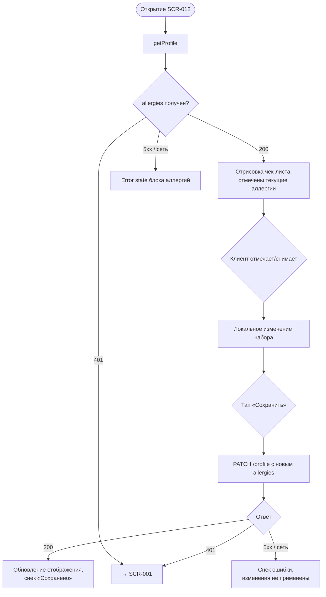

# Управление аллергиями

**ID:** LOGIC-007  
**Тип:** Логика  
**Домен:** 09. Логики  
**Приоритет:** Medium  
**Статус:** Черновик  
**Функциональные блоки:** FB-006-001

---

## История изменений

| Релиз | ТЗ | Описание изменений |
|-------|-----|-------------------|
| — | — | Первоначальная документация |

---

## Входные данные

| Название | Тип | Возможные значения | Описание |
|----------|-----|-------------------|----------|
| `profile.allergies` | Состояние (из ответа `getProfile`) | Массив строк, возможно пустой | Текущий список аллергий клиента. Источник для отображения и редактирования. |

---

## Обзор

Логика управляет чтением и редактированием списка аллергий клиента. Аллергии хранятся в профиле (`ClientProfile.allergies`) и автоматически подставляются бэкендом в новые брони при создании (FR-027). Логика работает в двух режимах:

1. **Read-only** — на экране оформления брони (SCR-005) аллергии отображаются как информационный блок без возможности редактирования.
2. **Редактируемый** — на экране профиля (SCR-012) клиент может отметить/снять аллергии из предзаданного чек-листа и сохранить изменения через `PATCH /profile`.

### User Story

> Как клиент, я хочу указать свои аллергии в профиле,
> чтобы студия и шеф учитывали их при подготовке классов, на которые я записываюсь.

### Бизнес-ценность

- Безопасность клиента: аллергии доводятся до шефа до начала класса (FR-027, BR-001).
- Единый источник правды: аллергии задаются один раз в профиле и применяются ко всем будущим броням автоматически.
- Снижение ошибок ручного ввода: предзаданный чек-лист вместо свободного текста.

---

## Точки применения

| Экран/Компонент | Элемент/Триггер | Условие |
|-----------------|-----------------|---------|
| [SCR-012 Профиль клиента](../06-profile/SCR-012-client-profile.md) | Блок аллергий (чек-лист), кнопка «Сохранить» | Всегда — read/write режим |
| [SCR-005 Оформление брони](../03-booking/SCR-005-booking-setup.md) | Блок аллергий (read-only) | Всегда — только отображение |

---

## Флоу

---

## Описание логики

### Режим Read-only (SCR-005)

На экране оформления брони аллергии загружаются через `getProfile` и отображаются как read-only блок:

- `profile.allergies` не пуст → список аллергий через запятую (или чипами).
- `profile.allergies` пуст → текст «Аллергии не указаны».
- Ошибка загрузки `getProfile` (5xx / сеть) → блок аллергий скрывается, остальной контент доступен.

Ручной ввод и редактирование на SCR-005 запрещены (US-018). Аллергии **не передаются** в теле `createBooking` — бэкенд подставляет их автоматически из профиля (FR-027).

### Режим редактирования (SCR-012)

На экране профиля клиенту доступен предзаданный чек-лист распространённых аллергий:

| Элемент | Описание |
|---------|----------|
| Чек-лист | Фиксированный перечень распространённых аллергенов (например: орехи, глютен, лактоза, морепродукты, яйца, соя). |
| Отметка | Чекбоксы; предзаполнены значениями из `profile.allergies`. |
| Сохранение | Кнопка «Сохранить» → `PATCH /profile` с полным массивом `allergies`. |

Перечень чек-листа зафиксирован в приложении (не приходит из API). Клиент не может добавить произвольную аллергию свободным текстом — только отметить из списка. Это снижает опечатки и упрощает обработку на стороне студии.

### Принцип сохранения

`PATCH /profile` передаёт **полный** массив `allergies` (а не дельту) — итоговый набор после всех изменений. Бэкенд заменяет список целиком. Локальное изменение применяется в UI только после успешного ответа 200; до этого отображается «грязное» состояние с активной кнопкой «Сохранить».

---

## API запросы

### GET /profile

**Триггер:** Открытие SCR-012 / SCR-005 (чтение аллергий).

**Спецификация:** [openapi.yaml](../../api/openapi.yaml) → `getProfile` (GET /profile)

**Обработка ответа:**

| Результат | Условие | Действие |
|-----------|---------|----------|
| Успех | 200, `allergies` не пуст | Отобразить список (SCR-012 — чек-лист с отметками; SCR-005 — read-only) |
| Успех | 200, `allergies` пуст | SCR-012 — чек-лист без отметок; SCR-005 — «Аллергии не указаны» |
| 401 | — | Переход на SCR-001 (LOGIC-001) |
| 5xx / сеть | — | SCR-012 — error state блока; SCR-005 — блок скрыт |

---

### PATCH /profile

**Триггер:** Тап «Сохранить» на SCR-012.

**Спецификация:** [openapi.yaml](../../api/openapi.yaml) → `updateProfile` (PATCH /profile)

**Параметры/Body:**

| Параметр | Тип | Обязательность | Описание | Значение/Источник |
|----------|-----|----------------|----------|-------------------|
| `allergies` | array of string | Да | Полный итоговый список аллергий | Локальное состояние после изменений |
| `Authorization` | string (header) | Да | Bearer-токен | Защищённое хранилище |

**Обработка ответа:**

| Результат | Условие | Действие |
|-----------|---------|----------|
| Загрузка | — | Индикатор на кнопке «Сохранить» |
| Успех | 200 | Обновить отображение из ответа, снек «Сохранено» |
| 401 | — | Переход на SCR-001 (LOGIC-001) |
| 5xx / сеть | — | Снек ошибки, изменения не применены |

---

## Локальное хранение

| Ключ | Тип хранения | Описание |
|------|--------------|----------|
| `profile.allergies` (кэш) | Локальный кэш / Состояние | Последний успешно загруженный список аллергий. Используется для предзаполнения чек-листа при повторном открытии SCR-012 до свежего запроса. |

---

## Связанные требования

### Функциональные (FR / UC)

| ID | Название | Приоритет |
|----|----------|-----------|
| FR-027 | Автоподстановка аллергий из профиля в бронь (бэкенд) | Must |
| UC-009 | Управление профилем (аллергии) | Should |

### UI (US)

| ID | Название | Приоритет |
|----|----------|-----------|
| US-018 | Автоподстановка аллергий из профиля; редактирование только в профиле | Should |

---

## Критерии приёмки

| ID | Критерий |
|----|----------|
| AC-001 | **Дано** открытие SCR-012, **Когда** getProfile возвращает 200 с аллергиями, **Тогда** чек-лист отображается с предзаполненными отметками по `profile.allergies`. |
| AC-002 | **Дано** `profile.allergies` пуст, **Когда** getProfile возвращает 200, **Тогда** чек-лист отображается без отметок. |
| AC-003 | **Дано** клиент снял/отметил аллергии, **Когда** тап «Сохранить», **Тогда** выполняется PATCH /profile с полным итоговым массивом `allergies`. |
| AC-004 | **Дано** PATCH /profile возвращает 200, **Когда** успех, **Тогда** отображение обновляется из ответа, показывается снек «Сохранено». |
| AC-005 | **Дано** на SCR-005, **Когда** getProfile возвращает 200 с аллергиями, **Тогда** аллергии отображаются read-only без возможности редактирования. |
| AC-006 | **Дано** аллергии не передаются в теле createBooking, **Когда** бронь создаётся, **Тогда** бэкенд подставляет аллергии из профиля автоматически (FR-027). |
| AC-007 | **Дано** PATCH /profile возвращает 5xx / нет сети, **Когда** ошибка, **Тогда** показывается снек ошибки, локальные изменения не применяются к отображаемому профилю. |

---

## Обработка ошибок

| Тип ошибки | Контекст | Действие |
|------------|----------|----------|
| Ошибка загрузки профиля на SCR-005 | getProfile 5xx / сеть | Блок аллергий скрывается; бронирование остаётся доступным (бэкенд подставит аллергии из профиля независимо). |
| Ошибка сохранения на SCR-012 | PATCH /profile 5xx / сеть | Снек ошибки; «грязное» состояние сохраняется, клиент может повторить «Сохранить». |

---
