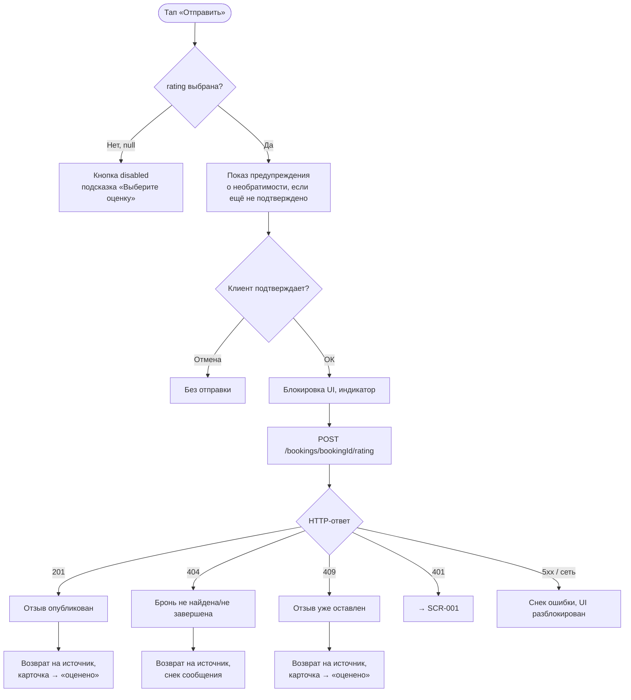

# Оценка и отзыв по завершённому классу

**ID:** LOGIC-008  
**Тип:** Логика  
**Домен:** 09. Логики  
**Приоритет:** Medium  
**Статус:** Черновик  
**Функциональные блоки:** FB-005-001

---

## История изменений

| Релиз | ТЗ | Описание изменений |
|-------|-----|-------------------|
| — | — | Первоначальная документация |

---

## Входные данные

| Название | Тип | Возможные значения | Описание |
|----------|-----|-------------------|----------|
| `bookingId` | Параметр экрана | UUID | Идентификатор завершённой брони, по которой оставляется отзыв. |
| `rating` | Состояние экрана | 1, 2, 3, 4, 5, `null` | Оценка звёздами. Обязательна для отправки. `null` — оценка не выбрана. |
| `comment` | Состояние экрана | string, опционально | Текстовый отзыв. Может быть пустым. |

---

## Обзор

Логика описывает валидацию и отправку оценки/отзыва через `createRating` (POST /bookings/{bookingId}/rating). Оценка звёздами обязательна, текстовый отзыв опционален. Действие окончательное: после отправки отзыв публикуется немедленно и публично, без премодерации, без возможности редактирования или удаления (NFR-017).

Логика валидирует предусловие (выбрана ли оценка), отправляет запрос и обрабатывает три специфичных исхода: успех (201), бронь не завершена/не найдена (404), отзыв уже оставлен (409).

### User Story

> Как клиент, я хочу отправить оценку и отзыв по завершённому классу,
> чтобы поделиться впечатлением и помочь другим клиентам выбрать шефа.

### Бизнес-ценность

- Собирает публичные отзывы, формирующие агрегированный рейтинг шефа (FR-005, FR-025).
- Публикация без премодерации обеспечивает актуальность отзывов (NFR-017).
- Необратимость повышает осознанность оценки.

---

## Точки применения

| Экран/Компонент | Элемент/Триггер | Условие |
|-----------------|-----------------|---------|
| [SCR-011 Оценка и отзыв](../05-history-and-ratings/SCR-011-rating.md) | Кнопка «Отправить» | `rating` выбрана (не `null`) |
| [LOGIC-001 Сессия](LOGIC-001-auth-and-session.md) | Ответ 401 | Истечение сессии |

---

## Флоу

---

## Описание логики

### Шаг 1: Валидация

- Оценка `rating` обязательна. Кнопка «Отправить» заблокирована (disabled), пока `rating = null`.
- Текстовый отзыв `comment` опционален; пустая строка допустима.

### Шаг 2: Предупреждение о необратимости

Перед отправкой отображается заметное предупреждение: отзыв публикуется публично без возможности редактирования или удаления (NFR-017). Подтверждение клиентом требуется один раз за сессию экрана (или при каждой отправке — определяется реализацией SCR-011).

### Шаг 3: Запрос

Выполняется `POST /bookings/{bookingId}/rating` с телом `{ rating, comment }`. Во время запроса UI блокируется, повторные тапы игнорируются.

### Шаг 4: Обработка исходов

| HTTP | `reason` | Смысл | Действие |
|------|----------|-------|----------|
| 201 | — | Отзыв сохранён и опубликован | Возврат на источник (SCR-010 или SCR-009); карточка отображается в статусе «оценено» |
| 404 | — | Бронь не найдена или не завершена | Возврат на источник; снек с текстом из `message` |
| 409 | — | Отзыв уже оставлен для этой брони | Возврат на источник; карточка отображается в статусе «оценено» (идемпотентный исход) |
| 401 | `unauthorized` | Сессия истекла | Переход на SCR-001 (LOGIC-001) |
| 5xx / сеть | — | Серверная ошибка / нет соединения | Снек ошибки, UI разблокируется для повторной попытки |

### Принцип публикации

Отзыв публикуется немедленно и публично, без премодерации (NFR-017). Агрегированный рейтинг шефа (`Chef.rating`) обновляется бэкендом; клиентское приложение не пересчитывает рейтинг самостоятельно (CON-001).

---

## API запросы

### POST /bookings/{bookingId}/rating

**Триггер:** Тап «Отправить» на SCR-011 (после валидации и подтверждения).

**Спецификация:** [openapi.yaml](../../api/openapi.yaml) → `createRating` (POST /bookings/{bookingId}/rating)

**Параметры/Body:**

| Параметр | Тип | Обязательность | Описание | Значение/Источник |
|----------|-----|----------------|----------|-------------------|
| `bookingId` | string (uuid, path) | Да | ID завершённой брони | Параметр экрана |
| `rating` | integer (1–5, body) | Да | Оценка звёздами | Состояние экрана |
| `comment` | string (body) | Нет | Текстовый отзыв | Состояние экрана (может быть пустым) |
| `Authorization` | string (header) | Да | Bearer-токен | Защищённое хранилище |

**Обработка ответа:**

| Результат | Условие | Действие |
|-----------|---------|----------|
| Загрузка | — | Индикатор на кнопке «Отправить», UI заблокирован |
| Успех | 201 | Возврат на источник; карточка → «оценено» |
| Не завершена/не найдена | 404 | Возврат на источник; снек из `message` |
| Уже оценено | 409 | Возврат на источник; карточка → «оценено» |
| 401 | — | Переход на SCR-001 (LOGIC-001) |
| 5xx / сеть | — | Снек ошибки, UI разблокируется |

---

## Связанные требования

### Функциональные (FR / UC)

| ID | Название | Приоритет |
|----|----------|-----------|
| FR-005 | Агрегированный рейтинг шефа (формируется из отзывов) | Must |
| FR-023 | Оценка звёздами 1–5 (обязательна) | Must |
| FR-024 | Текстовый отзыв (опционален) | Must |
| FR-025 | Отзыв публикуется немедленно, без премодерации | Must |
| FR-026 | Отзыв нельзя редактировать или удалить | Must |
| UC-010 | Оставить отзыв по завершённому классу | Should |

### Интеграции (NFR / CON)

| ID | Название | Приоритет |
|----|----------|-----------|
| NFR-017 | Публикация отзывов без премодерации | Should |
| CON-001 | Приложение — read-only консьюмер API; рейтинг пересчитывает бэкенд | Must |

### UI (US)

| ID | Название | Приоритет |
|----|----------|-----------|
| US-016 | Оставить оценку звёздами сразу после класса | Should |

---

## Критерии приёмки

| ID | Критерий |
|----|----------|
| AC-001 | **Дано** `rating = null`, **Когда** попытка отправки, **Тогда** кнопка «Отправить» заблокирована (disabled). |
| AC-002 | **Дано** `rating` выбрана, `comment` пуст, **Когда** тап «Отправить» и подтверждение, **Тогда** выполняется POST с `{ rating }` (без comment), запрос валиден. |
| AC-003 | **Дано** запрос выполняется, **Когда** ожидание ответа, **Тогда** UI заблокирован, повторные тапы игнорируются. |
| AC-004 | **Дано** ответ 201, **Когда** отзыв опубликован, **Тогда** возврат на источник (SCR-010/SCR-009), карточка отображается в статусе «оценено». |
| AC-005 | **Дано** ответ 409 (уже оценено), **Когда** повторная отправка, **Тогда** возврат на источник, карточка отображается в статусе «оценено» (идемпотентный исход). |
| AC-006 | **Дано** ответ 404 (бронь не завершена/не найдена), **Когда** бронь недоступна для оценки, **Тогда** возврат на источник, снек с текстом из `message`. |
| AC-007 | **Дано** ответ 401, **Когда** сессия истекла, **Тогда** переход на SCR-001 (LOGIC-001). |
| AC-008 | **Дано** ответ 5xx / нет сети, **Когда** сервер недоступен, **Тогда** снек ошибки, UI разблокируется для повторной попытки. |

---

## Обработка ошибок

| Тип ошибки | Контекст | Действие |
|------------|----------|----------|
| Двойная отправка | Повторный тап во время запроса | UI заблокирован, повторные тапы игнорируются. |
| Уже оценено (409) | Отзыв оставлен ранее (гонка/повторное открытие) | Идемпотентный исход: карточка отображается как «оценено», без ошибки. |
| Бронь не завершена (404) | Попытка оценить незавершённый класс | Возврат на источник; снек из `message`. |

---
