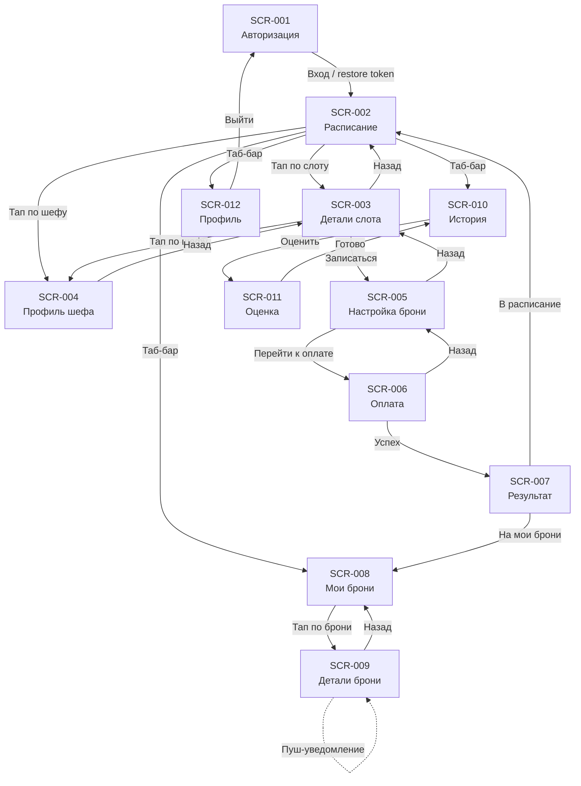

# Мобильное приложение «Кулинарная студия» — Спецификация ТЗ

**Версия:** 1.0.0  
**Роль:** Клиент  
**Платформа:** React Native / Flutter (кроссплатформа)  
**Язык интерфейса:** Русский (CON-009)  
**API-контракт:** [openapi.yaml](../api/openapi.yaml)

---

## Содержание

- [Обзор](#обзор)
- [Структура папок](#структура-папок)
- [Экраны](#экраны)
- [Логики](#логики)
- [Карта навигации](#карта-навигации)
- [Покрытие API-эндпоинтов](#покрытие-api-эндпоинтов)
- [Связанные документы](#связанные-документы)

---

## Обзор

Настоящий каталог содержит технические задания (ТЗ) для всех экранов и сквозных логик мобильного приложения клиента «Кулинарная студия». Документы разделены на два типа:

- **Экраны (SCR-xxx)** — спецификация отдельного экрана UI: элементы, состояния, действия, запросы, критерии приёмки. Шаблон: [_SCREEN_TEMPLATE.md](_SCREEN_TEMPLATE.md).
- **Логики (LOGIC-xxx)** — сквозная логика, затрагивающая несколько экранов или глобальный слой (сессия, оплата, отмена). Шаблон: [_LOGIC_TEMPLATE.md](_LOGIC_TEMPLATE.md).

Каждый документ опирается на дизайн-брифы из [3-design-brief/](../3-design-brief/) и API-контракт из [api/openapi.yaml](../api/openapi.yaml). Требования — из [2-requirements/](../2-requirements/).

---

## Структура папок

```
5-mobile-app-spec/
├── README.md                          ← этот файл
├── _SCREEN_TEMPLATE.md                ← шаблон экрана
├── _LOGIC_TEMPLATE.md                 ← шаблон логики
├── 01-auth/                           ← авторизация
├── 02-schedule/                       ← расписание и выбор класса
├── 03-booking/                        ← бронирование и оплата
├── 04-my-bookings/                    ← предстоящие брони
├── 05-history-and-ratings/            ← история и оценки
├── 06-profile/                        ← профиль клиента
└── 09-logics/                         ← сквозные логики
```

---

## Экраны

### 01. Авторизация

| ID | Экран | Файл | Дизайн-бриф | Приоритет |
|----|-------|------|-------------|-----------|
| SCR-001 | Авторизация (логин) | [01-auth/SCR-001-login.md](01-auth/SCR-001-login.md) | [SCR-001](../3-design-brief/SCR-001-login.md) | Critical |

### 02. Расписание

| ID | Экран | Файл | Дизайн-бриф | Приоритет |
|----|-------|------|-------------|-----------|
| SCR-002 | Расписание классов | [02-schedule/SCR-002-schedule.md](02-schedule/SCR-002-schedule.md) | [SCR-002](../3-design-brief/SCR-002-schedule.md) | High |
| SCR-003 | Детали слота (класс) | [02-schedule/SCR-003-slot-details.md](02-schedule/SCR-003-slot-details.md) | [SCR-003](../3-design-brief/SCR-003-slot-details.md) | High |
| SCR-004 | Профиль шефа | [02-schedule/SCR-004-chef-profile.md](02-schedule/SCR-004-chef-profile.md) | [SCR-004](../3-design-brief/SCR-004-chef-profile.md) | Medium |

### 03. Бронирование

| ID | Экран | Файл | Дизайн-бриф | Приоритет |
|----|-------|------|-------------|-----------|
| SCR-005 | Настройка бронирования | [03-booking/SCR-005-booking-setup.md](03-booking/SCR-005-booking-setup.md) | [SCR-005](../3-design-brief/SCR-005-booking-setup.md) | High |
| SCR-006 | Оплата | [03-booking/SCR-006-payment.md](03-booking/SCR-006-payment.md) | [SCR-006](../3-design-brief/SCR-006-payment.md) | Critical |
| SCR-007 | Результат бронирования | [03-booking/SCR-007-booking-result.md](03-booking/SCR-007-booking-result.md) | [SCR-007](../3-design-brief/SCR-007-booking-result.md) | High |

### 04. Мои брони

| ID | Экран | Файл | Дизайн-бриф | Приоритет |
|----|-------|------|-------------|-----------|
| SCR-008 | Мои брони (предстоящие) | [04-my-bookings/SCR-008-my-bookings.md](04-my-bookings/SCR-008-my-bookings.md) | [SCR-008](../3-design-brief/SCR-008-my-bookings.md) | High |
| SCR-009 | Детали брони | [04-my-bookings/SCR-009-booking-details.md](04-my-bookings/SCR-009-booking-details.md) | [SCR-009](../3-design-brief/SCR-009-booking-details.md) | High |

### 05. История и оценки

| ID | Экран | Файл | Дизайн-бриф | Приоритет |
|----|-------|------|-------------|-----------|
| SCR-010 | История: завершённые классы | [05-history-and-ratings/SCR-010-history.md](05-history-and-ratings/SCR-010-history.md) | [SCR-010](../3-design-brief/SCR-010-history.md) | Medium |
| SCR-011 | Оценка класса | [05-history-and-ratings/SCR-011-rating.md](05-history-and-ratings/SCR-011-rating.md) | [SCR-011](../3-design-brief/SCR-011-rating.md) | Medium |

### 06. Профиль

| ID | Экран | Файл | Дизайн-бриф | Приоритет |
|----|-------|------|-------------|-----------|
| SCR-012 | Профиль клиента | [06-profile/SCR-012-client-profile.md](06-profile/SCR-012-client-profile.md) | [SCR-012](../3-design-brief/SCR-012-client-profile.md) | High |

---

## Логики

| ID | Логика | Файл | Применяется на | Приоритет |
|----|--------|------|----------------|-----------|
| LOGIC-001 | Авторизация и управление сессией | [09-logics/LOGIC-001-auth-and-session.md](09-logics/LOGIC-001-auth-and-session.md) | SCR-001, SCR-012, глобально (401) | Critical |
| LOGIC-002 | Доступность слотов и мест | [09-logics/LOGIC-002-slot-availability.md](09-logics/LOGIC-002-slot-availability.md) | SCR-002, SCR-003, SCR-005 | High |
| LOGIC-003 | Выбор даты, фильтр и поиск | [09-logics/LOGIC-003-schedule-date-filter.md](09-logics/LOGIC-003-schedule-date-filter.md) | SCR-002 | High |
| LOGIC-004 | Выбор оборудования и расчёт стоимости | [09-logics/LOGIC-004-equipment-and-pricing.md](09-logics/LOGIC-004-equipment-and-pricing.md) | SCR-005 | High |
| LOGIC-005 | Создание брони и оплата | [09-logics/LOGIC-005-booking-and-payment.md](09-logics/LOGIC-005-booking-and-payment.md) | SCR-005, SCR-006, SCR-007 | Critical |
| LOGIC-006 | Отмена брони пользователем | [09-logics/LOGIC-006-booking-cancellation.md](09-logics/LOGIC-006-booking-cancellation.md) | SCR-009 | High |
| LOGIC-007 | Управление аллергиями | [09-logics/LOGIC-007-allergies-management.md](09-logics/LOGIC-007-allergies-management.md) | SCR-005, SCR-012 | High |
| LOGIC-008 | Оценка после завершённого визита | [09-logics/LOGIC-008-rating-submission.md](09-logics/LOGIC-008-rating-submission.md) | SCR-010, SCR-011 | Medium |

---

## Карта навигации



> **Глобальная навигация:** При любом 401 на авторизованном запросе — возврат на SCR-001 (LOGIC-001). Пуш-уведомления ведут напрямую на SCR-009.

---

## Покрытие API-эндпоинтов

| Метод | Эндпоинт | Экран / Логика | Описание |
|-------|----------|----------------|----------|
| POST | `/auth/login` | SCR-001, LOGIC-001 | Авторизация, получение JWT |
| GET | `/chefs` | SCR-002, LOGIC-003 | Список шефов (фильтр) |
| GET | `/chefs/{chefId}` | SCR-004 | Профиль шефа |
| GET | `/slots` | SCR-002, LOGIC-002, LOGIC-003 | Список слотов (дата, шеф) |
| GET | `/slots/{slotId}` | SCR-003, LOGIC-002 | Детали слота |
| POST | `/bookings` | SCR-005/006, LOGIC-005 | Создание брони |
| GET | `/bookings` | SCR-008, SCR-010 | Список броней (по статусу) |
| GET | `/bookings/{bookingId}` | SCR-009 | Детали брони |
| PATCH | `/bookings/{bookingId}/cancel` | SCR-009, LOGIC-006 | Отмена брони |
| PATCH | `/bookings/{bookingId}/allergies` | SCR-012, LOGIC-007 | Обновление аллергий в брони |
| PATCH | `/me/allergies` | SCR-012, LOGIC-007 | Обновление аллергий в профиле |
| POST | `/bookings/{bookingId}/ratings` | SCR-011, LOGIC-008 | Отправка оценки |

> **Авторизация:** Все эндпоинты кроме `POST /auth/login` требуют заголовок `Authorization: Bearer <token>`.

---

## Связанные документы

| Категория | Документ | Путь |
|-----------|----------|------|
| API-контракт | OpenAPI-спецификация | [api/openapi.yaml](../api/openapi.yaml) |
| Требования | Функциональные требования | [2-requirements/functional-requirements.md](../2-requirements/functional-requirements.md) |
| Требования | Нефункциональные требования | [2-requirements/non-functional-requirements.md](../2-requirements/non-functional-requirements.md) |
| Требования | Бизнес-требования | [2-requirements/business-requirements.md](../2-requirements/business-requirements.md) |
| Требования | Use Cases | [2-requirements/use-cases.md](../2-requirements/use-cases.md) |
| Требования | User Stories | [2-requirements/user-stories.md](../2-requirements/user-stories.md) |
| Требования | Ограничения и скоуп | [2-requirements/constraints-and-scope.md](../2-requirements/constraints-and-scope.md) |
| Дизайн | Дизайн-брифы экранов | [3-design-brief/](../3-design-brief/) |
| Дизайн | Реестр экранов | [3-design-brief/_SCREEN_REGISTRY.md](../3-design-brief/_SCREEN_REGISTRY.md) |
| Шаблоны | Шаблон экрана | [_SCREEN_TEMPLATE.md](_SCREEN_TEMPLATE.md) |
| Шаблоны | Шаблон логики | [_LOGIC_TEMPLATE.md](_LOGIC_TEMPLATE.md) |
